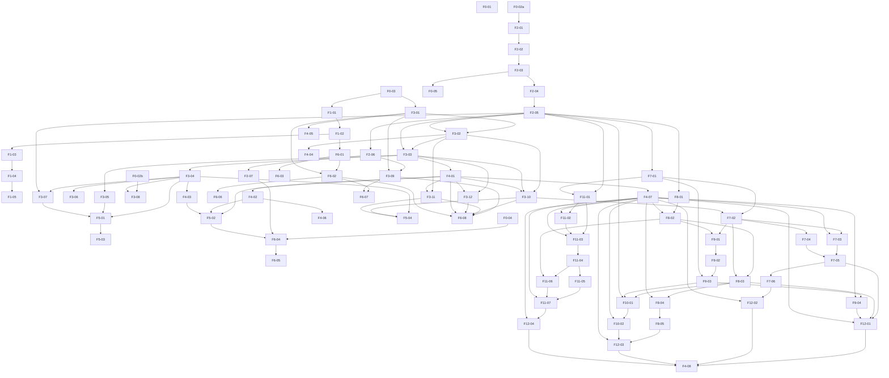

# Backlog

Work across both deliveries, grouped by planning phase. Phases 0-6 record the
completed first delivery. Phases 7-12 cover the monolith analytics part of the
second delivery. Story identifiers are `F<phase>-<n>`.

Estimates are set by the team at Planning, not here. Sprint membership lives in
the GitHub Projects `Sprint` field, not in this document — a backlog that
duplicates the board drifts from it within a week.

Priority: **P0** the delivery fails without it · **P1** required, schedulable
later · **P2** optional.

**This is not the whole second-delivery backlog.** [ADR-0016][adr-0016]
requires the distributed architecture, but each component is blocked on a
decision that does not exist yet. Phases 7-12 plan only the monolith analytics
work and create no microservice, client application, MongoDB or Redis
implementation, or shared authentication scheme.

## Dependency graph

The two setup chains — infrastructure (`F1-*`) and the data model (`F0-02a` ->
`F2-*`) — run in parallel and converge at `F3-03`, once both the application
skeleton and the schema exist to authenticate against. The early-deployment
branch (`F1-02` -> `F6-01` -> `F6-02`) is deliberately shallow so a reverse
proxy and process manager exist as soon as the application serves a page.

---

## Phase 0 — Preparation

| ID | Story | Priority | Depends on |
|---|---|---|---|
| F0-01 | Reset the repository, documentation and board to the monolith scope | P0 | — |
| F0-02a | Decide the company name and business domain identity | P0 | — |
| F0-02b | Decide the design system for the interface | P0 | — |
| F0-03 | Every member has a GCP account, the SDK CLI, an editor and Git working | P0 | — |
| F0-04 | Confirm the host assignment and whether the team delivers once (Q-1, Q-2) | P0 | — |
| F0-05 | Functional and non-functional requirements, user stories, business rules and the permission matrix | P0 | F2-03 |

**F0-02 is split.** Company name and design system are independent decisions
gated on different open questions (`docs/scope.md` §8, Q-3 and Q-4), and only
one of them feeds the data model chain. `F2-01` needs the business domain
identity (Q-3) to model against; it does not need the design system (Q-4),
which only `F3-08` consumes. Bundling both under one story meant `F2-01`
carried a blocker it had no reason to carry. Both are now resolved: the
company name is MOSAIQ, and the design system is recorded in
[ADR-0002](adr/0002-mosaiq-identity-and-design-system.md).

**F0-05 was written after the model, not before it.** Requirements belong in
Phase 0 and the story sits there, but it depends on `F2-03`: the model was built
first and the requirements were written against it. That inversion is a fact
about how the project ran, not a plan, and the dependency edge records it rather
than pretending the order was the tidy one.

## Phase 1 — GCP infrastructure

| ID | Story | Priority | Depends on |
|---|---|---|---|
| F1-01 | Create the Compute Engine instance: e2-standard-2, 50 GB persistent disk, CentOS 10 Stream | P0 | F0-03 |
| F1-02 | Firewall rules allowing HTTP/80 and SSH/22; SSH access verified by every member | P0 | F1-01 |
| F1-03 | Install PostgreSQL from the official repository on the instance | P0 | F1-02 |
| F1-04 | Configure `postgresql.conf` and `pg_hba.conf` for remote access by the application role | P0 | F1-03 |
| F1-05 | Create the application database role with least privilege, separate from the owner | P0 | F1-04 |

## Phase 2 — Database

| ID | Story | Priority | Depends on |
|---|---|---|---|
| F2-01 | Conceptual model: entities, attributes, relationships, functional and multivalued dependencies | P0 | F0-02a |
| F2-02 | Normalize to 4NF, with a written justification for each decision | P0 | F2-01 |
| F2-03 | Logical model: ER diagram and data dictionary | P0 | F2-02 |
| F2-04 | `sql/00_create_database.sql` | P0 | F2-03 |
| F2-05 | `sql/01_schema.sql` with primary keys, foreign keys, `UNIQUE`, `CHECK` and indexes | P0 | F2-04 |
| F2-06 | `sql/02_seed_30_per_table.sql`, at least 30 rows per table | P0 | F2-05 |
| F2-07 | Integrity verification: positive and negative cases, with evidence | P0 | F2-06 |

**F2-02 is the phase's real deliverable.** The scripts are mechanical once the
model is right; a model that is wrong is discovered during Phase 3 and costs the
application layer that was built on top of it.

## Phase 3 — Application

| ID | Story | Priority | Depends on |
|---|---|---|---|
| F3-01 | Flask application skeleton organized by layers | P0 | F0-03 |
| F3-02 | Database connection driven by environment variables | P0 | F3-01, F2-05 |
| F3-03 | Authentication: login, logout, password hashing | P0 | F3-02, F2-05 |
| F3-04 | Administrator module: complete CRUD over every catalog | P0 | F3-03 |
| F3-05 | Regular user module: listing, search and detail views | P0 | F3-03 |
| F3-06 | User management: create, edit, deactivate | P0 | F3-04 |
| F3-07 | Image handling: upload JPG/PNG/WebP, store under `uploads/`, keep the path in the database | P0 | F3-04, F2-05 |
| F3-08 | Apply the chosen design system across the interface | P1 | F0-02b, F3-04 |
| F3-09 | One command brings the whole stack up through Docker Compose | P1 | F2-06, F3-01 |
| F3-10 | Segment assignment process: score RFM over recorded sales, match the rules, write the assignment | P0 | F3-02, F3-03, F4-01 |
| F3-11 | Audit log view for the administrator and the auditor | P0 | F3-02, F4-01 |
| F3-12 | Authenticated application shell and navigation | P0 | F3-03, F4-01 |

**F3-10 and F3-11 exist because the demonstration needs them.** The
first-partial demonstration list asks for "ejecución de un proceso principal"
and "registro de auditoría", and neither had a story. `F3-10` is a deliberately
narrow slice of the RFM work `roadmap.md` defers — quintile scoring and a match
against the `segment_rule` bands already in the schema, and nothing else. It
inherits [ADR-0004](adr/0004-model-ahead-of-the-deferred-segmentation-modules.md),
including the warning that `customer.current_segment_id` is a column the
segment-history module will have to migrate. `F3-11` reads the `audit_log` the
triggers have been filling since `F2-05`; nothing in the application looks at it
today.

**F3-12 is the shell every other Phase 3 story hangs off.** `F3-03` establishes
a session, `F3-04` and `F3-05` build modules, and `F3-08` styles whatever
exists — none of them builds the page a signed-in user lands on or the
navigation between modules. Without it the application is a set of URLs someone
has to already know, and every demonstration item is reached through it.

**F3-09 is Docker Compose, not a shell script.** It was written as a script that
ran the three SQL files and started Flask.
[ADR-0006](adr/0006-run-under-both-systemd-and-docker-compose.md) decides the
application runs under both systemd and Compose, so the one command is
`docker compose up`. This does not change the deployment: systemd stays the
default on the instance and `F6-01` and `F6-02` are untouched.

**F3-02 depends on the schema, not the infrastructure role.** Connecting
through environment variables needs a database to connect to (`F2-05`), not
the provisioned least-privilege VM role (`F1-05`) — that role is an
operational concern, not a precondition for writing the connection code.
Chaining Phase 3 through five infrastructure stories put them on the critical
path for no reason; the least-privilege runtime role is instead verified as an
acceptance criterion at `F6-02`, where the application is actually deployed
against it. `F3-07` also gains `F2-05`: the schema stores the image path
alongside the catalog row, so it has to exist before an upload can be
persisted.

## Phase 4 — Security and roles

| ID | Story | Priority | Depends on |
|---|---|---|---|
| F4-01 | Roles and permissions with an authorization middleware enforcing them at the route level | P0 | F3-03 |
| F4-02 | Single administrator: refused by the application **and** by a partial unique index | P0 | F4-01 |
| F4-03 | Input validation and sanitization; every SQL statement parameterized | P0 | F3-04 |
| F4-04 | Secure sessions; no secrets in source, all configuration in `.env` | P0 | F3-02 |
| F4-05 | Controlled error handling and basic application logging | P1 | F3-01 |
| F4-06 | Create the real administrator on the instance without a published password | P0 | F3-03, F4-02 |
| F4-07 | Assign each Delivery 2 analytics surface to permissions held by the existing role profiles | P0 | F4-01 |
| F4-08 | Verify every Delivery 2 analytics route is default-deny and permits only its declared profiles | P0 | F12-01, F12-02, F12-03, F12-04 |

**F4-06 closes the gap the seed leaves open.** `sql/02_seed_30_per_table.sql`
creates thirty demonstration accounts, the administrator among them, all with a
password published in this repository. That is right for local work and for the
demonstration, and it is a hole on a public host. `F4-02` makes it harder rather
than easier: with the partial unique index in place, a real administrator cannot
simply be added alongside the seeded one. Someone has to decide whether the
instance carries the demonstration accounts at all.

**F4-02 needs both halves.** The application check alone is bypassed by a direct
`INSERT`; the index alone produces an unexplained database error in the user
interface. Neither is sufficient by itself.

**The Delivery 2 profiles already exist.** `ANALYST`, `STORE_MANAGER`,
`MARKETING`, `INVENTORY_PLANNER` and `AUDITOR` are seeded and enforced by the
default-deny gate in
[ADR-0007](adr/0007-permissions-in-code-with-a-default-deny-middleware.md).
`F4-07` assigns the new surfaces to permissions; it does not recreate roles or
weaken the twice-enforced single-administrator rule. `F4-08` stays in the
security phase but waits for the last analytics routes so it can verify the
complete surface.

## Phase 5 — Testing and quality

| ID | Story | Priority | Depends on |
|---|---|---|---|
| F5-01 | Functional tests over registration, login, each CRUD module and image upload | P0 | F3-04, F3-05, F3-07 |
| F5-02 | Negative tests: unauthorized access, invalid data, controlled errors | P0 | F4-01, F4-02, F4-03 |
| F5-03 | Code review pass over consistency, error handling and logging | P1 | F5-01 |
| F5-04 | Screenshots of the key functionality as evidence | P0 | F3-04, F3-10, F3-11 |

**"Phase 3" and "Phase 4" are not issues.** They cannot be expressed as a
GitHub relationship, so `F5-01` and `F5-02` are enumerated against the actual
stories they exercise. Enumerating also drops `F3-08` from `F5-01`'s
blockers — it is P1 and cosmetic, and gating functional tests on the design
system pass would hold up testing for a story that doesn't affect behavior.

## Phase 6 — Deployment and publication

| ID | Story | Priority | Depends on |
|---|---|---|---|
| F6-01 | NGINX or Apache configured as a reverse proxy in front of the application | P0 | F1-02 |
| F6-02 | Gunicorn under `systemd`, restarting automatically | P0 | F6-01, F3-01 |
| F6-03 | SSL certificate with forced HTTPS | P2 | F6-01 |
| F6-04 | Publish the documentation and evidence page on the assigned host | P0 | F0-04, F2-07, F5-02 |
| F6-05 | Final verification: links, images, downloads, checked in a private window | P0 | F6-04 |
| F6-06 | Continuous deployment: automatically update the assigned host on every merge to `main` | P1 | F6-02 |
| F6-07 | Capture proof of deployment as evidence | P0 | F6-01, F6-02, F3-09 |
| F6-08 | Rehearse the technical demonstration end to end on the instance | P0 | F3-09, F3-10, F3-11, F3-12, F4-01, F6-02 |

**F6-06 targets one environment, not two.** There is a single GCP instance
(`docs/scope.md` C-5), and it is the assigned host; `develop` stays an
integration branch gated by CI, but nothing deploys from it. The pipeline
triggers only on merge to `main`, after review, and needs `F6-02` — a
`systemd`-managed `gunicorn` process already has to exist for the pipeline to
restart it. The single-environment decision is recorded as an ADR as part of
this story, not assumed silently.

**F6-04 needs the evidence it publishes to exist.** As written, its only
blocker was `F0-04` (the host assignment), which made it look startable in
week one — but the page carries integrity evidence (`F2-07`) and negative-test
results (`F5-02`), neither of which exists that early.

**Three deliverables had no story at all.** `docs/scope.md` §5 asks for
screenshots of the key functionality (deliverable 10) and proof of deployment
(deliverable 13), and the first-partial document asks for a technical
demonstration. `F5-01` captured test output rather than screenshots, `F6-02`
made the service survive a reboot without recording that it does, and nothing
rehearsed the demonstration. `F5-04`, `F6-07` and `F6-08` are those three.

**F6-08 does not wait for the documentation page.** It was listed as blocked
by `F6-04`, which put the one deliverable that cannot be corrected after
submission five levels deep on the critical path, behind
`F4-01 -> F4-02 -> F5-02 -> F6-04 -> F6-08`. Rehearsing the demonstration needs
the application deployed and supervised on the instance — `F6-02` — not a
published docs page. The blockers here now match the ones recorded on #110.

**F6-08 is the one that cannot be fixed afterwards.** Eight demonstration items,
each owned by a different story, and nothing until now checked that they work in
sequence, on the instance, against one set of data.

**Deploy early.** F6-01 and F6-02 depend on almost nothing and are scheduled as
soon as the application serves a single page. A first deployment attempted near
the delivery date is the most common way this kind of project fails.

## Phase 7 — Segmentation traceability

| ID | Story | Priority | Depends on |
|---|---|---|---|
| F7-01 | Add the ordered stable segment-label vocabulary to the 4NF model, schema and seed | P0 | F2-05 |
| F7-02 | Replace `customer.current_segment_id` in the 4NF model, schema and seed with durable runs and assignment history, and move every current-segment write and read to the open history row | P0 | F7-01, F3-10 |
| F7-03 | Run-history view with method, parameters, executor, counts and customer assignments | P0 | F7-02, F4-07 |
| F7-04 | Detect each customer's label migration between any two completed runs, including the unassigned state | P0 | F7-02 |
| F7-05 | Migration matrix for two selected runs | P0 | F7-03, F7-04 |
| F7-06 | Per-customer migration explanation from the R, F and M measure and score deltas between two runs | P0 | F7-05 |

**The label vocabulary starts here.** Assignment history needs a constrained
label before it can store the first durable result. Putting the vocabulary in
Phase 9 would make Phase 7 persist unconstrained strings or depend forward on
the modelling phase. [ADR-0018][adr-0018] defines the order and the
method-independent boundary that `F7-01` records.

**F7-02 retires the old source of truth in one story.** F3-10 (#102) currently
writes `customer.current_segment_id`, while catalog queries read it. Dropping
the column without rewriting both sides would leave the application broken.
The schema, the run transaction and all present-tense reads therefore move
together under [ADR-0017][adr-0017].

## Phase 8 — Sales ingestion and consumption profile

| ID | Story | Priority | Depends on |
|---|---|---|---|
| F8-01 | Define the durable source transaction identifier and duplicate rule in the 4NF model, schema and seed | P0 | F2-05 |
| F8-02 | Import versioned sales CSV files row by row and return a reconciled rejection report with row numbers and reasons | P0 | F8-01, F4-07 |
| F8-03 | Build the customer consumption profile: total spend, average ticket, frequency, last purchase, dominant channel and store, favourite categories, frequent products, average discount, RFM, and current and previous segment | P0 | F8-02, F7-02 |
| F8-04 | Server-rendered consumption profile view | P0 | F8-03, F4-07 |
| F8-05 | Detect channel, store and category shifts in the consumption profile | P0 | F8-04 |

**The CSV contract needs one schema story first.** The current database
generates `transaction.transaction_id`, while the file supplies a transaction
identifier used for retries and duplicate detection. [ADR-0020][adr-0020]
leaves that physical mapping to the 4NF analysis, so `F8-01` settles it before
the importer persists a row.

## Phase 9 — Segmentation modelling

| ID | Story | Priority | Depends on |
|---|---|---|---|
| F9-01 | Formalize the existing RFM rules as the `RFM_RULES` adapter behind a method-agnostic run pipeline | P0 | F7-02, F8-02 |
| F9-02 | Implement the `KMEANS` adapter over normalized RFM features, recording its parameters and quality metrics | P0 | F9-01 |
| F9-03 | Map K-means clusters to stable labels with ADR-0018's deterministic best-to-worst ordering | P0 | F9-02, F7-01 |
| F9-04 | Model comparison view over rule-based and K-means runs | P0 | F9-03, F4-07 |

**The adapters stop at the same boundary.** A run may record its method and
parameters, but assignment history, comparison and every later consumer read
the stable label. Raw K-means cluster ids never enter that contract.

## Phase 10 — Recommendations

| ID | Story | Priority | Depends on |
|---|---|---|---|
| F10-01 | Recommend products from the stable segment label, preferred categories and purchase history, restricted to stock in the customer's usual store, with a reason for every result | P0 | F8-03, F9-03, F2-05 |
| F10-02 | Server-rendered customer recommendation view that never shows a zero-stock product | P0 | F10-01, F4-07 |

**Recommendations do not know the segmentation method.** They receive the
stable label produced by the pipeline and cannot branch on `RFM_RULES`,
`KMEANS` or a raw cluster id. That keeps the contract in ADR-0018 testable at
the consumer boundary.

## Phase 11 — Campaigns and experiments

| ID | Story | Priority | Depends on |
|---|---|---|---|
| F11-01 | Revise the campaign and experiment schema, seed and 4NF model for stable-label targeting, exactly one control group, at least one treatment group, one arm per customer, a fixed conversion window, data origin, exposures and conversions | P0 | F2-05, F7-01 |
| F11-02 | Campaign workflow from draft through activation, completion or cancellation, targeting a stable segment label | P0 | F11-01, F4-07 |
| F11-03 | Experiment setup with a mandatory control, treatment groups, target metric, conversion window and data origin fixed before the first assignment | P0 | F11-01, F11-02, F4-07 |
| F11-04 | Record group assignment as a durable event before exposure or outcome is known | P0 | F11-03 |
| F11-05 | Record treatment exposure as a separate event and refuse exposure for the control group | P0 | F11-04 |
| F11-06 | Record conversion separately by linking an assignment to a qualifying sale inside the fixed window | P0 | F11-04, F8-02 |
| F11-07 | Measure intent-to-treat uplift from all assigned customers, validate it with A/A and fixed injected-uplift cases, and label every seeded or injected result `Synthetic` | P0 | F11-05, F11-06, F4-07 |

**F11-01 repairs constraints the current schema cannot express.** Today one
customer may enter two arms of the same experiment, and an experiment may have
zero or several control groups. Exposure and conversion have no durable home.
The schema story must land before the workflow that follows
[ADR-0019][adr-0019] uses those relations.

**Assignment, exposure and conversion stay separate.** An assigned customer
remains in the treatment denominator even without an exposure, and a purchase
becomes a conversion only through its recorded attribution inside the window.
Generated evidence keeps its `Synthetic` label through every result surface.

## Phase 12 — Analytics

| ID | Story | Priority | Depends on |
|---|---|---|---|
| F12-01 | Highcharts segmentation dashboard for segment sizes, RFM distribution, migration flow and revenue by stable segment label | P0 | F7-05, F8-03, F9-04, F4-07 |
| F12-02 | Filtered segment history and migration reports with per-customer explanations | P0 | F7-06, F4-07 |
| F12-03 | Filtered consumption-shift and recommendation reports | P0 | F8-05, F10-02, F4-07 |
| F12-04 | Filtered campaign and experiment reports for assignment, exposure, conversion and uplift, preserving the data-origin label | P0 | F11-07, F4-07 |

**The dashboard is server-rendered HTML with Highcharts.** This is Delivery 2
work, so the first delivery's C-1 and C-2 constraints do not govern it. The
choice does not abolish those constraints generally or introduce an ingestion
endpoint; ADR-0020 still makes CSV the only sales entry point for this phase.

[adr-0016]: adr/0016-the-second-delivery-reinstates-the-distributed-architecture.md
[adr-0017]: adr/0017-segment-assignment-history-replaces-the-mutable-current-segment.md
[adr-0018]: adr/0018-two-segmentation-strategies-behind-one-method-agnostic-pipeline.md
[adr-0019]: adr/0019-experiment-measurement-separates-assignment-exposure-and-conversion.md
[adr-0020]: adr/0020-csv-is-the-sole-sales-ingestion-entry-point-for-this-delivery.md
