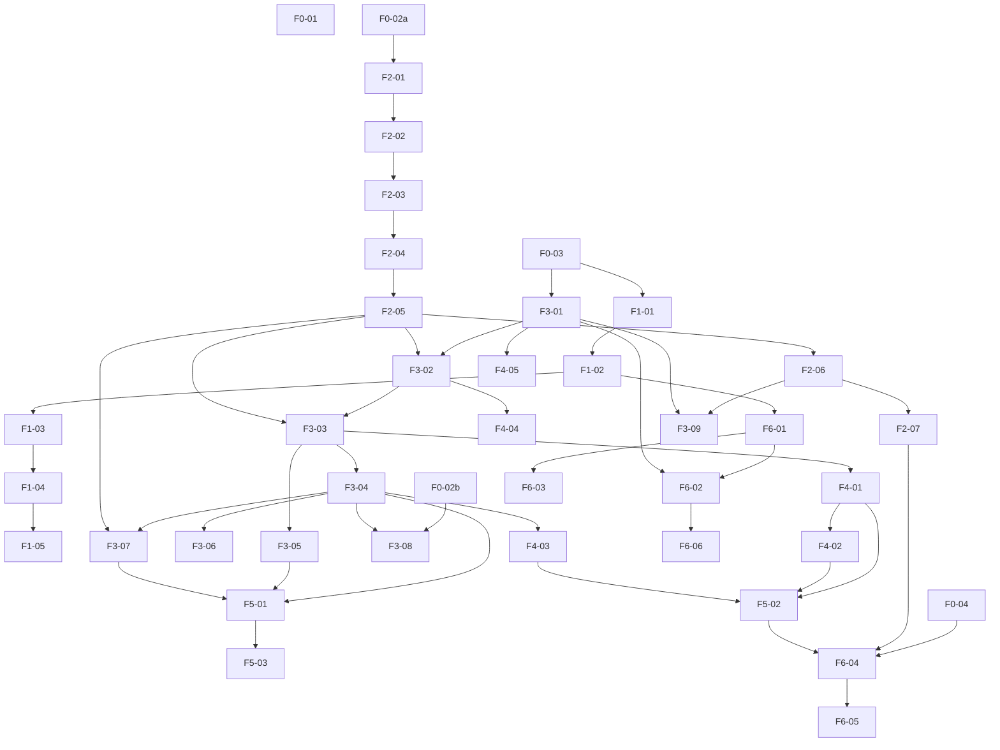

# Backlog

Work for the current delivery, grouped by the scope phases. Story identifiers
are `F<phase>-<n>`.

Estimates are set by the team at Planning, not here. Sprint membership lives in
the GitHub Projects `Sprint` field, not in this document — a backlog that
duplicates the board drifts from it within a week.

Priority: **P0** the delivery fails without it · **P1** required, schedulable
later · **P2** optional.

## Dependency graph

The two setup chains — infrastructure (`F1-*`) and the data model (`F0-02a` ->
`F2-*`) — run in parallel and converge at `F3-03`, once both the application
skeleton and the schema exist to authenticate against. The early-deployment
branch (`F1-02` -> `F6-01` -> `F6-02`) is deliberately shallow so a reverse
proxy and process manager exist as soon as the application serves a page.

---

## Phase 0 — Preparation

| ID | Story | Priority | Depends on |
|---|---|---|---|
| F0-01 | Reset the repository, documentation and board to the monolith scope | P0 | — |
| F0-02a | Decide the company name and business domain identity | P0 | — |
| F0-02b | Decide the design system for the interface | P0 | — |
| F0-03 | Every member has a GCP account, the SDK CLI, an editor and Git working | P0 | — |
| F0-04 | Confirm the host assignment and whether the team delivers once (Q-1, Q-2) | P0 | — |

**F0-02 is split.** Company name and design system are independent decisions
gated on different open questions (`docs/scope.md` §8, Q-3 and Q-4), and only
one of them feeds the data model chain. `F2-01` needs the business domain
identity (Q-3) to model against; it does not need the design system (Q-4),
which only `F3-08` consumes. Bundling both under one story meant `F2-01`
carried a blocker it had no reason to carry. Both are now resolved: the
company name is MOSAIQ, and the design system is recorded in
[ADR-0002](adr/0002-mosaiq-identity-and-design-system.md).

## Phase 1 — GCP infrastructure

| ID | Story | Priority | Depends on |
|---|---|---|---|
| F1-01 | Create the Compute Engine instance: e2-standard-2, 50 GB persistent disk, CentOS 10 Stream | P0 | F0-03 |
| F1-02 | Firewall rules allowing HTTP/80 and SSH/22; SSH access verified by every member | P0 | F1-01 |
| F1-03 | Install PostgreSQL from the official repository on the instance | P0 | F1-02 |
| F1-04 | Configure `postgresql.conf` and `pg_hba.conf` for remote access by the application role | P0 | F1-03 |
| F1-05 | Create the application database role with least privilege, separate from the owner | P0 | F1-04 |

## Phase 2 — Database

| ID | Story | Priority | Depends on |
|---|---|---|---|
| F2-01 | Conceptual model: entities, attributes, relationships, functional and multivalued dependencies | P0 | F0-02a |
| F2-02 | Normalize to 4NF, with a written justification for each decision | P0 | F2-01 |
| F2-03 | Logical model: ER diagram and data dictionary | P0 | F2-02 |
| F2-04 | `sql/00_create_database.sql` | P0 | F2-03 |
| F2-05 | `sql/01_schema.sql` with primary keys, foreign keys, `UNIQUE`, `CHECK` and indexes | P0 | F2-04 |
| F2-06 | `sql/02_seed_30_per_table.sql`, at least 30 rows per table | P0 | F2-05 |
| F2-07 | Integrity verification: positive and negative cases, with evidence | P0 | F2-06 |

**F2-02 is the phase's real deliverable.** The scripts are mechanical once the
model is right; a model that is wrong is discovered during Phase 3 and costs the
application layer that was built on top of it.

## Phase 3 — Application

| ID | Story | Priority | Depends on |
|---|---|---|---|
| F3-01 | Flask application skeleton organized by layers | P0 | F0-03 |
| F3-02 | Database connection driven by environment variables | P0 | F3-01, F2-05 |
| F3-03 | Authentication: login, logout, password hashing | P0 | F3-02, F2-05 |
| F3-04 | Administrator module: complete CRUD over every catalog | P0 | F3-03 |
| F3-05 | Regular user module: listing, search and detail views | P0 | F3-03 |
| F3-06 | User management: create, edit, deactivate | P0 | F3-04 |
| F3-07 | Image handling: upload JPG/PNG/WebP, store under `uploads/`, keep the path in the database | P0 | F3-04, F2-05 |
| F3-08 | Apply the chosen design system across the interface | P1 | F0-02b, F3-04 |
| F3-09 | One-command environment bootstrap: create the database, apply the schema, load seed data and start the application | P1 | F2-06, F3-01 |

**F3-02 depends on the schema, not the infrastructure role.** Connecting
through environment variables needs a database to connect to (`F2-05`), not
the provisioned least-privilege VM role (`F1-05`) — that role is an
operational concern, not a precondition for writing the connection code.
Chaining Phase 3 through five infrastructure stories put them on the critical
path for no reason; the least-privilege runtime role is instead verified as an
acceptance criterion at `F6-02`, where the application is actually deployed
against it. `F3-07` also gains `F2-05`: the schema stores the image path
alongside the catalog row, so it has to exist before an upload can be
persisted.

## Phase 4 — Security and roles

| ID | Story | Priority | Depends on |
|---|---|---|---|
| F4-01 | Roles and permissions with an authorization middleware enforcing them at the route level | P0 | F3-03 |
| F4-02 | Single administrator: refused by the application **and** by a partial unique index | P0 | F4-01 |
| F4-03 | Input validation and sanitization; every SQL statement parameterized | P0 | F3-04 |
| F4-04 | Secure sessions; no secrets in source, all configuration in `.env` | P0 | F3-02 |
| F4-05 | Controlled error handling and basic application logging | P1 | F3-01 |

**F4-02 needs both halves.** The application check alone is bypassed by a direct
`INSERT`; the index alone produces an unexplained database error in the user
interface. Neither is sufficient by itself.

## Phase 5 — Testing and quality

| ID | Story | Priority | Depends on |
|---|---|---|---|
| F5-01 | Functional tests over registration, login, each CRUD module and image upload | P0 | F3-04, F3-05, F3-07 |
| F5-02 | Negative tests: unauthorized access, invalid data, controlled errors | P0 | F4-01, F4-02, F4-03 |
| F5-03 | Code review pass over consistency, error handling and logging | P1 | F5-01 |

**"Phase 3" and "Phase 4" are not issues.** They cannot be expressed as a
GitHub relationship, so `F5-01` and `F5-02` are enumerated against the actual
stories they exercise. Enumerating also drops `F3-08` from `F5-01`'s
blockers — it is P1 and cosmetic, and gating functional tests on the design
system pass would hold up testing for a story that doesn't affect behavior.

## Phase 6 — Deployment and publication

| ID | Story | Priority | Depends on |
|---|---|---|---|
| F6-01 | NGINX or Apache configured as a reverse proxy in front of the application | P0 | F1-02 |
| F6-02 | Gunicorn under `systemd`, restarting automatically | P0 | F6-01, F3-01 |
| F6-03 | SSL certificate with forced HTTPS | P2 | F6-01 |
| F6-04 | Publish the documentation and evidence page on the assigned host | P0 | F0-04, F2-07, F5-02 |
| F6-05 | Final verification: links, images, downloads, checked in a private window | P0 | F6-04 |
| F6-06 | Continuous deployment: automatically update the assigned host on every merge to `main` | P1 | F6-02 |

**F6-06 targets one environment, not two.** There is a single GCP instance
(`docs/scope.md` C-5) and a single assigned host; `develop` stays an
integration branch gated by CI, but nothing deploys from it. The pipeline
triggers only on merge to `main`, after review, and needs `F6-02` — a
`systemd`-managed `gunicorn` process already has to exist for the pipeline to
restart it. The single-environment decision is recorded as an ADR as part of
this story, not assumed silently.

**F6-04 needs the evidence it publishes to exist.** As written, its only
blocker was `F0-04` (the host assignment), which made it look startable in
week one — but the page carries integrity evidence (`F2-07`) and negative-test
results (`F5-02`), neither of which exists that early.

**Deploy early.** F6-01 and F6-02 depend on almost nothing and are scheduled as
soon as the application serves a single page. A first deployment attempted near
the delivery date is the most common way this kind of project fails.
