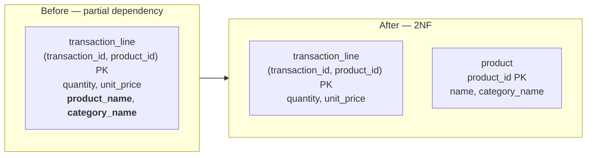
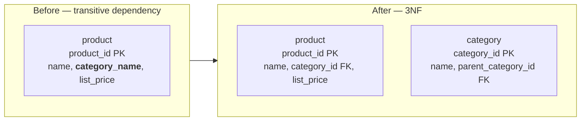
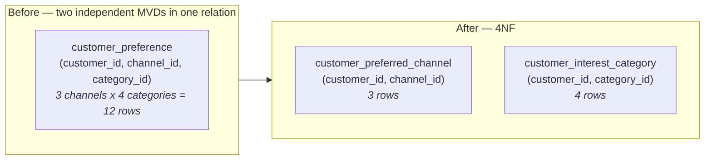
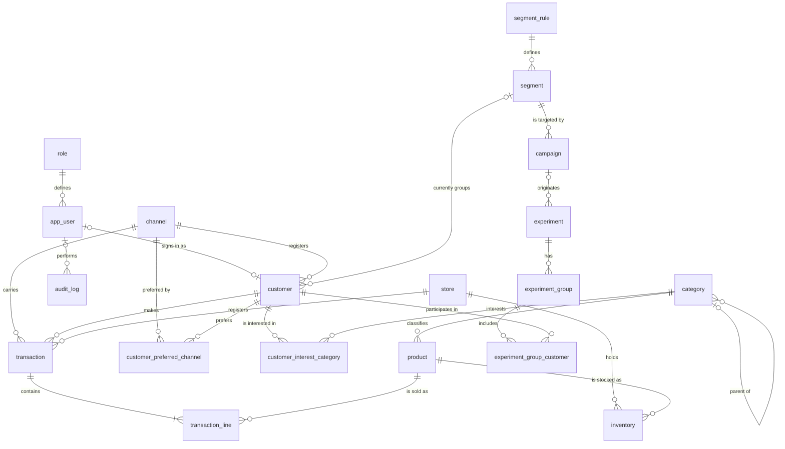

# Data model

The PostgreSQL model for MOSAIQ: the conceptual model, the normalization to
fourth normal form with the reason for each step, and the logical model as an
ER diagram and a data dictionary.

The model is implemented by [`sql/01_schema.sql`](../sql/01_schema.sql). Where
this document and that script disagree, the script is right and this document
is a bug — everything below was checked against it.

Stories: F2-01 (conceptual model), F2-02 (normalization), F2-03 (logical model).

---

## 1. Conceptual model

### Entities

| Entity | What it is |
|---|---|
| `role` | A permission profile. Seven exist; see the matrix below |
| `app_user` | Someone who signs in. Exactly one holds the administrator role |
| `customer` | Someone the business sells to. Not every customer signs in |
| `channel` | A route to market: mobile app, web, physical store, marketplace, call centre |
| `category` | A product classification, self-referencing so a category can have a parent |
| `product` | Something sold, priced, and classified into one category |
| `store` | A physical location that registers sales and holds inventory |
| `transaction` | One sale: a customer, at a store, through a channel, at a time |
| `transaction_line` | One product within one sale, with its quantity and the price actually paid |
| `inventory` | Stock of one product at one store |
| `segment_rule` | The RFM bands that define a segment |
| `segment` | A named group of customers, valid over a period, defined by one rule |
| `campaign` | Marketing action aimed at one segment, over a date range, in a status |
| `experiment` | An A/B test, optionally attached to a campaign, measuring one metric |
| `experiment_group` | A control or treatment arm of an experiment |
| `audit_log` | Who changed which business rule or catalog row, when, and to what |

### Relationships

- `app_user` (N) — has — (1) `role`
- `customer` (1) — makes — (N) `transaction`
- `store` (1) — registers — (N) `transaction`
- `transaction` (1) — contains — (N) `transaction_line` (N) — references — (1) `product`
- `product` (N) — belongs to — (1) `category`
- `category` (N) — is a child of — (0..1) `category`
- `customer` (N) — currently belongs to — (0..1) `segment`
- `segment` (N) — is defined by — (1) `segment_rule`
- `campaign` (N) — targets — (1) `segment`
- `experiment` (1) — has — (N) `experiment_group` — includes — (N) `customer`
- `inventory` (N) — is stock of — (1) `product` at (1) `store`
- `customer` (1) — prefers — (N) `channel`
- `customer` (1) — is interested in — (N) `category`
- `audit_log` records events over any audited entity

### Permission matrix

The seven roles and what each may reach are specified in
[`requirements.md`](requirements.md) §3. It is not repeated here: two copies of a
matrix drift, and the one that governs the authorization middleware is the one
next to the requirements it serves.

`role` holds those seven rows. Which user holds which is data, not schema — with
the single exception of the administrator, of whom there is exactly one:

```sql
CREATE UNIQUE INDEX ux_app_user_single_administrator
    ON app_user (role_id) WHERE role_id = 1;
```

Every row the predicate admits holds the same `role_id`, so uniqueness over that
column admits exactly one of them. The literal `1` is a coupling worth stating:
an index predicate must be immutable, so it cannot join `role` to find `ADMIN`
by its code, and the schema therefore depends on the seed giving `ADMIN`
`role_id` 1. `tests/test_single_administrator.py` asserts the two still agree,
so renumbering the roles fails the build rather than quietly disarming the rule.

The rule's other direction — never *zero* administrators — is not here, because
no unique index can require a row to exist. It lives in `web/services/users.py`,
and [`business-rules.md`](business-rules.md) RN-01 explains the split.

### Dependencies

**Functional.** Each surrogate key determines every non-key attribute of its
row: `product_id → sku, name, category_id, list_price, image_path, is_active`,
and equivalently for the other entities. Two candidate keys carry a functional
dependency of their own and are therefore `UNIQUE`: `sku → product_id` and
`email → user_id`.

The composite keys behave the same way:
`(transaction_id, product_id) → quantity, unit_price` and
`(store_id, product_id) → quantity_on_hand, updated_at`.

**Multivalued.** One customer has several preferred channels *and* several
categories of interest, and the two facts are independent — knowing a
customer's channels tells you nothing about their categories. Written as
multivalued dependencies over a single preference relation:

```
customer_id ↠ channel_id
customer_id ↠ category_id
```

This is the dependency the fourth normal form step removes, in §2.4.

---

## 2. Normalization

Each step names the anomaly it removes. A model that reaches 4NF without
recording what it fixed cannot be reviewed, and this justification is a graded
deliverable in its own right.

### 2.1 First normal form

The starting relations repeated groups and mixed independent facts:

- `transaction_line` carried `product_name` and `category_name` alongside every
  sale line.
- `product` stored `category_name` as free text.
- `customer_preference` held a channel and a category of interest in one row.

1NF requires atomic values and no repeating groups. The repetition above is
real duplication, not just verbosity: the same product name is stored once per
line item sold.

### 2.2 Second normal form

`transaction_line` has the composite key `(transaction_id, product_id)`.
`product_name` and `category_name` depend on `product_id` alone — part of the
key, not the whole of it. That is a partial dependency, so both attributes move
out to `product`:



`unit_price` deliberately stays on the line. It is not the product's price; it
is the price actually charged in that sale, and it must survive a later price
change on the product.

### 2.3 Third normal form

`product` still held `category_name`, which depends on the category, which
depends on the product — a transitive dependency. Renaming a category would
have meant updating every product row carrying that text, and any missed row
becomes a second spelling of the same category. `category` becomes a table and
`product` references it:



`category` is self-referencing so that a hierarchy — Dairy → Milk — is data
rather than two columns.

### 2.4 Fourth normal form

`customer_preference(customer_id, channel_id, category_id)` is in 3NF and still
wrong. Channels and categories are independent multivalued facts about a
customer, so the relation forces one row per *combination*: a customer with 3
preferred channels and 4 categories of interest needs 12 rows to say something
that is really 3 + 4 = 7 facts. Worse, every one of those 12 rows asserts a
channel–category pairing the business never claimed, and adding a fourth
channel means inserting four more rows or leaving the relation inconsistent.

4NF requires that a relation carry no more than one independent multivalued
dependency. The decomposition splits it in two:



The decomposition is lossless: joining the two tables on `customer_id`
reproduces exactly the original relation, which is the defining property of a
valid 4NF decomposition.

Every other relation in the model is already in 4NF. The remaining composite-key
tables — `transaction_line`, `inventory`, `experiment_group_customer` — each
carry a single multivalued fact plus attributes that depend on the whole key,
so there is nothing to decompose.

---

## 3. Logical model

### ER diagram



### Data dictionary

Nullability is stated for every column. `PK` primary key, `FK` foreign key,
`UQ` unique, `NN` not null.

#### `role`

| Column | Type | Null | Constraints | Meaning |
|---|---|---|---|---|
| `role_id` | `SMALLINT` | NN | PK | Role identifier |
| `code` | `VARCHAR(40)` | NN | UQ | Stable code the middleware matches on, e.g. `ADMIN` |
| `description` | `VARCHAR(160)` | yes | — | Human-readable purpose |

#### `channel`

| Column | Type | Null | Constraints | Meaning |
|---|---|---|---|---|
| `channel_id` | `SMALLINT` | NN | PK | Channel identifier |
| `name` | `VARCHAR(60)` | NN | UQ | `mobile_app`, `web`, `physical_store`, `marketplace`, `call_center` |

#### `category`

| Column | Type | Null | Constraints | Meaning |
|---|---|---|---|---|
| `category_id` | `SMALLINT` | NN | PK | Category identifier |
| `name` | `VARCHAR(80)` | NN | UQ | Category name |
| `parent_category_id` | `SMALLINT` | yes | FK → `category`, `ON DELETE RESTRICT` | Parent in the hierarchy; `NULL` at the top level |

#### `store`

| Column | Type | Null | Constraints | Meaning |
|---|---|---|---|---|
| `store_id` | `SMALLINT` | NN | PK | Store identifier |
| `name` | `VARCHAR(100)` | NN | — | Store name |
| `city` | `VARCHAR(80)` | NN | — | City |
| `state` | `VARCHAR(80)` | NN | — | State |
| `is_active` | `BOOLEAN` | NN | default `TRUE` | Whether the store trades today |

#### `segment_rule`

| Column | Type | Null | Constraints | Meaning |
|---|---|---|---|---|
| `rule_id` | `INT` | NN | PK | Rule identifier |
| `rule_code` | `VARCHAR(40)` | NN | UQ | Stable code, e.g. `RULE_007` |
| `r_min`, `r_max` | `SMALLINT` | NN | `CHECK BETWEEN 1 AND 5` | Recency band |
| `f_min`, `f_max` | `SMALLINT` | NN | `CHECK BETWEEN 1 AND 5` | Frequency band |
| `m_min`, `m_max` | `SMALLINT` | NN | `CHECK BETWEEN 1 AND 5` | Monetary band |

Table constraint: `r_min <= r_max AND f_min <= f_max AND m_min <= m_max`.

#### `segment`

| Column | Type | Null | Constraints | Meaning |
|---|---|---|---|---|
| `segment_id` | `INT` | NN | PK | Segment identifier |
| `name` | `VARCHAR(80)` | NN | UQ | Segment name |
| `description` | `VARCHAR(255)` | yes | — | What the segment means commercially |
| `rule_id` | `INT` | NN | FK → `segment_rule`, `RESTRICT` | The RFM bands that define it |
| `valid_from` | `DATE` | NN | — | First day the definition applies |
| `valid_to` | `DATE` | yes | `CHECK >= valid_from` | Last day; `NULL` while current |

#### `app_user`

| Column | Type | Null | Constraints | Meaning |
|---|---|---|---|---|
| `user_id` | `UUID` | NN | PK, default `gen_random_uuid()` | User identifier |
| `role_id` | `SMALLINT` | NN | FK → `role`, `RESTRICT` | The one role the user holds |
| `name` | `VARCHAR(120)` | NN | — | Display name |
| `email` | `VARCHAR(160)` | NN | UQ, `CHECK ~ '@'` | Login identity |
| `password_hash` | `VARCHAR(255)` | NN | — | argon2id hash. Never the password, never logged, excluded from the audit payload |
| `is_active` | `BOOLEAN` | NN | default `TRUE` | Deactivation is how F3-06 removes access without deleting history |
| `created_at` | `TIMESTAMPTZ` | NN | default `now()` | Account creation |

Named `app_user` because `user` is a reserved word in PostgreSQL.

#### `customer`

| Column | Type | Null | Constraints | Meaning |
|---|---|---|---|---|
| `customer_id` | `UUID` | NN | PK, default `gen_random_uuid()` | Customer identifier |
| `user_id` | `UUID` | yes | UQ, FK → `app_user`, `SET NULL` | The account this customer signs in with, if any |
| `name` | `VARCHAR(120)` | NN | — | Customer name |
| `email` | `VARCHAR(160)` | yes | UQ, `CHECK ~ '@'` | Contact address |
| `phone` | `VARCHAR(20)` | yes | — | Contact number |
| `registration_channel_id` | `SMALLINT` | NN | FK → `channel`, `RESTRICT` | Where the customer was acquired |
| `current_segment_id` | `INT` | yes | FK → `segment`, `SET NULL` | Segment the customer currently sits in |
| `registered_on` | `DATE` | NN | default `CURRENT_DATE` | Registration date |

`current_segment_id` is a **known limitation**, recorded here rather than left
to be discovered. [`roadmap.md`](roadmap.md) states that segment assignments
must be kept as history and never updated in place, because overwriting them
destroys exactly the migration history the project exists to report on. The
column stays for this delivery because there is no segmentation run to produce
history yet; the segment-history module replaces it with an assignment table
carrying `valid_from`/`valid_to` and a constraint that stops a customer holding
two open assignments. See [ADR-0004](adr/0004-model-ahead-of-the-deferred-segmentation-modules.md).

#### `customer_preferred_channel`

| Column | Type | Null | Constraints | Meaning |
|---|---|---|---|---|
| `customer_id` | `UUID` | NN | PK, FK → `customer`, `CASCADE` | The customer |
| `channel_id` | `SMALLINT` | NN | PK, FK → `channel`, `CASCADE` | A channel they prefer |

#### `customer_interest_category`

| Column | Type | Null | Constraints | Meaning |
|---|---|---|---|---|
| `customer_id` | `UUID` | NN | PK, FK → `customer`, `CASCADE` | The customer |
| `category_id` | `SMALLINT` | NN | PK, FK → `category`, `CASCADE` | A category they are interested in |

These two are the 4NF decomposition from §2.4.

#### `product`

| Column | Type | Null | Constraints | Meaning |
|---|---|---|---|---|
| `product_id` | `INT` | NN | PK | Product identifier |
| `sku` | `VARCHAR(40)` | NN | UQ | Stock keeping unit |
| `name` | `VARCHAR(150)` | NN | — | Product name |
| `category_id` | `SMALLINT` | NN | FK → `category`, `RESTRICT` | Its category |
| `list_price` | `NUMERIC(10,2)` | NN | `CHECK >= 0` | Current list price |
| `image_path` | `VARCHAR(255)` | yes | — | Path under `UPLOAD_DIR`. The database stores the path; the bytes are never versioned and never held in a column |
| `is_active` | `BOOLEAN` | NN | default `TRUE` | Whether it is sold today |

#### `transaction`

| Column | Type | Null | Constraints | Meaning |
|---|---|---|---|---|
| `transaction_id` | `BIGINT` | NN | PK, `GENERATED ALWAYS AS IDENTITY` | Sale identifier |
| `customer_id` | `UUID` | NN | FK → `customer`, `RESTRICT` | Who bought |
| `store_id` | `SMALLINT` | NN | FK → `store`, `RESTRICT` | Where |
| `channel_id` | `SMALLINT` | NN | FK → `channel`, `RESTRICT` | Through which channel |
| `occurred_at` | `TIMESTAMPTZ` | NN | — | When the sale happened |
| `total` | `NUMERIC(12,2)` | NN | `CHECK >= 0` | Sale total |

#### `transaction_line`

| Column | Type | Null | Constraints | Meaning |
|---|---|---|---|---|
| `transaction_id` | `BIGINT` | NN | PK, FK → `transaction`, `CASCADE` | The sale |
| `product_id` | `INT` | NN | PK, FK → `product`, `RESTRICT` | The product |
| `quantity` | `INT` | NN | `CHECK > 0` | Units sold |
| `unit_price` | `NUMERIC(10,2)` | NN | `CHECK >= 0` | Price actually charged, not the product's list price |

#### `campaign`

| Column | Type | Null | Constraints | Meaning |
|---|---|---|---|---|
| `campaign_id` | `INT` | NN | PK | Campaign identifier |
| `name` | `VARCHAR(120)` | NN | — | Campaign name |
| `segment_id` | `INT` | NN | FK → `segment`, `RESTRICT` | Segment targeted |
| `starts_on` | `DATE` | NN | — | Start |
| `ends_on` | `DATE` | NN | `CHECK >= starts_on` | End |
| `status` | `VARCHAR(20)` | NN | `CHECK IN ('DRAFT','ACTIVE','FINISHED','CANCELLED')` | Lifecycle state |

#### `experiment`

| Column | Type | Null | Constraints | Meaning |
|---|---|---|---|---|
| `experiment_id` | `INT` | NN | PK | Experiment identifier |
| `name` | `VARCHAR(120)` | NN | — | Experiment name |
| `campaign_id` | `INT` | yes | FK → `campaign`, `SET NULL` | Campaign it belongs to, if any |
| `target_metric` | `VARCHAR(60)` | NN | — | Metric measured, e.g. `CONVERSION` |
| `starts_on` | `DATE` | NN | — | Start |
| `ends_on` | `DATE` | yes | `CHECK >= starts_on` | End; `NULL` while running |

#### `experiment_group`

| Column | Type | Null | Constraints | Meaning |
|---|---|---|---|---|
| `group_id` | `INT` | NN | PK | Group identifier |
| `experiment_id` | `INT` | NN | FK → `experiment`, `CASCADE` | Its experiment |
| `kind` | `VARCHAR(20)` | NN | `CHECK IN ('CONTROL','TREATMENT')` | Which arm |

#### `experiment_group_customer`

| Column | Type | Null | Constraints | Meaning |
|---|---|---|---|---|
| `group_id` | `INT` | NN | PK, FK → `experiment_group`, `CASCADE` | The arm |
| `customer_id` | `UUID` | NN | PK, FK → `customer`, `CASCADE` | The customer in it |
| `assigned_at` | `TIMESTAMPTZ` | NN | default `now()` | When they were assigned |

#### `inventory`

| Column | Type | Null | Constraints | Meaning |
|---|---|---|---|---|
| `store_id` | `SMALLINT` | NN | PK, FK → `store`, `CASCADE` | The store |
| `product_id` | `INT` | NN | PK, FK → `product`, `CASCADE` | The product |
| `quantity_on_hand` | `INT` | NN | `CHECK >= 0` | Units in stock |
| `updated_at` | `TIMESTAMPTZ` | NN | default `now()` | Last stock update |

#### `audit_log`

| Column | Type | Null | Constraints | Meaning |
|---|---|---|---|---|
| `audit_id` | `BIGINT` | NN | PK, `GENERATED ALWAYS AS IDENTITY` | Entry identifier |
| `user_id` | `UUID` | yes | FK → `app_user`, `SET NULL` | Who acted; `NULL` when the actor is genuinely unknown |
| `entity` | `VARCHAR(60)` | NN | — | Table changed |
| `entity_pk` | `VARCHAR(80)` | NN | — | Primary key of the changed row, as text |
| `action` | `VARCHAR(20)` | NN | `CHECK IN ('INSERT','UPDATE','DELETE')` | What happened |
| `data_before` | `JSONB` | yes | — | Row before, `NULL` on insert |
| `data_after` | `JSONB` | yes | — | Row after, `NULL` on delete |
| `executed_at` | `TIMESTAMPTZ` | NN | default `now()` | When |

---

## 4. Physical model

**Key types.** `customer_id` and `user_id` are `UUID`, so records can be
created without a round trip to a sequence and without colliding if data is
ever loaded from more than one source. `transaction_id` and `audit_id` are
`BIGINT GENERATED ALWAYS AS IDENTITY`: high volume, insert-ordered, and never
exposed in a URL where a guessable identifier would matter. Catalogs use small
explicit integers because their rows are referenced by seed and by tests.

`gen_random_uuid()` is core in PostgreSQL 13 and later, so no extension is
needed for it. `pg_trgm` is installed for the name searches F3-05 performs.

**Delete rules.** `RESTRICT` on catalog references — a category with products
cannot be deleted, and neither can a customer with sales. `CASCADE` on the
bridge tables, where a child row has no meaning without its parent.
`SET NULL` where the reference is optional context rather than structure:
`customer.current_segment_id`, `audit_log.user_id`.

**Indexes.**

| Index | Columns | Query it serves |
|---|---|---|
| `idx_transaction_customer_date` | `transaction (customer_id, occurred_at)` | A customer's purchase history; the RFM window later |
| `idx_transaction_store_date` | `transaction (store_id, occurred_at)` | Sales by store over a period |
| `idx_transaction_line_product` | `transaction_line (product_id)` | Units sold of one product |
| `idx_customer_segment` | `customer (current_segment_id)` | Members of a segment |
| `idx_product_category` | `product (category_id)` | Catalog browsing by category |
| `idx_campaign_segment` | `campaign (segment_id)` | Campaigns aimed at a segment |
| `idx_experiment_group_customer_cust` | `experiment_group_customer (customer_id)` | Experiments a customer is in |
| `idx_audit_log_entity` | `audit_log (entity, entity_pk)` | The history of one row |

**Partitioning is not implemented.** `transaction` is the fastest-growing table
and range partitioning by date is the obvious eventual move, but at 300 seed
rows it would add a partition key to the primary key and complicate the foreign
key from `transaction_line` for no measurable gain. Recorded as deferred, to be
revisited when transaction ingestion lands ([`roadmap.md`](roadmap.md)).

---

## 5. Audit strategy

One trigger function, `fn_audit()`, takes the audited table's primary key
column as its argument and writes to `audit_log` after every insert, update and
delete. Two groups of tables carry it:

| Group | Tables | Why |
|---|---|---|
| Business rules | `segment`, `segment_rule`, `campaign`, `experiment` | Changing a rule silently changes what every report means |
| Catalogs | `category`, `product`, `store`, `customer`, `app_user` | These are what the administrator module edits, so this is what the demonstration's audit trail shows |

Individual sales are **not** audited. Their volume and history already live in
`transaction` and `transaction_line`, and auditing them would double the write
cost of the busiest table in the model.

Two details worth knowing:

- `password_hash` is stripped from both JSON payloads before the row is
  written. Auditing `app_user` is what makes user management traceable; copying
  credentials into a second, longer-lived table is not part of that.
- The actor comes from the `mosaiq.user_id` setting on the connection, which
  F4-01 sets once the application knows who is signed in. Until then — and for
  anything the seed does — it is `NULL`, because the actor is genuinely
  unknown and a fabricated one would be worse than an absent one.

Retention: audit rows are kept indefinitely as compliance evidence. Archiving
by year is possible later and is not needed at this volume.

---

## 6. Where this differs from the delivery document

The model was designed in `PrimeraEntrega-MOSAIQ_IAC.pdf`. Five things in the
implementation differ from what that document says, each deliberately:

| Delivery document | Implementation | Why |
|---|---|---|
| `transaccion` range-partitioned by date | Not partitioned | See §4. Deferred, not dropped |
| Catalog tables `estado_campania`, `estado_experimento` | `CHECK` constraints on `campaign.status` and `experiment_group.kind` | Four fixed values that no administrator maintains are a constraint, not a catalog. A catalog table would need 30 seed rows it has no way to fill |
| Audit written with `row_to_json` | `to_jsonb` | `jsonb` is what the column stores; `to_jsonb` avoids a cast on every trigger call and allows the `- 'password_hash'` redaction |
| `auditoria.entidad_pk VARCHAR(20)` | `audit_log.entity_pk VARCHAR(80)` | A UUID primary key rendered as text is 36 characters and would not fit in 20 |
| UUIDs generated via the `pgcrypto` extension | `gen_random_uuid()` from core | Core since PostgreSQL 13. Passwords are hashed by the application with argon2, so nothing else needed `pgcrypto` |

Identifiers are in English throughout, per `AGENTS.md`; the delivery document
uses Spanish names for the same tables. The mapping is direct — `cliente` is
`customer`, `detalle_transaccion` is `transaction_line`, and so on.
