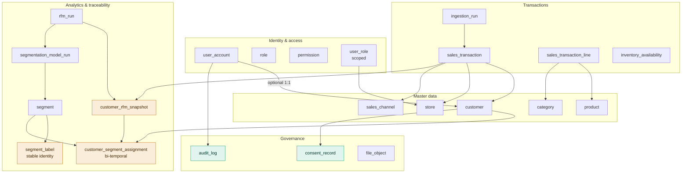
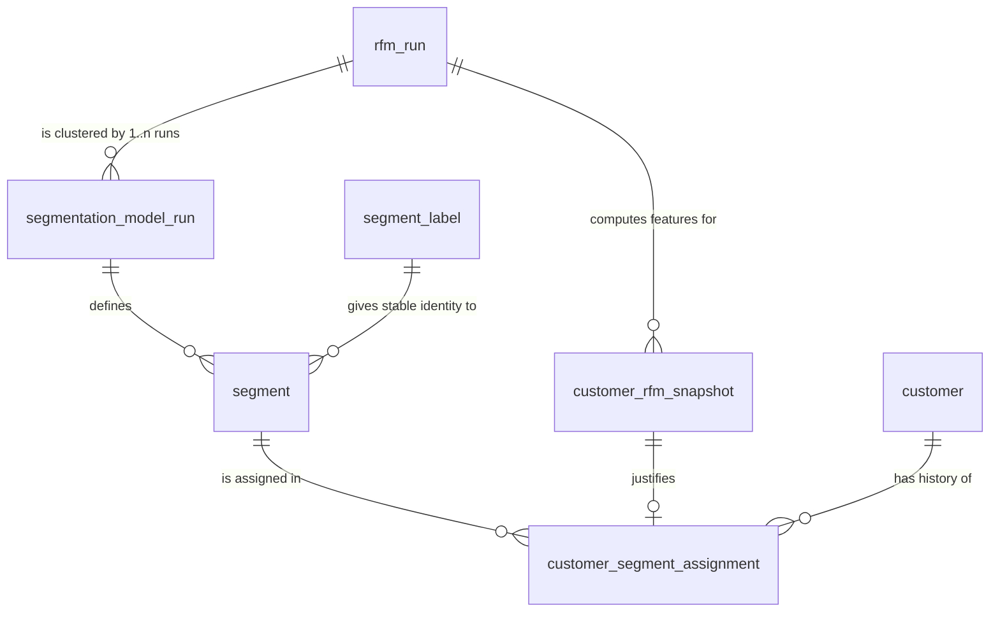

# PostgreSQL Data Model — Milestone 1

**Project:** Dynamic Segmentation and Retail Personalization Platform
**Story:** S0-04 — Frozen data model including segment traceability
**Authors:** Estefanía (lead), Marcelo (review)
**Version:** 0.9 — PROPOSED, freeze at Sprint 0 Planning 2026-08-10
**Physical model:** `infra/sql/schema/001_m1_initial_schema.sql` (authoritative)
**Generated ERD:** `docs/architecture/postgresql-physical-model.md`
**Verification:** `infra/sql/schema/verify_m1_schema.sql`

---

## 1. Scope boundary

The instruction driving this story was "design the model considering all system requirements". Those are two different deliverables and conflating them would be a mistake:

| | What it means | Delivered here |
|---|---|---|
| **Frozen** | DDL written, migration applied, code may depend on it, changes require a new migration and a note in this document | 27 tables, 3 views, 75 indexes — the M1 set |
| **Designed** | The M2/M3 entity is understood well enough to prove the M1 schema will accept it without a rewrite | §9 Extension contract |

Writing DDL in August for campaign, experiment and drift tables that nobody will use until October is waterfall planning with a Scrum label, and the columns would be wrong. What must be decided now is only the subset where **deferring the decision is more expensive than making it early** — because the cost lands on a table that will hold 100,000+ rows, or because every authorization call site would have to change. §3 lists exactly those and nothing else.

Requirements this model must not break, restated as design obligations:

1. Segments update **without losing historical traceability** — the central requirement.
2. Six behaviour changes must be *detectable and attributable*: purchase frequency, category mix, promotion response, store, spend level, channel.
3. Seven profiles, one of which (Store Manager) is scoped to a single store.
4. Three data stores with a defensible boundary, not a decorative one.
5. Four client applications sharing one authentication scheme and one API contract.
6. An auditor can reconstruct any customer's segment as of any past date.
7. LFPDPPP: purpose limitation, consent, and no real personal data.

---

## 2. Conventions

| Concern | Rule | Why |
|---|---|---|
| Table names | singular, `snake_case` | matches S0-10; `customer` reads better than `customers` in a join |
| Primary keys | `id bigint GENERATED ALWAYS AS IDENTITY` | `serial` is deprecated; identity cannot be overwritten by accident |
| Client-generated keys | none in M1; add `client_uuid uuid UNIQUE` only to the specific tables the mobile app writes offline in M3 | making all 100k+ line rows UUID costs index size and locality for no M1 benefit |
| Foreign keys | `<referenced_table>_id` | mechanical, so autogenerated names are predictable |
| Timestamps | `timestamptz`, stored UTC, rendered `America/Monterrey` | a naive timestamp in a segmentation window is a silent off-by-hours bug |
| Calendar values | `date` for analysis windows and birth dates | an analysis window has no time zone |
| Money | `numeric(14,2)` + `currency_code char(3)` | float money is indefensible in an audited system |
| Ratios and scores | `numeric(6,4)` | exact, comparable across runs |
| Enumerations | `varchar` + `CHECK`, or a lookup table when the value carries attributes | PostgreSQL `ENUM` values cannot be removed or reordered, and Alembic handles them badly |
| Soft delete | `deleted_at timestamptz` on catalog tables **only** | never on transactional or audit rows; every business-key unique index is partial `WHERE deleted_at IS NULL` |
| Object naming | `pk_ ux_ ix_ ck_ fk_ ex_` | required so Alembic can drop a constraint by name later |

Alembic must be configured with a naming convention in `env.py`, or autogenerate emits anonymous constraints that cannot be dropped in a later migration:

```python
NAMING_CONVENTION = {
    "pk": "pk_%(table_name)s",
    "ux": "ux_%(table_name)s_%(column_0_N_name)s",
    "ix": "ix_%(table_name)s_%(column_0_N_name)s",
    "ck": "ck_%(table_name)s_%(constraint_name)s",
    "fk": "fk_%(table_name)s_%(column_0_name)s_%(referred_table_name)s",
}
metadata = MetaData(naming_convention=NAMING_CONVENTION)
```

Two extensions are required: `btree_gist` (for the exclusion constraints) and `pg_trgm` (catalog substring search). Both must be created in the first migration, and both must be available in the container image — verify in S0-02.

---

## 3. Design decisions

Each decision states what happens if it is deferred instead. That column is the argument; the rest is bookkeeping.

### D-01 — The assignment history is bi-temporal, with two time axes

`customer_segment_assignment` carries `valid_from` / `valid_to` (**valid time** — when the customer was in the segment) *and* `recorded_at` / `superseded_at` (**decision time** — when the platform believed it).

The Sprint 0 backlog called the model "bi-temporal" but specified only one axis. That is valid-time versioning, and it cannot distinguish two situations that must never be confused:

- On 2026-01-01 customer X genuinely moved from *champions* to *at risk*.
- On 2026-01-01 we discovered the 2025-07-01 run used a mis-fitted scaler, and X was never *champions* at all.

With one axis, correcting the second case either destroys the record of what we once believed, or fabricates a behaviour change that never happened. Requirement 6 — *the auditor reconstructs any customer's segment as of any past date* — is ambiguous without the second axis, because "as of" can mean either. Cost: two columns and one index predicate. Deferring it means the correction path is invented during Sprint 2 under demo pressure.

### D-02 — `is_authoritative` on the assignment, and the uniqueness rule is scoped by it

The backlog specified a partial unique index on `customer_id WHERE valid_to IS NULL`. That index contradicts two other documents. `01-product-backlog-epics.md` (E-07) and the release plan both state that two runs coexist over the same population so that model comparison is possible — but the index forbids a second open assignment, so a challenger model cannot be scored against production without closing production's assignments. One of the two had to change.

Resolution: `segmentation_model_run.purpose ∈ {production, candidate, experiment}`, and assignments from non-production runs are written with `is_authoritative = false`. Uniqueness applies only to authoritative rows.

### D-03 — An `EXCLUDE` constraint replaces the partial unique index

```sql
EXCLUDE USING gist (customer_id WITH =, tstzrange(valid_from, valid_to) WITH &&)
  WHERE (is_authoritative AND superseded_at IS NULL)
  DEFERRABLE INITIALLY IMMEDIATE
```

Strictly stronger than the specified index, which only caught *two open* rows. This catches any overlapping interval, including two closed intervals that overlap — the more likely bug, and the one that produces history looking plausible while being wrong.

`DEFERRABLE INITIALLY IMMEDIATE` was chosen after testing all three modes on PostgreSQL 16:

| Mode | Overlap fails fast | Loader may insert before closing |
|---|---|---|
| `NOT DEFERRABLE` | yes | no |
| `INITIALLY DEFERRED` | no — error surfaces at `COMMIT` with no statement context | yes |
| `INITIALLY IMMEDIATE` | yes | yes, via `SET CONSTRAINTS ... DEFERRED` inside the run transaction |

**Hard rule for the pipeline:** the closing `valid_to` and the opening `valid_from` must be the *same instant*, taken from `segmentation_model_run.completed_at`. `tstzrange` is half-open, so `[t1,t2)` and `[t2,∞)` neither overlap nor leave a gap. Any other pairing produces a rejected insert or an unrepresented interval.

### D-04 — `segment_label` gives segments a stable identity across runs

This is the decision with the largest blast radius, and it is not in the current documents.

Segments are scoped to a run, which is correct. The backlog then defines migration detection as "a query over two consecutive assignments for a customer". Taken literally that compares `segment_id` — and because every run creates new `segment` rows, **`segment_id` differs for every customer on every run**. The migration report would say 100% of customers migrated, every time. Verified: `verify_m1_schema.sql` CHECK 7.

Migration must therefore be defined on a stable label. `segment_label` is a lookup keyed by code (`champions`, `at_risk`, …) with a `value_rank`, and `segment.label_code` points at it, unique within a run.

Two consequences the team must accept:

1. **Labelling is algorithmic, not cosmetic.** K-means cluster indices are arbitrary and unstable between runs. Mapping cluster → label must be a deterministic rule over centroid position, recorded in `segmentation_model_run.labelling_strategy`. If a human names clusters by hand after each run, migration detection reports label-assignment noise as customer behaviour. **This is a task on Estefanía's plate that nobody has estimated.**
2. `value_rank` makes migration *direction* (upgrade / lateral / downgrade) a query, not application logic — which is what uplift measurement (E-26) will need.

Deferring it: campaigns in M2 cannot target a segment, because the segment they targeted stops existing at the next run. The workaround teams reach for is string-matching on segment names.

### D-05 — `rfm_run` is the parent of `segmentation_model_run`, not a child

The backlog put `analysis_window_start/end` on `segmentation_model_run` and made `customer_rfm_snapshot` a child of it. Conceptually that is backwards, and it costs three things:

- Comparing k=4 against k=6 requires **identical features**. With RFM under the segmentation run, each candidate k recomputes its own snapshots, so the comparison is confounded by two variables instead of one.
- 2,000 customers × every candidate k of redundant snapshot rows.
- M2's drift detection (E-20) and incremental segmentation (E-18) consume features *without* clustering. Under the original shape they must trigger a fake segmentation run to get them.

Split: `rfm_run` owns the analysis window, quintile strategy and features. `segmentation_model_run.rfm_run_id` points at it. One RFM run, many clusterings.

### D-06 — The snapshot carries behavioural features, not only R, F and M

The problem statement names six behaviour changes. R, F and M cover two of them (frequency, spend). A report that says "customer moved from *loyal* to *at risk*" without being able to say *why* does not answer the question the project was set.

Added to `customer_rfm_snapshot`: `top_category_id`, `top_category_share`, `distinct_category_count`, `dominant_channel_code`, `digital_share`, `dominant_store_id`, `distinct_store_count`, `avg_order_value`, `avg_interpurchase_days`, `promo_response_rate`, `return_count`, `return_amount`, `tenure_days`. The view `v_customer_behavior_delta` diffs consecutive snapshots and reports `category_shifted`, `channel_switched`, `store_switched` plus frequency and spend deltas.

These are also the category-mix features E-06 needs for clustering, so the same columns serve both.

### D-07 — Returns are first-class rows with negative amounts

`sales_transaction.transaction_type ∈ {sale, return}`, with a sign constraint and an optional `original_transaction_id`.

This is not hypothetical. Public retail transaction datasets — the intended base for S0-08 — commonly encode credit notes as negative-quantity documents. Treating them as sales inflates Monetary, and "reduce gasto" becomes unmeasurable because refunds are invisible. A return is permitted *without* an original, because historical imports routinely contain credit notes whose original falls outside the window.

### D-08 — Ingestion has a natural key

`UNIQUE (source_system, external_transaction_id)`. The S0-08 acceptance criterion — *`make seed` twice, row counts unchanged* — is not achievable without one; the only alternative is truncating first, which is not idempotency. Also gives the CSV upload path a defined behaviour on re-upload: `rows_duplicate` in the rejection report instead of silent double counting.

### D-09 — Consumers and staff are separate entities linked one-to-one

`user_account.customer_id` nullable and unique. Staff accounts have no `customer`; most customers have no account.

Rejected alternative: one `user_account` table with a `customer` role. The seed dataset supplies 2,000+ customers who will never authenticate; routing them through `user_account` pollutes user administration, makes the audit `actor` semantics ambiguous, and forces a fake password hash per row. The link exists because the mobile app authenticates consumers through the same JWT scheme (ADR-001).

### D-10 — Authorization has a scope dimension from day one

`user_role.scope_store_id`, with `role.scope_kind ∈ {global, store}` and a trigger enforcing consistency.

Store Manager sees segments and promotions **for their store only**. A pure role→permission model has nowhere to put "which store", so the scope is retrofitted in M3 — and retrofitting row-level scope touches every authorization decision, every query, and the permission decorator. Cost now: one nullable column and a trigger.

### D-11 — Consent is versioned, not a boolean

`consent_purpose` × `privacy_notice_version` × `consent_record`, with an exclusion constraint preventing overlapping intervals per customer per purpose. Withdrawal closes the interval and opens a denial.

`customer.consent_flag boolean` cannot answer the question LFPDPPP actually asks: *which purpose was consented, under which notice version, when, through which channel, and was it in force at the moment of the run that profiled them*. R-12 names this as graded content, not only a real-world concern. Note the recurring shape: this is the same valid-time pattern as D-01, deliberately, so there is one convention in the codebase rather than three.

### D-12 — The line stores the category as at the time of sale

`sales_transaction_line.category_id`, copied from the product at ingestion.

`product.category_id` is mutable master data. If category-mix features read it live, re-categorizing one product silently rewrites the feature history of every past run and every stored RFM snapshot becomes irreproducible — which destroys D-01's guarantee from a completely different direction.

### D-13 — `product.attributes jsonb` with a GIN index

Content-based recommendation (E-22) has no feature space if a product has nothing but a category. Adding attributes after 100,000 lines exist is a backfill exercise against data whose provenance has been lost. Cost now: one column. A typed attribute schema goes in `docs/data/product-attribute-schema.md`; JSONB rather than EAV because the read pattern is "give me this product's attributes", never "find all products with attribute X across types".

### D-14 — `audit_log` is polymorphic and append-only, enforced at two levels

`entity_type` + `entity_id varchar` with **no** foreign key: a real FK would block deletion of any audited row and would require one nullable column per entity type. `actor_email` is a snapshot, so renaming an account does not rewrite history.

Append-only is enforced by a statement trigger *and* by grants — which requires the application to connect as a role that does not own the schema. **This is a hard dependency on S0-02 and S0-03: `.env` needs two DSNs**, `DATABASE_URL` (runtime, restricted) and `DATABASE_MIGRATION_URL` (owner). If the app connects as owner, the `REVOKE` has no effect and append-only is decoration. Tell Max and Raquel before they finish the compose file, not at Wednesday's refinement.

### D-15 — Deferred, with the reason stated

| Not built in M1 | Why |
|---|---|
| `notification` | no consumer until the mobile app exists (E-15, M2) |
| `campaign`, `experiment`, `experiment_variant`, `experiment_assignment` | require stable segment identity, which D-04 provides; shape in §9 |
| `drift_check` | requires two comparable runs to exist first |
| Monthly partitioning of `audit_log` | 100k transactions will not produce enough audit volume; documented trigger at 5M rows |
| `recommendation_event` | belongs in MongoDB, not PostgreSQL |
| Inventory history | telemetry; MongoDB. `inventory_availability` in PostgreSQL is current state only |

`system_setting` **is** built, despite E-14 being M2, because the Sprint 2 demonstration runs the pipeline twice with different parameters and having those defaults in one auditable place costs one table.

---

## 4. Conceptual model

Five subject areas. The arrows that matter are the ones crossing between them.



### 4.1 The traceability core



Read the cardinality `rfm_run ||--o{ segmentation_model_run` carefully — that one relationship is D-05, and it is what makes model comparison a fair comparison.

---

## 5. Logical model — the parts the DDL cannot explain

The DDL in `001_m1_initial_schema.sql` is the authoritative attribute list and carries `COMMENT ON` for every non-obvious column. Repeating it here would create two sources of truth. What follows is only what a reader cannot infer from the DDL.

### 5.1 `customer_segment_assignment` — the four timestamps

| Column | Axis | Meaning | Set by |
|---|---|---|---|
| `valid_from` | valid | the customer was in this segment from here | the run that created it, `= completed_at` |
| `valid_to` | valid | until here, exclusive; `NULL` = still current | the *next* production run |
| `recorded_at` | decision | the platform first believed this | insert default |
| `superseded_at` | decision | the platform stopped believing this | a correction, never a normal run |

A normal segmentation run touches only the valid axis. A correction touches only the decision axis. If code ever sets `superseded_at` during a routine run, the two axes have been confused and the audit trail is compromised.

### 5.2 `segmentation_model_run` — reproducibility set

`random_seed`, `code_version`, `library_version`, `feature_set_version`, `scaler_kind` and `scaler_state` exist together for one reason: a run that cannot be reproduced cannot be defended at review, and a `scaler_state` that is not persisted means no future customer can ever be scored against this model. `model_artifact_uri` points at Cloud Storage and is null in M1; M2's incremental segmentation needs it for a warm start.

### 5.3 The store/channel rule

`sales_channel.requires_store` drives a trigger: an `in_store` transaction must name a store; a `web` transaction must not be forced to invent one. Store and channel are **separate dimensions** because "changed store" and "changed channel" are two distinct migration signals in the problem statement, and collapsing them into a single field loses one of the six required detections.

The trigger is per-row and costs a lookup per insert. For S0-08's bulk load, `COPY` into staging, validate set-based, then insert with the trigger disabled inside the loader transaction. Never disable it for interactive writes.

### 5.4 Store/document/cache boundary

| Store | Holds | Rule |
|---|---|---|
| PostgreSQL | anything that must join, constrain, or be audited | the system of record |
| MongoDB | per-row ingestion rejections, model run telemetry, recommendation events, inventory history | genuinely variable shape per source file — the justification the course asks for is real here, not decorative |
| Redis | sessions, revocation denylist, chart cache, rate limits, locks | nothing that cannot be rebuilt |

The crossing point is `ingestion_run.telemetry_ref`, a plain string holding a MongoDB `ObjectId`. **No referential integrity is claimed across stores.** PostgreSQL keeps the counts that must join (`rows_read`, `rows_accepted`, `rows_rejected`, `rows_duplicate`); MongoDB keeps the detail whose shape varies. Full collection and key-namespace designs are S0-04's remaining deliverables and belong in `mongodb-design.md` and `redis-design.md` — deliberately not inlined here, because ADR-002 has to assign an owner to each of them and that document is Estefanía's, not this one's.

---

## 6. The three canonical queries

These live in views so the web system, the microservices and the desktop client cannot drift into three definitions of "migration".

**Point-in-time, both axes.** "Which segment was customer X in on date D, as the platform believed at time T?"

```sql
SELECT s.label_code
FROM   customer_segment_assignment a
JOIN   segment s ON s.id = a.segment_id
WHERE  a.customer_id = :x
  AND  a.is_authoritative
  AND  a.valid_from <= :d AND (a.valid_to      IS NULL OR a.valid_to      > :d)
  AND  a.recorded_at <= :t AND (a.superseded_at IS NULL OR a.superseded_at > :t);
```

Drop the last line and you have the Auditor's normal question: current belief about a past date. Keep it and you can answer what the platform believed *before* a correction — which is the question an auditor asks when they are actually auditing something.

**Migration.** `v_segment_migration` — consecutive authoritative assignments where `label_code` changed, classified `upgrade` / `lateral` / `downgrade` by `value_rank`.

**Attribution.** `v_customer_behavior_delta` — consecutive snapshots, reporting frequency delta, spend delta, and boolean category / channel / store shift.

Index support: `ix_customer_segment_assignment_customer_valid (customer_id, valid_from DESC)` serves both the point-in-time lookup and the `LAG` window.

---

## 7. Verification performed

The schema was applied to PostgreSQL 16.14 and 16 acceptance checks executed. `verify_m1_schema.sql` reproduces this and must be run in CI on every migration.

| # | Check | Result |
|---|---|---|
| 1 | First authoritative assignment inserts | pass |
| 2 | Second **open** authoritative assignment rejected, at statement time | pass |
| 3 | **Overlapping closed** intervals rejected — the case the original index missed | pass |
| 4 | Candidate run coexists with production | pass |
| 5 | `SET CONSTRAINTS ... DEFERRED` allows insert-then-close ordering | pass |
| 6 | Point-in-time lookup returns exactly one segment per customer, at two dates | pass |
| 7 | Migration report counts **label** changes, not `segment_id` changes | pass |
| 8 | Behaviour delta identifies category shift and channel switch | pass |
| 9 | `audit_log` `UPDATE` and `DELETE` both rejected | pass |
| 10 | Return with a positive amount rejected | pass |
| 11 | In-store transaction without a store rejected | pass |
| 12 | Re-ingesting the same source transaction rejected | pass |
| 13 | Overlapping consent for one purpose rejected | pass |
| 14 | Store-scoped role without a store rejected | pass |
| 15 | Global role carrying a store scope rejected | pass |
| 16 | Line `net_amount` computed, not trusted from input | pass |

Checks 2, 3, 6, 7 and 9 are the ones the Sprint 2 demonstration depends on. Check 7 is the one that would otherwise have been discovered on 2026-09-04.

---

## 8. Deltas from `03-sprint-00-backlog.md`

Every change below is a change to a document already circulated. Review these specifically.

| Backlog said | This model says | Reason |
|---|---|---|
| `customer_rfm_snapshot.model_run_id` → segmentation run | `rfm_run_id` → new `rfm_run` table | D-05 |
| `analysis_window_start/end` on `segmentation_model_run` | on `rfm_run` | D-05 |
| Partial unique index on `customer_id WHERE valid_to IS NULL` | `EXCLUDE USING gist`, scoped by `is_authoritative` | D-02, D-03 |
| "bi-temporal" with one time axis | two axes: `recorded_at`, `superseded_at` | D-01 |
| Migration = compare two consecutive assignments | compare `segment_label.code`; `segment_id` comparison is meaningless | D-04 |
| `segment.label` free text | `segment.label_code` → `segment_label` lookup | D-04 |
| Snapshot holds R, F, M and scores | plus 13 behavioural feature columns | D-06 |
| `sales_transaction` implicitly sales-only | `transaction_type`, sign constraint, `original_transaction_id` | D-07 |
| No natural key on transactions | `UNIQUE (source_system, external_transaction_id)` | D-08 |
| `user_role` (user, role) | plus `scope_store_id` and `role.scope_kind` | D-10 |
| `customer` with "consent flags" | `consent_record` versioned, `consent_purpose`, `privacy_notice_version` | D-11 |
| Security tables listed as five | plus `password_reset_token`; `user_account.permission_version` for ADR-001 | E-01 needs both |
| Not mentioned | `file_object` registry, `sales_channel`, `segment_label`, `system_setting` | required by E-13, the channel dimension, D-04, Sprint 2 demo |

**One sequencing correction.** The backlog has S0-05 (ADR-001) depending on S0-04. It does not, in any meaningful way — authentication design needs only the shape of `user_account` and `role`, both settled above. Marcelo can start ADR-001 Monday morning in parallel rather than waiting for Tuesday's freeze. That removes half a day from the critical path in a sprint the team's own numbers say is over capacity.

---

## 9. Extension contract for M2 and M3

Not built. Recorded so that M2 can be started without reopening this migration. Each row states which M1 element it attaches to.

| M2/M3 entity | Attaches to | Constraint this model already satisfies |
|---|---|---|
| `campaign` | `segment_label.code`, **not** `segment.id` | targeting survives the next run; D-04 |
| `experiment`, `experiment_variant` | `campaign` | — |
| `experiment_assignment` | `customer`, `experiment_variant`; same valid-time pattern as D-01 | one versioning convention, not a second one |
| `drift_check` | two `rfm_run` ids | features exist without a clustering; D-05 |
| `recommendation` | `customer`, `product`, `segmentation_model_run` | recommendations are attributable to the model that produced them |
| `recommendation_event` | MongoDB | high volume, variable shape |
| `notification` | `user_account` | — |
| Incremental K-means | `segmentation_model_run.model_artifact_uri`, `scaler_state` | warm start possible; column already present |
| Mobile offline capture | `client_uuid uuid UNIQUE` added to the specific M3 tables only | idempotent sync without making every M1 key a UUID |
| Desktop XML export | no schema impact | serialization is ADR-003, not a data model concern |
| Uplift measurement | `segment_label.value_rank`, `v_segment_migration.direction` | direction is a query, not application logic |

**The trap this contract exists to prevent:** a campaign that FKs to `segment.id` targets a segment that ceases to exist at the next run. That is a two-line mistake in M2 that invalidates every experiment built on top of it.

---

## 10. Open assumptions

For `docs/scrum/assumption-register.md`. Work proceeds on each; none blocks the freeze.

| ID | Question | Working assumption | Impact if wrong |
|---|---|---|---|
| A-02 | Are seven differentiated screen sets required in M1, or is the permission matrix sufficient for four of them? | Matrix for seven, screens for three (R-05) | Medium — 8–13 SP |
| A-03 | Is single currency acceptable? | Yes, MXN; `currency_code` present but never varied | Low |
| A-04 | Must the desktop application write, or only read? | Read and export only in M3 | Medium — write paths need scoped authorization per D-10 |
| A-05 | Is a corrected segmentation run in scope, or is a bad run simply discarded? | Correction is supported by the decision axis but has no UI in M1 | Low — schema already permits it |
| A-06 | How many segment labels, and are they fixed by the business or derived from k? | Six fixed labels, `k` between 2 and 20, labels assigned by deterministic centroid rank | Medium — changes `segment_label` seed data and the labelling rule |
| A-07 | Is customer-level PII required at all, or can the seed be fully pseudonymous? | Pseudonymous; no real personal data ever loaded (R-12) | Low |
| A-08 | Retention period for `audit_log` and RFM snapshots? | Indefinite for M1; policy documented in the privacy section | Low |

A-06 needs an answer from Estefanía before S0-08 generates the injected migration ground truth, because the ground truth has to be expressed in labels.

---

## 11. Cost of this story, honestly

S0-04 is estimated at 5 SP ≈ 12.5 hours and its task list also includes the MongoDB collection design and the Redis key namespace design. Those are two more documents, each with its own acceptance criterion.

The design work above is already done, so what remains is review, the Alembic revision, and the two remaining store designs. That is still more than 12.5 hours for one person on the sprint's critical path, and `03-sprint-00-backlog.md` already records Estefanía at 9 SP against a 4.8 SP individual capacity.

Recommended split at planning:

| Story | Content | Owner | SP | Due |
|---|---|---|---|---|
| S0-04a | This document reviewed and frozen; Alembic revision applied; `verify_m1_schema.sql` green in CI | Estefanía, Marcelo review | 3 | Tue 2026-08-11 EOD |
| S0-04b | MongoDB collection design + Redis key namespace design | Estefanía | 2 | Wed 2026-08-12 |

That makes R-01's trigger — *not frozen by end of Tuesday* — testable against something specific rather than against a five-part story that is partially done.

---

## Revision history

| Version | Date | Author | Change |
|---|---|---|---|
| 0.9 | 2026-08-08 | Estefanía, Marcelo | Initial proposal. 27 tables, 3 views, 75 indexes, verified on PostgreSQL 16.14. Status PROPOSED until Sprint 0 Planning. |
