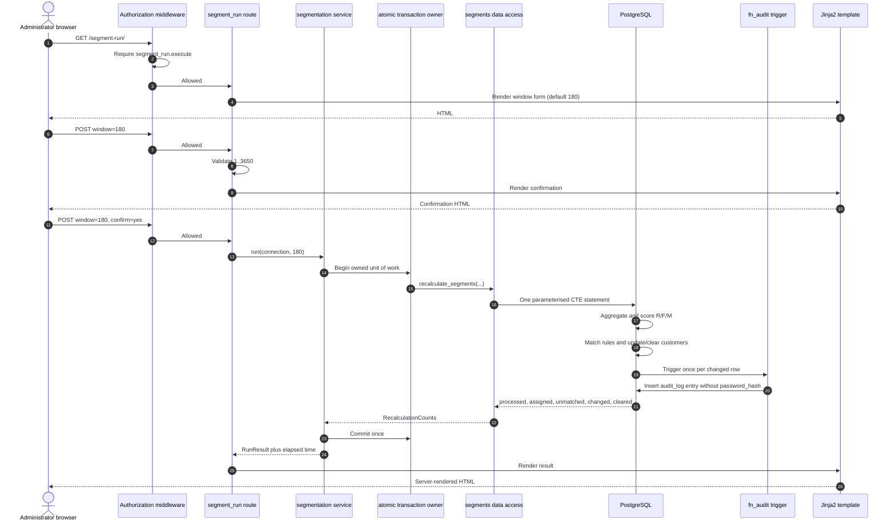
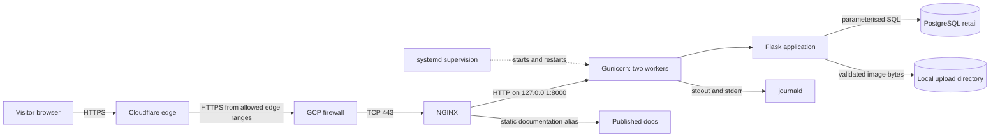
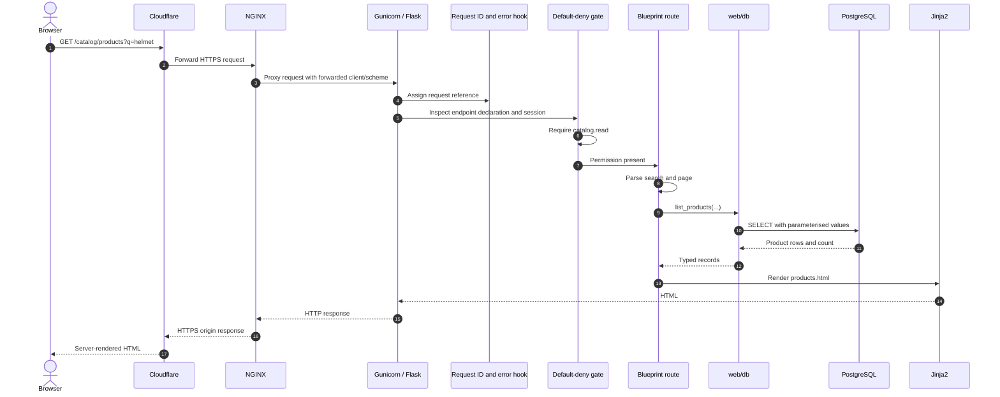

# MOSAIQ System and Demonstration Guide

This is the compact technical guide to keep at hand while rehearsing the
demonstration. It describes the system that exists in this repository today,
not an intended system inferred from its name. It separates three states:

- **Running now:** implemented in the Flask application or the deployed
  infrastructure.
- **Modelled only:** represented in PostgreSQL or design documents, but without
  a complete application workflow.
- **Future:** required by the roadmap or the second delivery, but not built.

The authoritative boundary remains [`scope.md`](scope.md). When an older
decision and the current code disagree, this guide calls out the difference
instead of silently choosing the more convenient claim.

---

## 1. The retail-segmentation problem

Retailers accumulate facts about customers, sales, products, channels, stores
and inventory. The facts are individually useful, but they do not answer the
commercial questions until they are connected:

- Who purchased recently?
- Who purchases frequently?
- Who generates the most revenue?
- Which customers now behave alike?
- Which products, channels and stores explain that behaviour?
- Who changed a rule or assignment, and when?

Without that foundation, every customer tends to receive the same treatment,
data changes are difficult to trust, and a segment cannot be reproduced or
explained.

MOSAIQ currently addresses the problem in two stages:

1. It centralises and governs the retail data in a normalised PostgreSQL model.
2. It runs a deliberately narrow RFM recalculation that assigns each customer
   their current segment from recorded sales and configured rule bands.

A safe one-sentence description for the demonstration is:

> MOSAIQ is a server-rendered retail data-management platform that protects and
> connects customer, sales, catalogue and inventory data, then uses a
> deterministic RFM-by-quintile process to recalculate the current customer
> segment with full change auditing.

It is not yet a complete analytics platform. Clustering, assignment history,
migration reports and analytical dashboards are future work.

---

## 2. What exists now, what is only modelled, and what is future

| State | Capability |
|---|---|
| Running now | Public landing page; login and logout; permission-based navigation; catalogue administration; user creation and activation/deactivation; product-image upload; read-only consultation of products, customers, stock and segments; manual RFM recalculation; audit-log consultation; controlled errors; operational CLI commands |
| Running now | One Flask/Jinja2 application over PostgreSQL, deployed through Cloudflare, NGINX, Gunicorn and systemd on one GCP Compute Engine instance |
| Modelled only | Campaigns and experiments have tables, seed data and permissions, but no working create/update workflow |
| Modelled only | MongoDB and Redis have design documents. Neither engine, dependency, connection, environment variable nor runtime component currently exists |
| Future analytics | CSV transaction ingestion, extended RFM analysis, K-means clustering, segment-assignment history, migration reports and dashboards |
| Future architecture | Six to ten containerised microservices, Android over JSON, desktop over XML/XSD, JWT, Redis, MongoDB and OpenAPI contracts |

The second-delivery architecture is authorised by
[ADR-0016](adr/0016-the-second-delivery-reinstates-the-distributed-architecture.md),
but its service boundaries, contracts, datastore ownership and JWT design are
not decided yet. Do not invent them in the presentation.

---

## 3. The main business process: segment recalculation

The demonstration item called **main-process execution** is the segment
recalculation at `/segment-run/`. Only the administrator can reach either its
form or its execution route because the operation may change every customer's
current segment.

### 3.1 Business calculation

The administrator chooses a window from 1 to 3,650 days; the default is 180.
For every customer with a transaction inside that window, the SQL calculates:

| Measure | MOSAIQ calculation | Meaning |
|---|---|---|
| Recency | `max(transaction.occurred_at)` | The latest purchase wins the better quintile |
| Frequency | `count(*)` over transactions | The customer with more sales receives the better quintile |
| Monetary | `sum(transaction.total)` | The customer with more recorded spend receives the better quintile |

Each measure receives a score from 1 to 5 using `ntile(5)`. A score of 5 is the
best. The resulting `(R, F, M)` triple is compared with the minimum and maximum
bands in `segment_rule`, considering only segments valid on the current date.

- One matching rule assigns its segment.
- Several matching rules deterministically choose the lowest `segment_id`.
- Sales but no matching rule leave the customer unassigned and counted as
  unmatched.
- No sales in the window clear any stale current assignment.

The query breaks equal measurements by `customer_id`, and updates with `IS
DISTINCT FROM`, so identical source sales always produce the same answer and a
second identical run writes nothing.

### 3.2 Execution sequence



The service owns the transaction. If the query or commit fails, the transaction
wrapper rolls back and the shared error handler returns a controlled page.

### 3.3 Demonstrated seed result

The recorded run over 30 customers and 300 transactions produced:

| Window | Processed | Assigned | Unmatched | Changed | Cleared |
|---|---:|---:|---:|---:|---:|
| First 180-day run | 30 | 13 | 17 | 30 | 0 |
| Same run again | 30 | 13 | 17 | 0 | 0 |
| Seven-day run | 7 | 5 | 2 | 5 | 10 |

Seventeen unmatched customers are a property of the demonstration rule data,
not an algorithm failure. The 30 seeded rules reduce to only three distinct
band combinations, all requiring `M >= 3`. See
[`evidence/f3-10-segment-run.md`](evidence/f3-10-segment-run.md).

### 3.4 Deliberate limitations

This process is quintile scoring plus rule matching. It does **not** provide:

- K-means or another clustering algorithm.
- A persisted record of segmentation runs and their parameters.
- A semantic segment-assignment history table.
- Migration comparison between two runs.
- Analytical charts or dashboards.

It overwrites `customer.current_segment_id`. The audit log records the changes,
but an audit trail is not a replacement for a domain-level assignment-history
model.

---

## 4. The monolith

A monolith is not one source file or one operating-system PID. It means the
business application is delivered, versioned and operated as one unit. MOSAIQ
has many Python modules and Gunicorn has two workers, but there is still one
Flask application, one systemd service and one release target.

Internal modules call each other in process. They do not communicate through
HTTP, REST, JSON, XML or a message broker. PostgreSQL, NGINX and Cloudflare are
infrastructure around the business application, not microservices.

### 4.1 End-to-end deployment path



### 4.2 Infrastructure-component definitions

| Component | General definition | Responsibility in MOSAIQ |
|---|---|---|
| Cloudflare | Public DNS, edge proxy and TLS service | Publishes `mosaiq.maxthecoder.online`, presents the browser-trusted certificate, forces HTTPS and connects to the origin in Full (strict) mode |
| GCP firewall | Network-ingress policy | Allows HTTPS to the VM from Cloudflare ranges and administrative SSH through OS Login; rejects other ingress |
| NGINX | Edge web server and reverse proxy | Terminates origin TLS, applies headers and request limits, resolves the real visitor address, serves the documentation alias and proxies application traffic |
| Gunicorn | Production WSGI server | Runs two Flask workers bound only to `127.0.0.1:8000` |
| systemd | Operating-system service manager | Starts MOSAIQ on boot, restarts it after failures and supplies its environment file |
| Flask | Python web framework | Dispatches requests, sessions, middleware, blueprints and templates |
| PostgreSQL | Relational database | Holds the 4NF domain model, constraints, indexes, current assignments and audit log |
| Local uploads | Persistent VM filesystem path | Holds product-image bytes; PostgreSQL holds only the generated relative path |
| journald | System log collector | Captures Gunicorn and application logs from stdout/stderr |
| GitHub Actions | Continuous-integration/deployment runner | Runs Compose smoke tests, formatting, linting, tests and clean database builds; deploys only a merge on `main` |

Docker Compose reproduces the application and PostgreSQL locally. It is a
development and local-demonstration path only; it must never be started on the
published instance because it collides with both production ports and would
displace the systemd deployment.

---

## 5. The life of an ordinary web request

This is the most useful architecture story to explain aloud because every
component has a clear reason to exist.

### 5.1 Normal authenticated read



For simple reads, routes often call `web/db` directly. For state-changing use
cases, the required path is `route -> service -> db`, because the service owns
validation, the complete transaction and expected failure translation.

### 5.2 Anonymous request to a protected page

1. The error hook assigns an eight-hex-character request reference.
2. The authorization middleware finds the route's declaration.
3. An anonymous `GET` is redirected to `/login?next=<safe local path>`.
4. An anonymous `POST` receives 403 because its request body cannot safely be
   replayed after login.
5. Login reads the user by email and verifies Argon2id in the authentication
   service.
6. Success stores `user_id`, `role_id`, `role_code` and display name in the
   signed Flask session cookie.
7. The browser is redirected to the original safe path or home.

`safe_next` rejects external hosts, schemes, protocol-relative URLs,
backslashes and line breaks, preventing the login page from becoming an open
redirect.

### 5.3 Permission refusal

Every application route must declare one of:

- `@public`: no login required.
- `@requires()`: any authenticated user.
- `@requires(permission)`: authenticated user holding every named permission.

A route with no declaration is treated as a programming defect and refused.
The route function never runs. The log records the user, role, endpoint, path,
method and shared request reference; the visitor receives a branded 403 page
without implementation details.

### 5.4 State-changing request and audit attribution

1. Middleware reads the signed-in user from the session.
2. When the request first opens its PostgreSQL connection, a connection
   initializer calls parameterised `set_config('mosaiq.user_id', user_id,
   false)`.
3. The route validates HTTP inputs and calls a write service.
4. The service opens the outermost `atomic` unit of work.
5. Data-access functions issue parameterised SQL and never commit.
6. PostgreSQL constraints enforce structural invariants.
7. Audit triggers read `mosaiq.user_id` and insert `audit_log` rows.
8. The service commits once after all work succeeds.
9. Expected integrity failures become typed, user-readable refusals; unexpected
   exceptions reach the shared 500 handler.
10. The request-scoped connection is closed during Flask teardown.

Nested services using the same connection join the outer transaction. This is
how administrator transfer and demonstration-account deactivation can succeed
or fail as a single operation.

---

## 6. Internal application components

| Component | MVC mapping | What it does |
|---|---|---|
| `web/app.py` | Composition root | Builds the Flask application; loads configuration; configures MIME types, logging, sessions, trusted proxy headers, errors, middleware and database lifecycle; registers blueprints and CLI commands |
| `web/config/` | Cross-cutting configuration | Reads documented environment variables and refuses unsafe production defaults |
| `web/errors.py` | Request preamble | Assigns request references and renders controlled HTTP/500 error pages |
| `web/log.py` | Cross-cutting logging | Enriches logs with reference, actor and client without making services import Flask |
| `web/security.py` | Cross-cutting session policy | Configures `HttpOnly`, `SameSite=Lax` and environment-controlled `Secure` cookies |
| `web/middleware/` | Request gate | Enforces the permission matrix before a controller runs and builds permission-driven navigation |
| `web/routes/` | Controller | Reads HTTP inputs, calls services or read functions and chooses a redirect or template |
| `web/services/` | Model: business rules | Validates use cases, owns transactions, hashes/verifies passwords, handles uploads, computes dashboard content and translates expected failures |
| `web/db/` | Model: persistence | Owns connection lifecycle, typed records and every SQL statement executed by Python |
| `web/templates/` | View | Produces HTML from values supplied by a route |
| `web/static/` | View assets | Provides design-system CSS, minimal progressive-enhancement JavaScript, images and self-hosted fonts |
| `web/cli.py` | Non-HTTP controller | Exposes administrator provisioning, password rotation and account reporting to operators |

The dependency direction stays downward: HTTP and CLI entry points may know
services and data access; services may know data access; data access does not
know Flask requests or templates.

### 6.1 Application factory

`create_app()` in `web/app.py` is the technical entry point. It does not
perform segmentation itself. Its job is to assemble a valid application:

1. Load `.env` as a local fallback and construct `Config`.
2. Register portable font MIME types.
3. Create the Flask object.
4. Apply secret, upload limit, logging and cookie policy.
5. Trust forwarded headers only when explicitly configured.
6. Register request IDs and error handlers before authorization.
7. Register the default-deny authorization middleware.
8. Probe PostgreSQL at startup and install one request-scoped connection.
9. Register template-wide product identity.
10. Register every blueprint and CLI command.

Flask development mode discovers this factory automatically. Production
Gunicorn starts the same factory as `web.app:create_app()`.

### 6.2 Blueprints and workflows

| Blueprint | Prefix | Current workflow |
|---|---|---|
| `home` | `/` | Public landing page or permission-aware signed-in dashboard |
| `auth` | `/login`, `/logout` | Authenticate with email/password and clear the session |
| `admin` | `/admin` | Catalogue CRUD, user creation/activation/deactivation and protected product images |
| `catalog` | `/catalog` | Read-only products, customers, stock, segments and details |
| `segment_run` | `/segment-run` | Administrator-only, confirmed RFM recalculation |
| `audit` | `/audit` | Administrator/auditor filtering, pagination and before/after detail |
| `campaigns` | `/campaigns` | Permission-gated coming-soon page only |
| `reports` | `/reports` | Permission-gated coming-soon page only |

---

## 7. Current functional surface by role

This table describes reachable workflows, not every future-looking cell in the
canonical permission matrix.

| Role | Current useful access |
|---|---|
| `ADMIN` | All current consultation; full CRUD for category, product, store, channel and role; users; segment run; audit log |
| `ANALYST` | Product and stock consultation; customers and segments; campaign/report placeholders |
| `STORE_MANAGER` | Product and stock consultation; report placeholder; no customer directory |
| `MARKETING` | Product, stock, customer and segment consultation; campaign/report placeholders |
| `INVENTORY_PLANNER` | Product and stock consultation; report placeholder; no inventory-write screen yet |
| `AUDITOR` | Read-only product, stock, customer, segment and user views; campaign/report placeholders; audit log |
| `CUSTOMER` | Authenticated home only; `user.self` exists in the permission vocabulary but has no self-service route yet |

The canonical matrix is [`requirements.md`](requirements.md) section 3. It is
implemented as a frozen mapping in `web/middleware/authz.py`, not as permission
tables. Roles are catalogue data, but grants change only through code review and
deployment. A newly created role code therefore receives no permissions until
the mapping is deliberately extended.

---

## 8. Current application workflows

### 8.1 Authentication and dashboard

- Login uses email and Argon2id verification.
- Unknown users, inactive users, wrong passwords and unusable hashes receive the
  same public error.
- A dummy Argon2 hash spends comparable work for a missing or inactive account.
- Successful login writes identity and role information into Flask's signed
  session cookie.
- Logout clears the cookie-backed session.
- The dashboard reloads the account record and shows figures according to the
  permission set; audit readers also see recent audit entries.

There is no server-side session store or revocation list today. Role changes and
deactivation are not guaranteed to invalidate an already issued session until
it is cleared. Redis/JWT session revocation belongs to the future distributed
architecture.

### 8.2 Catalogue administration

The administrator has list, search, create, update and delete workflows for:

- Categories, including optional parent categories.
- Products, including SKU, category, price, active state and image.
- Stores, including location and active state.
- Channels.
- Roles.

Deletion that would break a foreign-key relationship is translated into a
plain-language conflict rather than exposing a PostgreSQL exception. Expected
uniqueness and referential failures return to the form with a useful message.

Product images are limited to JPEG, PNG and WebP and to the configured five-MiB
default. The application checks the reported MIME type, stream length and file
signature, ignores the original filename and stores a generated filename under
`UPLOAD_DIR`.

### 8.3 User management

The administrator can list and create users and activate/deactivate accounts.
New passwords require at least 12 characters and are hashed before PostgreSQL
sees them. Accounts are deactivated rather than deleted so audit history retains
its actor.

The one-administrator invariant is enforced twice:

- The service refuses a second administrator and refuses leaving none.
- The partial unique index
  `ux_app_user_single_administrator` independently refuses a second row with
  `role_id = 1`.

Changing who holds the administrator seat is an atomic transfer because
promoting first would temporarily create two and demoting first would
temporarily create none.

The web UI does not currently expose general user editing or role changes,
although service-level role-transfer operations exist.

### 8.4 Read-only consultation

`/catalog` is separate from `/admin` so a reader does not receive edit/delete
controls that will only lead to a 403.

- Products require `catalog.read`.
- Stock requires `catalog.read` and may be filtered by store and product text.
- Customers require `segment.read`.
- Segments and membership require `segment.read`.

Customer detail includes registration channel, current segment, independent
interest categories and preferred channels. Segment detail includes its RFM
rule and paginated members.

### 8.5 Audit log

The audit log is read-only in the application. It supports entity and date
filters, pagination and a detail comparison of values before and after.

`fn_audit()` triggers capture inserts, updates and deletes on:

- `segment`, `segment_rule`, `campaign`, `experiment`.
- `category`, `product`, `store`, `channel`, `role`.
- `customer`, `app_user`.

Transaction and transaction-line writes are deliberately excluded because the
sale tables already are history and auditing the busiest write path would
duplicate its cost. The trigger strips `password_hash` before an audit payload
is stored.

PostgreSQL uses `jsonb` inside `audit_log` for before/after row payloads. This
does not violate the first-delivery prohibition on JSON exchange: it is a
database storage type, not an internal API or browser exchange format.

### 8.6 Operator CLI

The Flask CLI provides:

- `provision-administrator`: installs a real administrator and can deactivate
  every demonstration account in the same transaction.
- `rotate-password`: changes an existing account password without placing the
  plaintext in a command argument.
- `account-report`: lists active accounts and reports how many known-password
  demonstration accounts remain active.

The published instance keeps the seeded rows for audit attribution but keeps
their accounts inactive. The real administrator password never belongs in the
repository.

---

## 9. PostgreSQL domain model

The schema has 19 tables.

| Domain | Tables | Definition in this project |
|---|---|---|
| Identity | `role`, `app_user` | Permission-profile names and accounts that sign in |
| Customers | `customer`, `customer_preferred_channel`, `customer_interest_category` | Customer identity, optional login link, acquisition channel, current segment and independent preferences |
| Catalogue and sales | `channel`, `category`, `store`, `product`, `transaction`, `transaction_line`, `inventory` | What was sold, to whom, where, through which channel, at which actual price, and current product/store stock |
| Segmentation | `segment_rule`, `segment` | Configurable RFM bands and the named valid segment definitions that use them |
| Marketing model | `campaign`, `experiment`, `experiment_group`, `experiment_group_customer` | Future campaign targeting and control/treatment assignment |
| Governance | `audit_log` | Actor, entity, operation, before/after data and execution time |

### 9.1 Fourth-normal-form rationale

The model records the anomaly removed at each stage:

- **1NF:** atomic values and no repeating groups.
- **2NF:** no attribute depends on only part of a composite key. Product name
  and category do not belong in every transaction line; the actual charged
  `unit_price` does.
- **3NF:** no transitive dependency. A product references a category instead of
  repeating the category name.
- **4NF:** a relation carries no two independent multivalued facts.

The central 4NF example is customer preferences. Preferred channels do not
determine interest categories, and interest categories do not determine
channels. A single three-column relation would invent channel/category pairings
and require a Cartesian combination of rows. MOSAIQ therefore uses two
independent junction tables:

```text
customer_preferred_channel(customer_id, channel_id)
customer_interest_category(customer_id, category_id)
```

The decomposition is lossless and states only the facts the business actually
provided. Full reasoning and the data dictionary are in
[`data-model.md`](data-model.md).

### 9.2 Reproducibility and least privilege

All DDL belongs to `sql/01_schema.sql`. Against an empty PostgreSQL installation,
the scripts must run in this order:

1. `00_create_database.sql`
2. `01_schema.sql`
3. `02_seed_30_per_table.sql`

The application connects as `retail_app`, which may perform required DML but
does not own the schema and cannot drop its tables. Dynamic values in every SQL
statement are parameterised. Table and column names that cannot be parameters
are fixed in source or selected from an explicit whitelist.

Every table has at least 30 seed rows except `role` and `channel`, whose real
domains contain seven and five entries respectively. Their reasons are recorded
in `sql/seed-exempt.txt` rather than padded with fictional values.

---

## 10. Architectural decisions to remember

An Architecture Decision Record captures the forcing context, the chosen
option, rejected alternatives, consequences and a compliance check. Accepted
records are immutable; a later decision supersedes them instead of rewriting
history.

| ADR | Current meaning and cost |
|---|---|
| [0001](adr/0001-flask-monolith-on-a-single-vm.md) | Chose Python 3.12, Flask, Jinja2 and local PostgreSQL instead of the illustrative Express stack. ADR-0016 supersedes its future direction, but it still describes the running first delivery |
| [0002](adr/0002-mosaiq-identity-and-design-system.md) | Chose MOSAIQ and a token-based, framework-free design system. It provides domain-specific visual language but must be maintained by the team |
| [0003](adr/0003-layered-architecture-with-an-explicit-service-layer.md) | Split MVC's model into business services and SQL data access. This improves testability and SQL review at the cost of extra indirection |
| [0004](adr/0004-model-ahead-of-the-deferred-segmentation-modules.md) | Kept segmentation/campaign/experiment tables in the complete graded data model and accepted `current_segment_id` as future migration debt |
| [0005](adr/0005-document-mongodb-and-redis-designs-without-implementing-them.md) | Preserved MongoDB/Redis design work without pretending the engines existed. Superseded for the second delivery, but still true of today's runtime |
| [0006](adr/0006-run-under-both-systemd-and-docker-compose.md) | Introduced two execution paths. Superseded by ADR-0015 because switching production to Compose for a demo was unsafe |
| [0007](adr/0007-permissions-in-code-with-a-default-deny-middleware.md) | Keeps the permission specification in versioned code and refuses undeclared routes. The cost is that an administrator cannot edit grants at runtime |
| [0008](adr/0008-the-instance-keeps-the-demonstration-accounts-deactivated.md) | Preserves seeded users for attribution while closing their publicly known credentials |
| [0009](adr/0009-nginx-as-the-reverse-proxy.md) | Uses NGINX for public ingress, TLS, headers and proxying instead of exposing Gunicorn |
| [0010](adr/0010-the-consultation-module-is-a-separate-read-only-blueprint.md) | Separates reader workflows from administrator CRUD and assigns customer access to `segment.read` |
| [0011](adr/0011-one-environment-deployed-from-main.md) | Treats the single VM as production and deploys only reviewed `main`; failed deploys restore the previous commit. There is no staging environment |
| [0012](adr/0012-release-merges-preserve-ancestry.md) | Requires true merge commits between `develop` and `main` so equivalent content retains shared ancestry |
| [0013](adr/0013-publish-mosaiq-through-cloudflare-with-an-origin-certificate.md) | Provides trusted public HTTPS and shields the origin, at the cost of depending on a team member's domain and Cloudflare account |
| [0014](adr/0014-service-owned-transactions-and-typed-write-failures.md) | Makes services own complete units of work and translate expected failures; data access never commits or chooses user messages |
| [0015](adr/0015-containers-are-a-development-path-only.md) | Keeps Compose for local reproducibility and forbids it on the instance, where systemd remains the deployment path |
| [0016](adr/0016-the-second-delivery-reinstates-the-distributed-architecture.md) | Authorises the future distributed system without guessing service boundaries or integration contracts |

---

## 11. Security and failure behaviour

- Passwords are hashed with Argon2id before PostgreSQL sees them.
- Dynamic SQL values are always parameters.
- Production refuses the development Flask secret.
- Session cookies are `HttpOnly`, `SameSite=Lax` and `Secure` behind TLS.
- Forwarded headers are trusted only for the configured NGINX hop.
- The database is loopback-only and reached remotely through SSH, not a public
  listener.
- Gunicorn is loopback-only and reached publicly only through NGINX.
- Product images are checked by MIME, size and signature.
- A partial unique index independently prevents a second administrator.
- Expected database refusals return user-readable field or conflict messages.
- Unexpected failures produce a generic 500 page and a correlated detailed
  log entry, never an interactive traceback.
- Application logs go to stderr and are retained by journald in production.
- No secret, dataset, CSV or uploaded file belongs in version control.

---

## 12. Documentation and implementation differences

These points are presentation traps. Describe the code that exists, and identify
future intent separately.

1. `scope.md` and the roadmap broadly defer RFM analytics, while RF-12 and
   F3-10 later implemented the smallest useful slice. Say **RFM quintile
   recalculation**, not complete RFM analytics or clustering.
2. ADR-0004 originally said no application code would read the deferred segment
   tables. The later segment-run and consultation features now read and write
   them. That clause is historical documentation debt.
3. The idealised layer description says every route calls a service. Current
   simple reads call `web/db` directly; writes and rule-heavy use cases go
   through services. SQL remains isolated correctly.
4. RF-02 says logout invalidates the session server-side. The current
   implementation uses Flask's signed cookie session and clears that cookie;
   there is no server-side session store or revocation list. Do not claim
   replay protection provided by Redis or server-side session state.
5. RF-09 says users are edited. The current UI creates, lists, activates and
   deactivates them, but exposes no general edit/role-change form.
6. HU-01 mentions a five-failure cool-off period. No login rate limiter exists
   in the current application.
7. The permission matrix includes inventory writes, customer self-service and
   campaign writes, but there are no current workflows for those capabilities.
8. Campaign and report navigation entries intentionally render coming-soon
   pages. Their presence is not proof of feature completion.
9. MongoDB, Redis, microservices, Android, desktop, JWT, OpenAPI, JSON APIs and
   XML/XSD contracts belong to the future delivery and do not run today.

---

## 13. Recommended live-demonstration order

Prepare a real administrator and any non-administrator account needed for the
role comparison before starting. Seed demonstration accounts should remain
inactive on the published instance.

1. **Frame the problem.** Explain why connected customer, sales and catalogue
   data are necessary before useful segmentation is possible.
2. **Show the public boundary.** Open the landing page and identify the single
   published web system.
3. **Show authentication.** Sign in with the real administrator and explain
   Argon2id, the session cookie and the permission-driven menu.
4. **Show differentiated access.** Use a prepared analyst account or captured
   evidence to show read access and an administrator-route 403.
5. **Show catalogue administration.** Create or edit a low-risk catalogue row,
   then explain route, service-owned transaction, parameterised SQL, database
   constraint and audit trigger.
6. **Show image handling.** If time permits, attach a valid product image and
   mention disk-versus-database storage.
7. **Show consultation.** Search products, inspect a customer and filter stock
   by store.
8. **Run the main process.** Choose 180 days, pause on the confirmation page,
   run it, and interpret every output count. Explain why unmatched is valid.
9. **Run it again.** Use the zero-change result to demonstrate determinism and
   idempotence.
10. **Show the audit trail.** Filter `customer` entries and open one
    before/after detail produced by the segment run.
11. **Explain deployment.** Walk from Cloudflare to NGINX, Gunicorn/systemd,
    Flask and PostgreSQL using the request diagram.
12. **Show containers separately.** Demonstrate Compose on a developer machine,
    never on the instance, and explain that both execution paths use the same
    application dependencies and environment contract.
13. **Close with the boundary.** Name clustering, history, migration,
    dashboards and the distributed second delivery as future work.

---

## 14. Short narration to memorise

> A browser reaches MOSAIQ through Cloudflare and the GCP firewall. NGINX
> terminates the origin connection and forwards the request to the Gunicorn
> service on loopback. Flask first assigns a request reference and applies its
> default-deny authorization gate. An allowed route reads the HTTP input. A
> simple query uses the isolated data-access layer; a write calls a business
> service that owns the complete transaction. Psycopg sends parameterised SQL
> to PostgreSQL, whose constraints protect the model and whose triggers record
> attributed changes. The route then renders a Jinja2 template, so the browser
> receives HTML rather than an internal JSON API response.

For the main process:

> The administrator selects a sales window. MOSAIQ calculates each customer's
> recency, transaction frequency and monetary total, converts each measure to a
> quintile from one to five, matches the triple against current segment rules,
> updates only changed assignments, clears stale assignments and commits the
> result atomically. PostgreSQL audits every changed customer, and repeating the
> same run produces no additional write.
