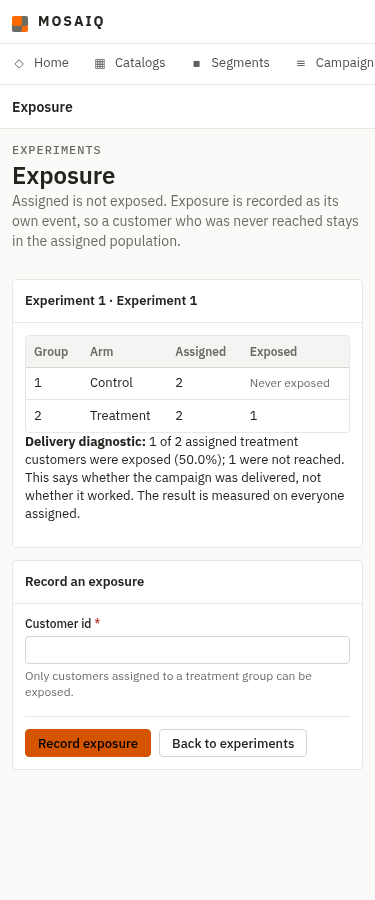
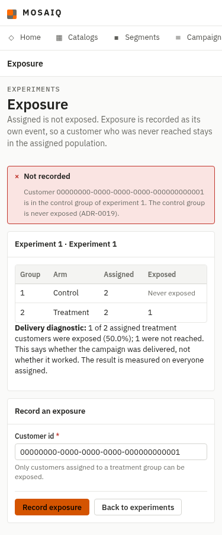
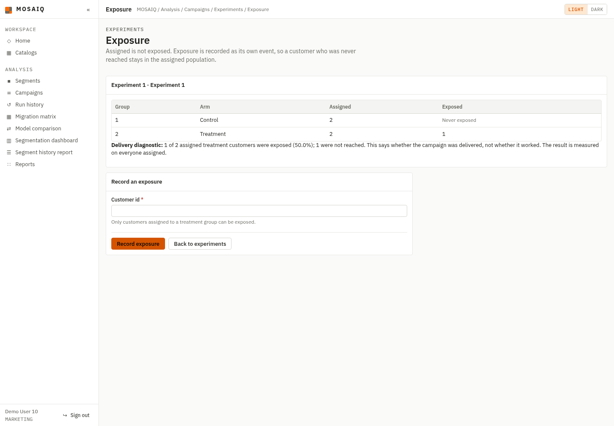
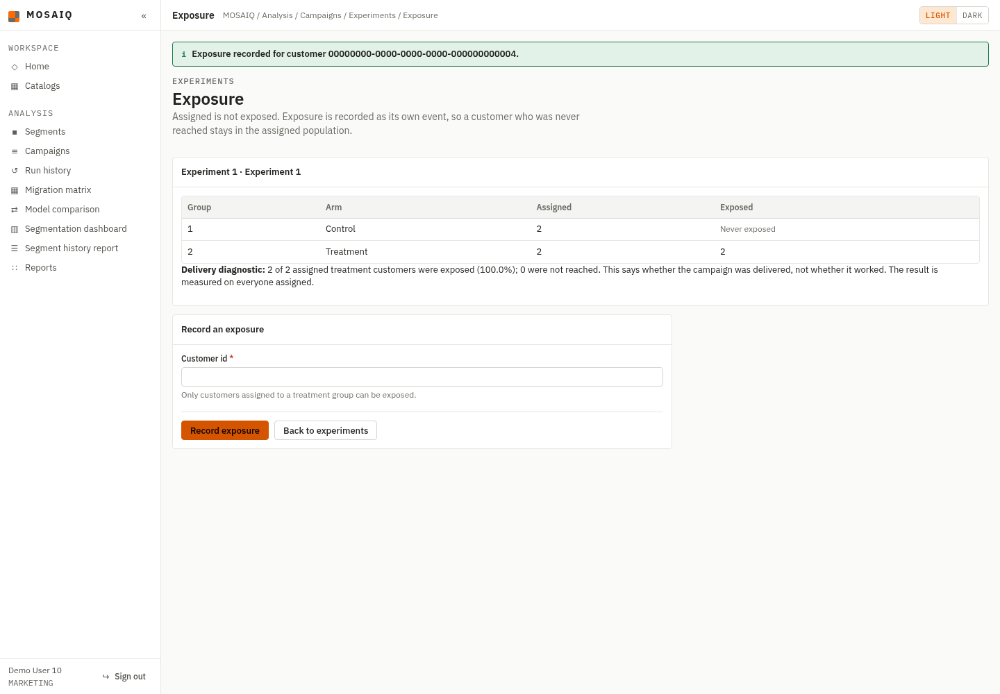

# F11-05 — Treatment exposure as a separate durable event

Evidence for #224 and ADR-0019, captured on 2026-09-28 from this branch against
an isolated PostgreSQL 16 database rebuilt from the three ordered scripts. The
browser session used the seeded `MARKETING` account `user10@mosaiq-demo.com`.

## Acceptance criteria

| Criterion | Observed result |
|---|---|
| A treatment assignment is exposed as a separate event with its own timestamp | Posting customer `…0004` returned 302, displayed the success notice and added a later `exposed_at` without changing `assigned_at` |
| A control assignment is refused | Posting customer `…0001` returned 409, displayed the control refusal and left the control exposure count at zero |
| Assigned but unexposed customers stay in the denominator | Experiment 2 has two treatment assignments, one exposure and one `NULL exposed_at`; the page reports `1 of 2` and one not reached |
| Exposure rate is a delivery diagnostic, not the result | Both widths state “Delivery diagnostic” and “not whether it worked”; the result remains measured on everyone assigned |

## Clean PostgreSQL run

The scripts ran in the required order with `ON_ERROR_STOP=1`:

```text
00_create_database.sql -> CREATE DATABASE ... ALTER DEFAULT PRIVILEGES
01_schema.sql          -> CREATE TABLE/FUNCTION/TRIGGER ... REVOKE
02_seed_30_per_table.sql -> BEGIN ... INSERT experiment_exposure 0 30 ... COMMIT
```

The application-role self-test was then extracted from `01_schema.sql` and run
directly as `retail_app`:

```text
NOTICE:  PASS: restricted role; ordinary tables retain DML privileges
NOTICE:  PASS: audit_log is append-only for the application role
NOTICE:  PASS: experiment_assignment is append-only for the application role
NOTICE:  PASS: experiment_exposure is append-only for the application role
NOTICE:  PASS: UPDATE experiment_exposure refused (SQLSTATE 42501)
NOTICE:  PASS: DELETE experiment_exposure refused (SQLSTATE 42501)
NOTICE:  PASS: control-group exposure refused (SQLSTATE 23514)
DO
ROLLBACK
```

Cases N30 and N31 in `sql/verify_integrity.sql` independently attempted a new
control exposure and reassigned an existing exposure to control as the schema
owner. Both reached the trigger:

```text
ERROR:  Control-group assignment 1 cannot be exposed
CONTEXT:  PL/pgSQL function fn_experiment_exposure_treatment_only() line 12 at RAISE
```

No control exposure survived:

```text
SELECT count(*)
FROM experiment_exposure AS x
JOIN experiment_assignment AS a USING (assignment_id)
JOIN experiment_group AS g USING (group_id)
WHERE g.kind = 'CONTROL';

 count
-------
     0
```

## Separate timestamps and the unexposed denominator

Experiment 2 still carries both treatment assignments while one has no exposure
row:

```text
 experiment_id |   kind    |             customer_id              |          assigned_at          |          exposed_at
---------------+-----------+--------------------------------------+-------------------------------+-------------------------------
             2 | CONTROL   | 00000000-0000-0000-0000-000000000005 | 2026-09-29 04:26:32.202621+00 |
             2 | CONTROL   | 00000000-0000-0000-0000-000000000006 | 2026-09-29 04:26:32.202621+00 |
             2 | TREATMENT | 00000000-0000-0000-0000-000000000007 | 2026-09-29 04:26:32.202621+00 | 2026-09-29 04:26:32.202621+00
             2 | TREATMENT | 00000000-0000-0000-0000-000000000008 | 2026-09-29 04:26:32.202621+00 |
```

The exposure recorded through the live form for experiment 1 received a later
event timestamp while its assignment stayed unchanged:

```text
             customer_id              |   kind    |          assigned_at          |          exposed_at           | later_event
--------------------------------------+-----------+-------------------------------+-------------------------------+-------------
 00000000-0000-0000-0000-000000000004 | TREATMENT | 2026-09-29 04:26:32.202621+00 | 2026-09-29 04:30:30.638645+00 | t
```

## Browser verification

At 375 px, the table, diagnostic and form fit the viewport and retain the
assigned/unexposed distinction:



The same width renders the application refusal with the control customer kept
in the form; the POST returned HTTP 409:



At 1440 px, the initial page shows one of two treatment customers exposed:



After the treatment POST, the success notice is visible and the diagnostic
changes to two of two without changing the assigned denominator:



## Automated checks

```text
pytest -q        -> 1770 passed in 22.63s
black --check .  -> 145 files would be left unchanged
ruff check .     -> All checks passed!
```
