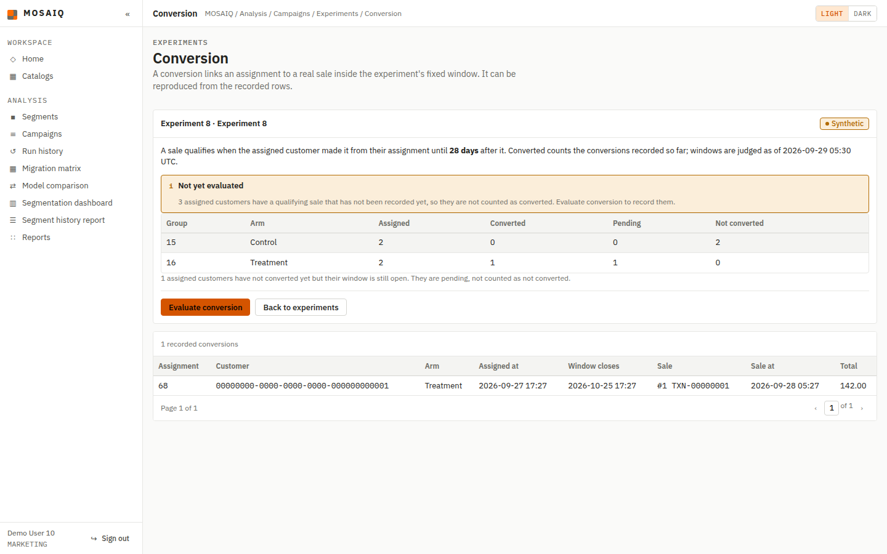
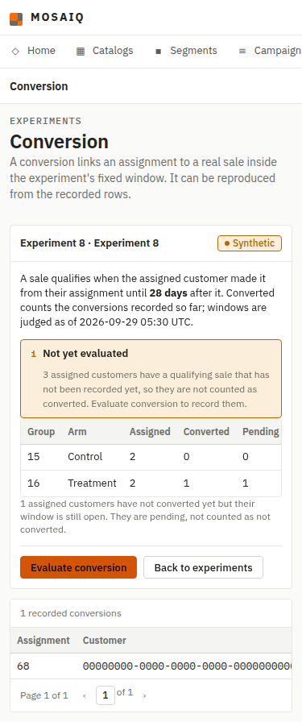
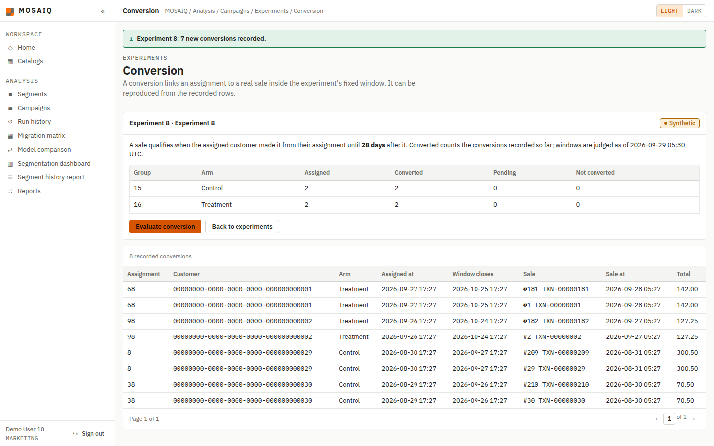
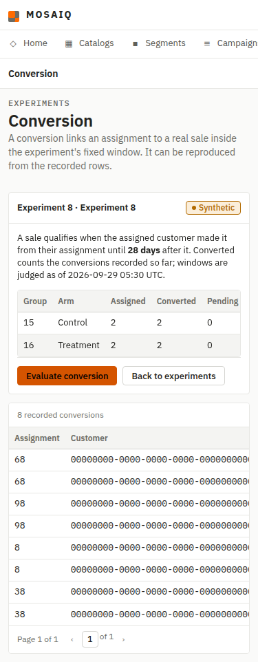

# F11-06 — Conversion as an assignment-to-sale attribution

Evidence for #225 and ADR-0019, captured on 2026-09-29 from this branch (after
`develop` with F11-05 was merged in) against an isolated PostgreSQL 16 database
rebuilt from the three ordered scripts. The browser session used the seeded
`MARKETING` account `user10@mosaiq-demo.com`.

## Acceptance criteria

| Criterion | Observed result |
|---|---|
| A qualifying sale inside the fixed window is recorded and names both | Evaluating all 30 experiments as `retail_app` recorded 210 rows; each names its assignment and its `transaction` |
| A sale outside the window is not attributed | After evaluation, 0 of the recorded conversions fall outside `[assigned_at, assigned_at + conversion_window_days)` or belong to another customer |
| An unfinished window is pending, not "not converted" | Experiment 8 (28-day window) reports its two treatment customers, assigned 1.5 and 2.5 days ago, as converted or pending, never as not converted |
| A conversion traces to the assignment, the window and the sale | The trace lists assignment, customer, arm, `assigned_at`, window close, sale id, source id, sale time and total |
| A sale carries no experiment column | `tests/test_experiment_conversion.py` checks the `transaction` definition |

Evaluating is idempotent: a second pass over the 30 experiments added 0 rows,
and the second POST on experiment 8 reported "0 new conversions recorded".

## Review fixes

- **Seed.** The 30 seeded conversions previously all pointed at a sale made
  *before* the assignment (assignments defaulted to `now()`, sales were in the
  past). `assigned_at` is now seeded half a day before each customer's most
  recent sale, and the seeded conversion picks a sale inside the window. The
  check below returned 30 rows, 0 outside the window.
- **Not yet evaluated.** Outcome counts come from recorded conversions. A
  customer with a qualifying sale that no evaluation has recorded is counted in
  `unrecorded` and the page warns instead of silently showing them as pending or
  not converted.
- **RN-27 wording.** Conversions are only ever added by the application, but
  `retail_app` still holds `UPDATE`/`DELETE` on `experiment_conversion`; the
  rule now says so rather than claiming database enforcement.

```text
SELECT count(*),
       count(*) FILTER (WHERE NOT (t.occurred_at >= a.assigned_at
                                   AND t.occurred_at < a.assigned_at
                                       + make_interval(days => e.conversion_window_days)))
FROM experiment_conversion c JOIN experiment_assignment a USING (assignment_id)
JOIN experiment e ON e.experiment_id = a.experiment_id
JOIN transaction t ON t.transaction_id = c.transaction_id;

 30 | 0
```

## Clean PostgreSQL run

`00_create_database.sql`, `01_schema.sql` and `02_seed_30_per_table.sql` ran
with `ON_ERROR_STOP=1`. The application-role self-test passed as `retail_app`
(13 `PASS` notices), and all 31 cases in `sql/verify_integrity.sql` raised
their expected error.

## Browser verification

Before evaluation, experiment 8 at 1440 px and 375 px: the seeded conversion is
counted, and three customers with an unrecorded qualifying sale are flagged:





After *Evaluate conversion*, the success notice, the counts and the trace:





Neither width scrolls horizontally; wide tables scroll inside their panel.

## Automated checks

```text
pytest -q        -> 1794 passed
black --check .  -> 148 files would be left unchanged
ruff check .     -> All checks passed!
```
