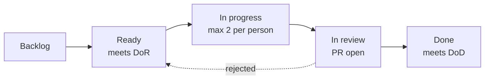

# Scrum Framework Charter

**Project:** Dynamic Segmentation and Retail Personalization Platform
**Course:** Integración de Aplicaciones Computacionales
**Team:** Team 03
**Document owner:** Marcelo (Scrum Master)
**Version:** 1.1
**Date:** 2026-08-08
**Status:** Active

All project artifacts — code, comments, commit messages, issues, documentation — are written in English. Spoken meetings are held in Spanish.

---

## 1. Purpose

This document defines how Team 03 works. It sets the roles, the cadence, the ceremonies, the rules for accepting work, and the capacity budget. It is the reference for any process dispute during the semester.

Two things this document is not: it is not a description of Scrum theory, and it is not aspirational. Every ceremony listed here is one the team will actually hold, and every rule is one the team intends to enforce. Processes that are documented but not performed damage credibility more than a smaller process that is followed.

---

## 2. Roles

| Role | Person | Responsibility |
|---|---|---|
| Product Owner | Dr. Raúl Morales Saucedo | Owns the requirements and accepts the deliverable. Sets milestone scope and final acceptance criteria. |
| Proxy Product Owner | Raquel | Day-to-day backlog owner. Writes and prioritizes stories, accepts stories against acceptance criteria, maintains the Assumption Register, resolves scope questions the PO has not answered. |
| Scrum Master | Marcelo | Facilitates ceremonies, maintains the board, removes blockers, enforces the Definition of Done, owns this document. |
| Development Team | Raquel, Estefanía, Max, Marcelo | Estimates, commits, builds, tests, demonstrates. |

### 2.1 Development Team specializations

| Person | Primary | Secondary |
|---|---|---|
| Raquel | Backend and frontend web (Flask, Jinja2, Highcharts) | Proxy PO duties |
| Estefanía | Data modeling, RFM, clustering, drift detection, seed data | Analytics endpoints |
| Max | Containers, GCP infrastructure, CI, PostgreSQL / MongoDB / Redis operations | Backend support |
| Marcelo | Full stack, authentication and authorization, DevOps | Scrum Master duties |

### 2.2 The Product Owner availability problem

The Product Owner is the course professor. He is not available for sprint planning, backlog refinement, or same-day answers to scope questions. This is the single largest process risk in the project (see Risk Register, R-02) and it is handled with three mechanisms rather than by pretending the PO is embedded:

1. **Proxy Product Owner.** Raquel holds delegated authority to prioritize the backlog and accept stories. This costs roughly 2 hours per week of her development capacity and is accounted for in the capacity model.
2. **Assumption Register.** Any question that would normally go to the PO is recorded as a numbered assumption with the decision the team took anyway, the date, and the cost of being wrong. Work does not stop waiting for an answer. See `docs/scrum/assumption-register.md`.
3. **Weekly written digest.** The Scrum Master sends the PO one message per week containing progress, open assumptions requiring confirmation, and any scope decision that changes a milestone deliverable. Silence is treated as confirmation of the recorded assumption after five working days.

The Scrum Master role and the Product Owner role are held by different people, and the Proxy PO is not the Scrum Master. Combining them is a known anti-pattern and would leave nobody to challenge scope decisions.

### 2.3 Single-point-of-failure declaration

Marcelo holds three functions: full-stack development, DevOps, and Scrum Master. Max is the designated backup for DevOps and infrastructure. Raquel is the designated backup for facilitation. Any component Marcelo builds alone must be documented well enough for Max to deploy it without him.

---

## 3. Cadence

The course recommends two-week sprints. The calendar between the project start and the Milestone 1 deadline does not divide into an even number of two-week sprints, so the team runs a mixed cadence. Each deviation is deliberate and justified below.

| Sprint | Dates | Length | Type | Justification for the length |
|---|---|---|---|---|
| Sprint 0 | Mon 2026-08-10 → Fri 2026-08-14 | 1 week | Initialization | Standard Sprint Zero. Deliberately serialized: it produces the frozen data model and the architectural contracts that every later story depends on. Parallel work before these exist produces merge conflicts and rework. |
| Sprint 1 | Mon 2026-08-17 → Fri 2026-08-28 | 2 weeks | Standard | Canonical sprint length. |
| Sprint 2 | Mon 2026-08-31 → Fri 2026-09-04 | 1 week | Compressed | A full two-week sprint would end on the delivery date, leaving no time for freeze, documentation consolidation, or demo rehearsal. |
| Hardening | Sat 2026-09-05 → Mon 2026-09-07 | 3 days | Code freeze | No new stories. Defect repair, documentation consolidation, and two full demo rehearsals only. |
| Milestone 1 delivery | Tue 2026-09-08 | — | — | Fixed by the course. |

Sprint length returns to a strict two-week cadence from Milestone 2 onward.

### 3.1 Working hours

Each team member commits 3 hours per weekday, Monday through Friday: 15 hours per week per person, 60 hours per week for the team. Weekend hours are permitted to recover slipped commitments but are not planned capacity. If weekend recovery is needed in two consecutive weeks, the sprint scope was set too high and the next sprint commitment is reduced.

---

## 4. Ceremonies

| Ceremony | When | Duration | Participants | Output |
|---|---|---|---|---|
| Sprint Planning | First Monday of the sprint | 90 min | Whole team + Proxy PO | Sprint Goal, committed backlog, task assignment |
| Weekly Sync | Every Monday | 20 min | Whole team | Blockers raised, board reconciled |
| Async Daily Check-in | Every weekday, written | 5 min | Individually | Yesterday / today / blockers, posted in the team channel |
| Backlog Refinement | Mid-sprint Wednesday | 45 min | Whole team + Proxy PO | Next sprint's candidate stories brought to Definition of Ready |
| Sprint Review | Last Friday of the sprint | 60 min | Whole team, PO invited | Working software demonstrated, stories accepted or rejected |
| Retrospective | Last Friday, immediately after Review | 45 min | Whole team | Between 1 and 3 committed improvement actions with owners |

### 4.1 Why there is no daily standup

The course specifies a short weekly meeting. Four people working 3-hour blocks on staggered schedules cannot reliably hold a synchronous daily meeting, and a documented daily that does not occur is worse than an honest weekly. The synchronous meeting is weekly; the daily coordination is written and asynchronous. Each member posts a check-in in the team channel by the end of their working block. Anyone blocked for more than 4 hours raises it in the channel immediately rather than waiting for the check-in.

### 4.2 Retrospective format

Rotating between two formats to avoid the ritual going stale:

- **Start / Stop / Continue** — used for Sprint 0 and Sprint 2.
- **Mad / Sad / Glad** — used for Sprint 1.

Every retrospective produces at most 3 improvement actions, each with a named owner and a target sprint. Actions from the previous retrospective are reviewed at the start of the next one. An action that carries over twice is either dropped or escalated as a risk.

---

## 5. Definition of Ready

A story may not enter a sprint until all of the following hold:

1. Written in user story format: `As a <role>, I want <capability>, so that <benefit>`.
2. Acceptance criteria written in Given / When / Then form, each independently testable.
3. Dependencies identified. Any blocking dependency is either already complete or scheduled earlier in the same sprint.
4. Data model impact known: which PostgreSQL tables, MongoDB collections, or Redis key patterns are read or written.
5. Estimated by the team in story points.
6. Owner assigned.
7. Fits within one sprint. A story estimated at 13 points is split before it is committed.
8. Any open PO decision is recorded in the Assumption Register with a working assumption.

---

## 6. Definition of Done

A story is Done only when all of the following hold. This list is enforced by the Scrum Master at Sprint Review; a story failing any item returns to the backlog and does not count toward velocity.

1. Every acceptance criterion is verified by a team member other than the author.
2. Code merged into `develop` through a pull request with at least one approval. Feature branch deleted.
3. Any database schema change ships as an Alembic migration. `alembic upgrade head` succeeds against an empty database.
4. A story that changes the database schema ships an updated `infra/sql/schema/verify_m1_schema.sql` that passes. A schema change with no corresponding check is a change nobody can verify.
5. The feature runs from a clean clone with no manual steps beyond `docker compose up`, migration, and seed.
6. Every state-changing operation writes an audit log record identifying the actor, the action, the target entity, and the timestamp.
7. Unit tests exist for business logic. The `pytest` suite passes.
8. Errors and significant events are logged through `structlog` with a request or correlation identifier.
9. No secrets in source. New configuration variables are documented in `.env.example`.
10. User-facing screens verified at 375 px and 1440 px viewport widths.
11. The issue is closed with attached evidence: a screenshot, test output, or short screen recording.

### 6.1 Definition of Done — sprint level

1. Sprint Goal met or the gap explicitly recorded in the Review notes.
2. `develop` merged to `main` and tagged `v0.<sprint>.0`.
3. All documentation deliverables assigned to the sprint are committed in `docs/`.
4. Retrospective actions recorded with owners.

---

## 7. Estimation

The team estimates in story points using a modified Fibonacci scale via Planning Poker. Points measure combined complexity, effort, and uncertainty — not hours.

| Points | Meaning |
|---|---|
| 1 | Trivial. Configuration or copy change. Nothing to design. |
| 2 | One simple CRUD screen or endpoint against an existing model. |
| 3 | Standard story. One model change, one view, tests. |
| 5 | Touches multiple models, or crosses components, or introduces a new integration. |
| 8 | Unfamiliar technology or significant unknowns. Split if possible. |
| 13 | Too large. Must be split before entering a sprint. |

### 7.1 Bootstrap anchor

The team has no velocity history, so Sprint 0 and Sprint 1 are planned against a provisional anchor of **1 story point ≈ 2.5 effective hours of one person's work**. This anchor is a planning device only. It is discarded after Sprint 1 and replaced with measured velocity. Points are never converted back to hours in reporting.

---

## 8. Capacity model

| Input | Value |
|---|---|
| Team members | 4 |
| Nominal hours per person per week | 15 |
| Nominal team hours per week | 60 |
| Focus factor | 0.80 |
| Effective team hours per week | 48 |

The 0.80 focus factor absorbs ceremony time, context switching, and the fact that the team carries other courses. Ceremony load in a two-week sprint is 90 + 40 + 45 + 60 + 45 = 280 minutes per person, roughly 2.3 hours per week, which is 15% of nominal capacity. The remaining 5% covers coordination overhead.

| Sprint | Weeks | Effective hours | Capacity (SP) | Committed (SP) | Commitment ratio |
|---|---|---|---|---|---|
| Sprint 0 | 1 | 48 | 19 | 16 | 84% |
| Sprint 1 | 2 | 96 | 38 | 32 | 84% |
| Sprint 2 | 1 | 48 | 19 | 15 | 79% |
| Hardening | 0.6 | ~20 | — | 0 | Defect repair only |
| **Total** | | **~212** | **76** | **63** | |

Sprint 2 is committed lower than Sprint 1 because documentation consolidation and demo preparation consume unpointed capacity in the final week.

**Total effective capacity for Milestone 1 is approximately 212 person-hours.** This budget covers a working web system, fourteen documentation deliverables, local container infrastructure, and a rehearsed demonstration. It is not generous. Scope is cut when the budget is exceeded; the deadline does not move.

---

## 9. Working agreements

**Work in progress.** Maximum 2 stories in progress per person. Finish before starting.

**Pull requests.** Reviewed within 24 hours on weekdays. A PR open longer than 48 hours is raised at the Weekly Sync. PRs touching more than 400 changed lines should have been split.

**Branching.** `main` is protected and only receives merges from `develop` at a sprint boundary, tagged. `develop` is the integration branch. Feature branches follow `feature/<issue-number>-kebab-slug`; also `fix/`, `chore/`, `docs/`.

**Commits.** Conventional Commits: `type(scope): subject`, referencing the issue number. Example: `feat(auth): add refresh token rotation (#42)`. This produces a commit history that reads as an audit trail of the process, which is itself graded evidence.

**Broken integration branch.** Anyone may declare `develop` broken. Repairing a red `develop` takes priority over all new work, for everyone.

**Documentation is scope, not overhead.** A story whose code works but whose documentation deliverable is missing is not Done.

**Blocked work.** Blocked more than 4 hours means post in the channel. Do not sit on a blocker until the Weekly Sync.

**Estimation honesty.** Nobody estimates alone, and nobody revises another person's estimate downward without discussion. Optimistic estimation is the most common cause of failed student sprints.

---

## 10. Tooling

| Purpose | Tool | Notes |
|---|---|---|
| Source control | GitHub, organization-owned monorepo | Organization ownership so the repository does not depend on one personal account |
| Task board | GitHub Projects (Board view) | Columns: Backlog, Ready, In Progress, In Review, Done |
| Issue tracking | GitHub Issues | Labels: `type:*`, `component:*`, `priority:*`; sprint membership lives in the Projects `Sprint` field |
| Documentation | Markdown in `docs/`, versioned in Git | The commit history proves documents were written incrementally |
| Architecture decisions | ADRs in `docs/adr/` | Numbered, immutable once accepted |
| Communication | Team channel (WhatsApp / Slack) | Async check-ins and blockers |

### 10.1 Board discipline



Definition of Ready and Definition of Done are gates between columns, not advisory checklists. A card cannot enter In Progress without meeting the first, and cannot reach Done without meeting the second.

The board is graded evidence. Two rules protect it:

1. An issue moves to In Progress only when someone is actually working on it, and the move happens the same day.
2. Nothing is closed retroactively in bulk. A board where forty issues close on 2026-09-07 is visibly fabricated and is worth less than a board showing steady progress with some spillover.

Spillover is normal and should be visible. Carrying a story into the next sprint and recording why in the retrospective is stronger evidence of a working process than a suspiciously clean burndown.

---

## 11. Metrics tracked

| Metric | Purpose | Reported at |
|---|---|---|
| Velocity (SP completed) | Calibrate the next commitment | Review |
| Commitment reliability (completed ÷ committed) | Detect systematic over-commitment | Review |
| Spillover count and cause | Feed the retrospective | Retrospective |
| Open blockers and mean age | Detect where the process is stuck | Weekly Sync |
| Defects found after acceptance | Test whether the DoD is strong enough | Retrospective |

---

## Appendix A — Sprint Planning agenda

1. Proxy PO states the proposed Sprint Goal (5 min).
2. Review of the previous sprint's velocity and spillover (5 min).
3. Confirm per-person available capacity for this sprint, including absences (5 min).
4. Walk the prioritized backlog; confirm each candidate meets the Definition of Ready (20 min).
5. Planning Poker on unestimated stories (20 min).
6. Commit. Stop at the capacity line, not at the end of the wish list (15 min).
7. Task breakdown and assignment (15 min).
8. Record the Sprint Goal and the committed set in `docs/scrum/sprints/sprint-NN.md`, copied from [`templates/sprint-record.md`](templates/sprint-record.md) (5 min).

The template carries the per-person load check from step 3 and the Planning Poker outcomes from step 5, because both are decisions taken in the room that are otherwise lost. It also keeps a record of what was committed on the day, which stops being recoverable from the sprint backlog document once that document is revised mid-sprint.

## Appendix B — Sprint Review agenda

1. Restate the Sprint Goal (2 min).
2. Demonstrate working software from a clean environment, not from a developer's warm session (30 min).
3. Story-by-story acceptance by the Proxy PO against acceptance criteria; accepted or rejected, no partial credit (15 min).
4. Report velocity, spillover, and the reason for each spillover (5 min).
5. Confirm the next sprint's likely goal (8 min).

Demonstrations run against the containerized stack. A demo that only runs on one laptop has not proven the Definition of Done.

## Appendix C — Retrospective template

The template lives at [`templates/retrospective.md`](templates/retrospective.md). Copy it to `docs/scrum/retrospectives/sprint-NN.md` at the start of each retrospective and fill it in during the meeting, not afterwards.

It carries both formats from §4.2 — delete the one not in use — and puts the §11 metrics above the discussion, so the conversation argues with numbers rather than with impressions.

## Appendix D — Assumption Register template

Used when a PO decision is unavailable. Work proceeds on the recorded assumption.

**The register itself lives at [`docs/scrum/assumption-register.md`](assumption-register.md).** It holds A-01 below plus the open assumptions carried from §10 of `docs/data/postgresql-model.md`. This appendix defines the row shape; the register is the record.

```markdown
| ID | Date | Question | Working assumption | Impact if wrong | Status | Resolved |
|----|------|----------|--------------------|-----------------|--------|----------|
| A-01 | 2026-08-10 | Are loyalty enrollments in M1 scope? | No. Public site shows enrollment form; persistence deferred to M2. | Low — 3 SP of rework | Open | — |
```

---

## Revision history

| Version | Date | Author | Change |
|---|---|---|---|
| 1.0 | 2026-08-08 | Marcelo | Initial charter |
| 1.1 | 2026-08-08 | Marcelo | Definition of Done gains one item: a story that changes the database schema ships an updated `verify_m1_schema.sql` that passes. Appendix D points at the now-existing `docs/scrum/assumption-register.md`. The capacity model is unchanged — the S0-04 split into S0-04a and S0-04b does not change the total. |
