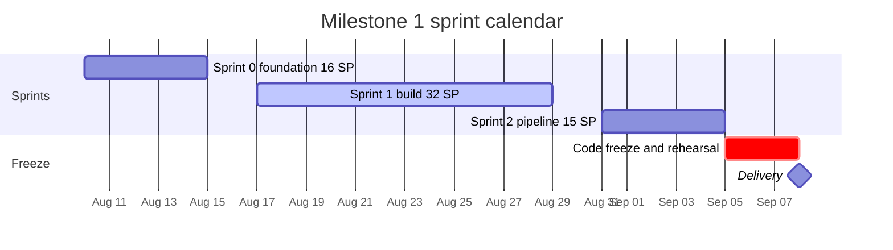

# Release Plan and Sprint Calendar

**Project:** Dynamic Segmentation and Retail Personalization Platform
**Version:** 1.1
**Date:** 2026-08-08
**Owner:** Marcelo (Scrum Master), Raquel (Proxy PO)

This document satisfies the Milestone 1 deliverable "Plan de trabajo del semestre".

---

## 1. Milestone map

| Milestone | Deadline | Scope |
|---|---|---|
| M1 — Analysis, architecture and minimum viable web system | **2026-09-08** (fixed) | Problem analysis, requirements, architecture diagrams, database designs, working web system, local containers, organized repository, technical demonstration |
| M2 — Microservices module and analytical services | TBC | Microservices platform, incremental segmentation, online clustering, drift detection, recommendations, campaigns, health monitoring |
| M3 — Mobile, desktop, experimentation and production deployment | TBC | Android app, desktop app, A/B experimentation, uplift measurement, load testing, GCP deployment hardening |

M2 and M3 deadlines are not yet known. They are placeholders and must be confirmed with the Product Owner before Sprint 2 planning, because the M1 architectural contracts (ADR-001, ADR-002, ADR-003) are sized on the assumption that M2 begins immediately after M1.

---

## 2. Milestone 1 sprint calendar

Today is Saturday 2026-08-08. Sprint 0 begins Monday 2026-08-10. The weekend of 8–9 August is optional preparation, not planned capacity.

| Sprint | Start | End | Working days | Committed SP | Sprint Goal |
|---|---|---|---|---|---|
| Sprint 0 | Mon 2026-08-10 | Fri 2026-08-14 | 5 | 16 | One command brings up the full local stack against a frozen database schema, and every architectural contract the other three components depend on is written down and agreed. |
| Sprint 1 | Mon 2026-08-17 | Fri 2026-08-28 | 10 | 32 | An authenticated analyst can log in, administer users and master data, and see it persisted in PostgreSQL with a complete audit trail, running entirely in containers. |
| Sprint 2 | Mon 2026-08-31 | Fri 2026-09-04 | 5 | 15 | An analyst can execute a full segmentation run end to end and inspect the resulting segments, RFM distribution and customer migrations in the dashboard, with the run recorded for audit. |
| Hardening | Sat 2026-09-05 | Mon 2026-09-07 | 3 | 0 | The demonstration runs from a clean clone without intervention, and every M1 document is committed. |

### 2.1 Ceremony calendar

| Date | Day | Ceremony | Time |
|---|---|---|---|
| 2026-08-10 | Mon | Sprint 0 Planning | 90 min |
| 2026-08-12 | Wed | Backlog Refinement (Sprint 1 candidates) | 45 min |
| 2026-08-14 | Fri | Sprint 0 Review + Retrospective | 60 + 45 min |
| 2026-08-17 | Mon | Sprint 1 Planning | 90 min |
| 2026-08-17 | Mon | Weekly Sync | 20 min |
| 2026-08-19 | Wed | Backlog Refinement | 45 min |
| 2026-08-24 | Mon | Weekly Sync | 20 min |
| 2026-08-26 | Wed | Backlog Refinement (Sprint 2 candidates) | 45 min |
| 2026-08-28 | Fri | Sprint 1 Review + Retrospective | 60 + 45 min |
| 2026-08-31 | Mon | Sprint 2 Planning + Weekly Sync | 90 + 20 min |
| 2026-09-02 | Wed | Backlog Refinement (M2 candidates) | 45 min |
| 2026-09-04 | Fri | Sprint 2 Review + Retrospective | 60 + 45 min |
| 2026-09-06 | Sun | Demo rehearsal 1 | 60 min |
| 2026-09-07 | Mon | Demo rehearsal 2, final freeze | 60 min |
| 2026-09-08 | Tue | **Milestone 1 delivery and demonstration** | — |

Written async check-ins occur every weekday and are not listed.

---

## 3. Sprint goals in detail

### Sprint 0 — Foundation and contracts (Aug 10–14, 16 SP)

Sprint 0 is deliberately serialized. Four people cannot work in parallel on a codebase that does not yet exist: without a frozen schema, a fixed authentication contract, and agreed repository conventions, the result is four branches carrying four interpretations of the data model and a second week spent resolving merge conflicts.

The single most important output is the **frozen bi-temporal segment schema** (E-07). Every subsequent story reads or writes it.

| Deliverable | Owner |
|---|---|
| GitHub organization, monorepo, branch protection, Projects board, issue labels | Marcelo |
| `docker-compose.yml` with PostgreSQL, MongoDB, Redis, web service | Max |
| Flask skeleton: app factory, blueprints, per-environment config, Alembic initialized | Raquel |
| **Frozen ERD including the traceability model: `rfm_run`, `customer_rfm_snapshot`, `segmentation_model_run`, `segment`, `segment_label` and the bi-temporal `customer_segment_assignment`** | Estefanía + Marcelo |
| ADR-001 Authentication and Token Lifecycle | Marcelo |
| ADR-002 Data Ownership Map | Estefanía |
| ADR-003 API Standards including the `Accept`-header XML contract | Max |
| Seed dataset loaded with synthetic store, channel and injected migrations | Estefanía |
| Coding standards, naming conventions, Definition of Done published | Raquel |

Detailed in `03-sprint-00-backlog.md`. **ADR-003 is owned by Max and the coding standards by Raquel**, following the rebalancing recorded in that document: Marcelo held four stories plus half the data model and was loaded at nearly double his individual capacity, which is R-03 appearing in the very first sprint. This table previously assigned both to Marcelo and was stale.

### Sprint 1 — Identity, authorization and master data (Aug 17–28, 32 SP)

Everything the segmentation pipeline needs to exist before it can run. Authentication, the permission model, the four catalogs, transaction ingestion, and the audit trail.

**Demonstrable at review:** login and logout, three differentiated profile menus, user and role administration, four working catalogs, a transaction file uploaded and ingested with a rejection report, and audit entries for every operation performed during the demonstration.

**Highest-risk story:** authentication. The JWT-in-cookie versus JWT-in-header split is where most teams accidentally build two authentication systems. It is assigned to Marcelo, scheduled in week 1, and reviewed by a second person before anything is built on top of it.

### Sprint 2 — The segmentation pipeline (Aug 31 – Sep 4, 15 SP)

The pipeline is the demonstration. One triggered run must: read the transaction history, compute RFM snapshots, execute K-means, write bi-temporally versioned segment assignments, detect migrations against the previous run, render four Highcharts views, and write audit records for the entire sequence.

**The critical acceptance test:** run the segmentation twice with different parameters, then show **both** of the following. Showing only the first is necessary but not sufficient, and the original wording of this test stopped there.

1. **The first run's assignments are still queryable, through the point-in-time query, on both time axes** — what was true on a past date, and what the platform believed on a past date. Two axes rather than one is what separates a genuine correction from a fabricated behaviour change (D-01).
2. **The migration report identifies movement by segment label, not by segment id.** Segments are scoped to a run, so `segment_id` differs for every customer on every run and a report built on it would show 100% migration every time — while erroring on nothing (D-04, verified by CHECK 7).

If both hold, the project's central requirement is demonstrably met. If the first holds and the second does not, the demonstration produces a confident number that means nothing, which is worse than producing no number at all. No amount of UI polish compensates for either.

Sprint 2 is committed at 15 SP rather than 19 because documentation consolidation and demo preparation consume capacity that is not represented as stories.

### Hardening — Freeze (Sep 5–7, 0 SP)

No new stories. No new features. Three activities only:

1. Defect repair on demonstration paths
2. Documentation consolidation: all fourteen M1 deliverables committed and cross-referenced
3. Two full demonstration rehearsals from a clean clone on a machine that is not the primary developer's

Programming until the delivery date is the most common cause of a failed demonstration. The freeze is not optional.

---

## 4. Milestone 1 deliverable coverage

Mapping course-required deliverables to the sprint that produces them and the owner.

| # | Required deliverable | Sprint | Owner | Location |
|---|---|---|---|---|
| 1 | Problem analysis document | S0–S1 | Estefanía | `docs/analysis/problem-analysis.md` |
| 2 | Functional and non-functional requirements | S1 | Raquel | `docs/requirements/` |
| 3 | User stories | S0–S2 | Raquel | GitHub Issues + `docs/requirements/user-stories.md` |
| 4 | Business rules | S1 | Estefanía | `docs/requirements/business-rules.md` |
| 5 | Profile and permission matrix | S1 | Marcelo | `docs/security/permission-matrix.md` |
| 6 | Architecture diagrams | S0–S2 | Marcelo | `docs/architecture/` |
| 7 | PostgreSQL model (conceptual, logical, physical) | S0 | Estefanía | `docs/data/postgresql-model.md`, `infra/sql/schema/001_m1_initial_schema.sql`, `infra/sql/schema/verify_m1_schema.sql` |
| 8 | MongoDB design | S0 | Estefanía | `docs/data/mongodb-design.md` |
| 9 | Redis design | S0 | Marcelo | `docs/data/redis-design.md` |
| 10 | Interface prototypes | S1 | Raquel | `docs/ux/` |
| 11 | Minimum viable web system | S1–S2 | Raquel, Marcelo | `web/` |
| 12 | Local containers | S0 | Max | `infra/docker-compose.yml` |
| 13 | Organized repository | S0 | Marcelo | repository root |
| 14 | Semester work plan | S0 | Marcelo | this document |
| 15 | Technical demonstration | Hardening | Whole team | `docs/demo/demo-script.md` |

Nine architecture diagrams are required: context, container, component, deployment, network, sequence, inter-application communication, authentication, and data storage. They are split across sprints rather than produced in a single block, because the deployment and network diagrams cannot be accurate until the infrastructure exists.

| Diagram | Sprint |
|---|---|
| Context, Container | S0 |
| Data storage, Authentication | S0 |
| Component, Sequence (segmentation run) | S1 |
| Deployment, Network | S2 |
| Inter-application communication | S2 |

---

## 5. Demonstration script — Milestone 1

The course specifies what must be demonstrated. Rehearsed sequence:

1. Start the stack from a clean clone: `docker compose up`, migrate, seed
2. Show the public site and the loyalty enrollment form
3. Log in as Administrator; show the menu, user administration, role assignment
4. Log out; log in as Commercial Analyst; show that the menu differs and that an Administrator-only route returns 403
5. Operate two catalogs: create, edit, search, soft delete
6. Upload a transaction file; show validation and the rejection report
7. Execute a segmentation run; show RFM snapshots and the resulting segments
8. Execute a second run with different parameters
9. Show the migration report identifying customers who moved between runs. **The report is label-based**: it compares `segment_label.code` across runs and classifies direction as upgrade, lateral or downgrade by `value_rank`. It is not a comparison of `segment_id`, which would report every customer as migrated on every run
10. Show the Highcharts dashboards
11. Log in as Auditor; show the audit trail containing every operation just performed, and a point-in-time segment lookup
12. Show that all of the above ran in containers

Steps 8, 9 and 11 are the ones that distinguish this project from a generic CRUD application. They must not be cut for time.

---

## 6. Release tagging

| Tag | Point |
|---|---|
| `v0.0.0` | Sprint 0 complete: stack runs, schema frozen, contracts published |
| `v0.1.0` | Sprint 1 complete: authentication, authorization, catalogs, ingestion, audit |
| `v0.2.0` | Sprint 2 complete: segmentation pipeline and dashboards |
| `v1.0.0-m1` | Milestone 1 delivery, 2026-09-08 |

---

## 7. Outlook for M2 and M3

Coarse sequencing only. Detailed planning occurs at the corresponding milestone kickoff.

**M2 — Microservices and analytical services.** Sprint A builds the platform foundation (E-17): REST conventions, API versioning, JSON and XML content negotiation, JWT validation against Redis, rate limiting, correlation identifiers, health endpoints, OpenAPI documentation. Nothing else starts until the foundation exists, because every subsequent service inherits it. Sprints B and C build the analytical services (E-18 through E-23) and the health monitoring dashboard (E-28). A GKE migration is evaluated at the end of M2 and only if the incremental and drift services show a genuine independent scaling need.

**Campaign targeting binds to segment labels.** When E-24 is built, a campaign references `segment_label.code` and never `segment.id`. Segments are scoped to a run, so a campaign that foreign-keys to `segment.id` targets a segment that ceases to exist at the next run — and every experiment and uplift measurement built on that campaign (E-25, E-26) inherits the defect. The M1 schema already satisfies this constraint; §9 of `docs/data/postgresql-model.md` records the attachment point so M2 can start without reopening the M1 migration.

**M3 — Clients, experimentation and hardening.** The Android and desktop applications are built in parallel by separate owners against the frozen API contracts. Experimentation and uplift measurement (E-25, E-26) run alongside. Locust load testing and observability (E-32) close the milestone.

**The dependency that must not be forgotten.** The desktop application consumes XML exclusively. If the microservices are built for JSON in M2 and XML is added in M3, the serialization layer is rewritten. Content negotiation is specified in ADR-003 during Sprint 0 and implemented in the M2 platform foundation, not retrofitted.

---

## Revision history

| Version | Date | Author | Change |
|---|---|---|---|
| 1.0 | 2026-08-08 | Marcelo | Initial release plan |
| 1.1 | 2026-08-08 | Marcelo | Corrected against `docs/data/postgresql-model.md` §3. Sprint 0 deliverable owners aligned with the rebalancing in `03-sprint-00-backlog.md` (ADR-003 to Max, coding standards to Raquel) — a pre-existing inconsistency between the two documents. Frozen ERD line names the traceability model. Sprint 2 critical acceptance test restated on both time axes and on label-based migration. Deliverable row 7 lists the SQL and verification script paths. Demo step 9 marked label-based. §7 M2 outlook binds campaign targeting to segment labels. |
