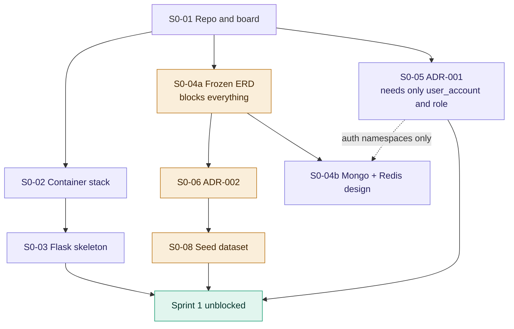

# Sprint 0 Backlog — Foundation and Contracts

**Sprint:** 0
**Dates:** Mon 2026-08-10 → Fri 2026-08-14 (5 working days)
**Capacity:** 19 SP · **Committed:** 22 SP · **Commitment ratio:** 116%
**Scrum Master:** Marcelo · **Proxy PO:** Raquel
**Version:** 1.2

---

## Sprint Goal

> One command brings up the full local stack against a frozen database schema, and every architectural contract the other three components depend on is written down and agreed.

---

## Why this sprint is serialized

Sprint 0 has more sequential dependency than any later sprint, and that is intentional. Parallelizing before the schema and the authentication contract exist produces four incompatible interpretations of the data model and a week spent on merge conflicts instead of features.

Execution order:



Day by day:

| Day | Work |
|---|---|
| Mon | S0-01 repository and board, then S0-02 container stack; S0-04a ERD begins; S0-05 ADR-001 begins in parallel |
| Tue | S0-04a ERD frozen; ADR-002 and ADR-003 start |
| Wed | **S0-05's authentication namespaces settled by 09:00**; S0-04b MongoDB and Redis design; S0-08 seed dataset |
| Thu | S0-10 standards; Sprint 1 handoff preparation for S0-09 and S0-11 |
| Fri | Integration verification, Review, Retrospective |

**S0-04a blocks everything downstream.** It is the highest-priority item in the sprint and it is not permitted to slip past Tuesday. S0-04b blocks nothing inside Sprint 0 and is due Wednesday.

**S0-05 partially gates S0-04b, and this edge was missing until 2026-08-11.** The
graph above showed S0-05 as an independent parallel track. It is not:
`docs/data/redis-design.md` records that `session:{user_id}:{jti}`,
`denylist:{jti}` and `refresh:{jti}` belong to ADR-001, that **ADR-001 wins** if
the two documents disagree on a pattern or a TTL, and that the Redis-unavailable
behaviour must be *"consistent with ADR-001"*. S0-04b is due Wednesday and cannot
write those rows against a stub without producing the second definition of the
revocation path that R-06 describes.

**The gate is a subset of S0-05, not all of it.** What S0-04b needs is three key
patterns, their TTLs, and the single fail-closed-or-fail-open decision. Claim
structure, CSRF, rotation and key-rotation policy gate nothing here. So S0-05's
authentication-namespace decisions are due **Wed 2026-08-12 09:00**, ahead of
S0-04b, while the rest of ADR-001 continues on its own schedule — and S0-04b's
MongoDB half is not gated at all and can proceed in parallel.

---

## Committed stories

### S0-01 — Repository, organization and board
**Owner:** Marcelo · **Points:** 2 · **Type:** chore · **Blocks:** all

> As a development team, we need a shared repository and task board so that work is traceable and does not depend on any individual's personal account.

**Tasks**
- Create the GitHub organization; add all four members as members, two as owners
- Create the monorepo with the agreed directory structure
- Protect `main`: no direct pushes, pull request required, one approval minimum
- Create `develop` as the default integration branch
- Configure GitHub Projects board: Backlog, Ready, In Progress, In Review, Done
- Create issue labels: `type:feature|bug|chore|docs|spike`, `component:web|services|mobile|desktop|ml|infra|docs`, `priority:P0|P1|P2|P3`; sprint membership is tracked with the Projects `Sprint` field, not duplicate labels
- Add `.github/ISSUE_TEMPLATE/` templates for user stories and defects
- Commit the root `README.md` and `CONTRIBUTING.md`

**Directory structure**
```
retail-segmentation/
  web/            Flask + Jinja2 web system (M1)
  services/       microservices module (M2) — README placeholder only
  mobile/         Android client (M3) — README placeholder only
  desktop/        desktop client (M3) — README placeholder only
  ml/             notebooks, RFM, clustering, seed generation
  infra/          docker-compose, Dockerfiles, GCP scripts
  docs/           all documentation, English only
    adr/          architecture decision records
    analysis/     problem analysis
    architecture/ diagrams
    data/         database designs, seed strategy
    requirements/ functional, non-functional, stories, business rules
    scrum/        this directory
    security/     permission matrix
```

A monorepo is chosen over separate repositories per component. The requirement that each microservice deploy independently concerns containers and pipelines, not repository boundaries. With four people, five repositories means five coordinated pull requests for every contract change and no single place to see which versions belong together.

**Acceptance criteria**
- Given a team member with a fresh clone, when they attempt to push directly to `main`, then the push is rejected
- Given a new issue, when it is created, then a template is offered and the label set is available
- Given an issue on the board, when its `Status` field is set to `In Review`, then the card is visible in the `In Review` board column

---

### S0-02 — Local container stack
**Owner:** Max · **Points:** 3 · **Type:** chore · **Depends on:** S0-01

> As a developer, I want the entire stack to start with one command so that every team member runs an identical environment and "it works on my machine" is not an accepted explanation.

**Tasks**
- `infra/docker-compose.yml`: PostgreSQL 16, MongoDB 7, Redis 7, web service
- Named volumes for all three data stores
- Health checks on each service; `depends_on` with `condition: service_healthy`
- `web/Dockerfile` on `python:3.12-slim`, non-root user, layer-cached dependency install
- `.env.example` listing every required variable with safe defaults
- `Makefile` targets: `up`, `down`, `migrate`, `seed`, `test`, `logs`, `reset`
- Verify that the `btree_gist` and `pg_trgm` extensions are available in the PostgreSQL image; the first migration creates both and the schema does not apply without them (`docs/data/postgresql-model.md` §2)
- `.env.example` carries **two** connection strings, not one: `DATABASE_URL` for the restricted runtime role and `DATABASE_MIGRATION_URL` for the schema owner (D-14)

**Why two DSNs.** `audit_log` is append-only, enforced by a statement trigger *and* by grants. A `REVOKE` has no effect on the role that owns the schema, so if the application connects as the owner the append-only guarantee is decoration. This is a hard dependency of S0-04a on this story and it has to be settled while the compose file is being written, not at Wednesday's refinement.

**Base image decision.** Alpine is rejected. scikit-learn and pandas do not publish musl wheels, so an Alpine base forces source compilation and multi-minute rebuilds. `python:3.12-slim` is the correct default for this stack.

**Acceptance criteria**
- Given a clean clone and a copied `.env`, when `make up` runs, then all four containers reach a healthy state without manual intervention
- Given a running stack, when `make reset` runs, then volumes are removed and the next `make up` starts from empty databases
- Given the web container, when it is inspected, then the process is not running as root
- Given `docker compose config`, when it is evaluated, then no secret values are present in the file

---

### S0-03 — Flask application skeleton
**Owner:** Raquel · **Points:** 3 · **Type:** chore · **Depends on:** S0-02

> As a developer, I want an application skeleton with configuration, blueprints and migrations already wired so that feature work in Sprint 1 does not begin with structural decisions.

**Tasks**
- Application factory pattern, `create_app(config_name)`
- Configuration classes: development, testing, production, read from environment
- Blueprint registration: `public`, `auth`, `admin`, `catalog`, `analytics`, `audit`, `api`
- SQLAlchemy initialization; Alembic initialized with one empty baseline revision
- Alembic configured in `env.py` with the naming convention from `docs/data/postgresql-model.md` §2, so autogenerate does not emit anonymous constraints that cannot be dropped in a later migration
- The application connects as the restricted runtime role (`DATABASE_URL`), never as the schema owner; migrations use `DATABASE_MIGRATION_URL` (D-14)
- MongoDB and Redis client initialization with connection pooling
- `structlog` configured for JSON output with a request-scoped correlation identifier
- Base Jinja2 layout, static asset structure, error handlers for 400, 401, 403, 404, 500
- `pytest` configured with an application fixture and a transactional database fixture
- `requirements.txt` and `requirements-dev.txt`

**Dependencies beyond the course minimum, with justification**

| Package | Justification |
|---|---|
| Alembic | Four people modifying one PostgreSQL schema without versioned migrations guarantees environment drift. This is the most significant gap in the specified minimum stack. |
| pandas, scikit-learn | RFM aggregation and K-means. Hand-implementing K-means spends capacity on a solved problem. |
| pytest | Testing is a required deliverable. |
| structlog | Structured error and event logging is a required deliverable; plain `logging` makes correlation identifiers awkward. |
| Argon2 (`argon2-cffi`) | Current password hashing standard. |

Rejected for M1: React (Jinja2 is required and sufficient), Celery (a manually triggered endpoint is adequate for a segmentation run at this stage), Kubernetes (see ADR-004).

**Acceptance criteria**
- Given the running container, when `/health` is requested, then it returns 200 with the status of PostgreSQL, MongoDB and Redis
- Given `alembic upgrade head` against an empty database, when it runs, then it completes without error
- Given `pytest`, when it runs, then the suite passes with at least one test per configured blueprint
- Given any request, when its log lines are inspected, then all lines for that request share one correlation identifier

---

### S0-04a — Frozen data model including bi-temporal segment traceability
**Owner:** Estefanía · **Reviewer:** Marcelo · **Points:** 3 · **Type:** docs + feature · **Due:** Tue 2026-08-11 EOD · **Blocks:** S0-06, S0-08, and all Sprint 1 stories

> As a team, we need the PostgreSQL schema frozen and the segment assignment model bi-temporal so that segments can be updated without losing historical traceability, which is the central requirement of the problem statement.

This is the highest-value story in the sprint. The problem statement's core requirement — update segments without losing historical traceability — is satisfied or broken here, at the schema level, before any code is written.

**The rule:** there is no mutable `customer.segment_id`. Segment assignment is never updated in place. Each run closes the prior assignment and inserts a new one.

The design is recorded in `docs/data/postgresql-model.md` (v0.9, PROPOSED, freezes at Sprint 0 Planning 2026-08-10), with the physical model in `infra/sql/schema/001_m1_initial_schema.sql`. The decision identifiers below (D-01 … D-15) refer to §3 of that document. Every entry in the table below is a change from this backlog's first version; §8 of the model document lists them side by side.

**Core traceability tables**

| Table | Key columns | Purpose |
|---|---|---|
| `rfm_run` | `id`, `analysis_window_start`, `analysis_window_end`, `reference_date`, `quintile_strategy`, `customer_scope`, `include_returns`, `code_version`, `correlation_id`, `status`, `completed_at` | **Parent of the clustering run.** Owns the analysis window and the feature computation (D-05) |
| `customer_rfm_snapshot` | `id`, `rfm_run_id`, `customer_id`, `recency_days`, `frequency`, `monetary`, `r_score`, `f_score`, `m_score`, `rfm_cell`, plus 13 behavioural feature columns | Immutable feature values per customer per **RFM** run, not per segmentation run (D-05, D-06) |
| `segmentation_model_run` | `id`, `rfm_run_id`, `algorithm`, `algorithm_version`, `library_version`, `code_version`, `k`, `random_seed`, `feature_set_version`, `scaler_kind`, `scaler_state`, `labelling_strategy`, `purpose`, `silhouette`, `inertia`, `status`, `completed_at`, `promoted_at` | One row per clustering execution over an existing `rfm_run` (D-05) |
| `segment` | `id`, `model_run_id`, `cluster_index`, `label_code` → `segment_label`, `centroid_scaled`, `member_count`, `revenue_share` | Segment definitions scoped to a run, not global. `label_code` is what makes them comparable (D-04) |
| `segment_label` | `code` (PK), `name`, `description`, `value_rank`, `display_order` | **Stable segment identity across runs.** Six seeded labels. `value_rank` makes migration direction a query rather than application logic (D-04) |
| `customer_segment_assignment` | `id`, `customer_id`, `segment_id`, `model_run_id`, `rfm_snapshot_id`, `is_authoritative`, `valid_from`, `valid_to`, `recorded_at`, `superseded_at`, `closed_by_run_id`, `distance_to_centroid` | Bi-temporal assignment history: `valid_from`/`valid_to` is **valid time**, `recorded_at`/`superseded_at` is **decision time** (D-01, D-02) |

**Consequences that make later epics cheap**
- Migration detection is a query over two consecutive assignments for a customer, compared on `segment_label.code` — never on `segment_id`, which differs for every customer on every run because segments are run-scoped (D-04)
- Point-in-time lookup: the segment of customer X on date D is the assignment where `valid_from <= D` and (`valid_to > D` or `valid_to IS NULL`), optionally constrained on the decision axis to ask what the platform believed at time T
- Model comparison becomes possible because two runs coexist over the same population: non-production runs write assignments with `is_authoritative = false`, so uniqueness applies only to authoritative rows (D-02)
- One feature set, many clusterings: comparing k=4 against k=6 uses identical features because both point at the same `rfm_run` (D-05)

**Tasks**
- Conceptual model: entities and relationships
- Logical model: full attribute set, keys, constraints
- Physical model: DDL as the first substantive Alembic migration
- Transactional tables: `customer`, `product`, `category`, `store`, `sales_channel`, `sales_transaction`, `sales_transaction_line`, `inventory_availability`
- Security tables: `user_account`, `role`, `permission`, `role_permission`, `user_role`
- Audit table: `audit_log`, append-only
- **Exclusion constraint** enforcing non-overlapping authoritative assignment intervals per customer, replacing the partial unique index (D-03):
  ```sql
  EXCLUDE USING gist (customer_id WITH =, tstzrange(valid_from, valid_to) WITH &&)
    WHERE (is_authoritative AND superseded_at IS NULL)
    DEFERRABLE INITIALLY IMMEDIATE
  ```
  It is `DEFERRABLE INITIALLY IMMEDIATE` because both properties are needed and only this mode gives both: overlaps fail at statement time with statement context, *and* the pipeline may opt into `SET CONSTRAINTS ... DEFERRED` inside the run transaction so it can insert the new assignment before closing the old one. `NOT DEFERRABLE` forbids the second; `INITIALLY DEFERRED` surfaces the error at `COMMIT` with no statement context and loses fail-fast behaviour for everyone else (D-03)
- Deterministic cluster-to-label mapping rule: a rule over centroid position, recorded in `segmentation_model_run.labelling_strategy`. K-means cluster indices are arbitrary and unstable between runs, so a human naming clusters by hand after each run makes migration detection report label-assignment noise as customer behaviour (D-04)
- The 13 behavioural feature columns on `customer_rfm_snapshot`: `top_category_id`, `top_category_share`, `distinct_category_count`, `dominant_channel_code`, `digital_share`, `dominant_store_id`, `distinct_store_count`, `avg_order_value`, `avg_interpurchase_days`, `promo_response_rate`, `return_count`, `return_amount`, `tenure_days`. R, F and M cover two of the six behaviour changes the problem statement names; these cover the rest, and they are also the category-mix features E-06 needs (D-06)
- `sales_transaction.transaction_type ∈ {sale, return}` with a sign constraint and an optional `original_transaction_id`. Returns are first-class negative rows: public retail datasets encode credit notes as negative-quantity documents, and treating them as sales inflates Monetary. A return is permitted without an original, because historical imports contain credit notes whose original falls outside the window (D-07)
- Natural key on `sales_transaction`: `UNIQUE (source_system, external_transaction_id)`. Without it S0-08's "`make seed` twice, row counts unchanged" is unachievable, and the CSV upload path has no defined behaviour on re-upload (D-08)
- `user_role.scope_store_id` with `role.scope_kind ∈ {global, store}` and a trigger enforcing consistency. Store Manager sees one store; retrofitting row-level scope in M3 touches every authorization decision (D-10)
- Versioned consent: `consent_purpose` × `privacy_notice_version` × `consent_record`, with an exclusion constraint preventing overlapping intervals per customer per purpose. A boolean cannot answer which purpose was consented, under which notice version, and whether it was in force at the moment of the run that profiled the customer (D-11)
- `sales_transaction_line.category_id` copied from the product at ingestion. `product.category_id` is mutable master data; if category-mix features read it live, re-categorizing one product silently rewrites the feature history of every past run (D-12)
- Two database roles and two DSNs: `audit_log` append-only is enforced by a statement trigger **and** by grants, and a `REVOKE` has no effect on the role that owns the schema. Hard dependency on S0-02 and S0-03 (D-14)
- Indexes for the migration query and the point-in-time query

**Acceptance criteria**

Acceptance is executable, not judged by reading. `infra/sql/schema/verify_m1_schema.sql` contains 16 numbered checks; the criteria below reference them by number. Checks 2, 3, 9, 10, 11, 12, 13, 14 and 15 pass by *raising* an error — an `ERROR` line there is the success condition, and a silent success is the failure.

- Given an empty database, when `alembic upgrade head` runs, then the DDL applies with zero errors, producing 27 tables, 3 views and 75 indexes
- Given the migrated database, when `verify_m1_schema.sql` runs, then **all 16 checks behave as their `expected:` lines state**
- Given a customer with an open authoritative assignment, when a second open one is inserted, then it is rejected **at statement time** — CHECK 2. If it reports `INSERT 0 1` the constraint was declared `INITIALLY DEFERRED` and fail-fast has been lost
- Given a customer with an existing assignment, when an **overlapping closed** interval is inserted, then it is rejected — CHECK 3. The originally specified partial unique index permitted this
- Given a production run, when a candidate run writes assignments over the same population, then both coexist — CHECK 4. The original index made this impossible
- Given the run transaction, when it opts into `SET CONSTRAINTS ... DEFERRED`, then insert-then-close ordering commits without error — CHECK 5
- Given two completed runs, when the point-in-time query runs for a date between them, then it returns exactly one segment per customer at both dates — CHECK 6
- Given two runs over the same population, when the migration report runs, then it counts **label** changes and not `segment_id` changes — CHECK 7
- Given two consecutive snapshots, when the behaviour delta view runs, then it identifies category shift and channel switch — CHECK 8
- Given an `audit_log` row, when `UPDATE` or `DELETE` is attempted, then both are rejected — CHECK 9
- Given a return with a positive amount, an in-store transaction with no store, a re-ingested source transaction, an overlapping consent interval, a store-scoped role with no store, and a global role carrying a store, then each is rejected — CHECKS 10, 11, 12, 13, 14, 15
- Given a transaction line, when `net_amount` is read, then it is computed rather than trusted from input — CHECK 16
- Given the ERD document, when reviewed, then every table has a stated purpose and every foreign key a stated cardinality

---

### S0-04b — MongoDB collection design and Redis key namespace design
**Owner:** Estefanía · **Points:** 2 · **Type:** docs · **Due:** Wed 2026-08-12 · **Depends on:** S0-04a; **and on S0-05 for the three authentication namespaces only**

> As a team, we need the document and cache stores designed with the same rigour as the relational one, so that the three-store boundary is defensible rather than decorative.

Split out of S0-04 so that R-01's trigger — *not frozen by end of Tuesday* — is testable against something specific rather than against a five-part story that is partially done. The relational freeze blocks the sprint; these two designs block nothing inside Sprint 0.

**Tasks**
- MongoDB collection design: `ingestion_run`, `ingestion_error`, `model_run_telemetry`, `recommendation_event`
- Redis key namespace design: sessions, revocation denylist, query cache, rate-limit counters, distributed locks, with TTLs per namespace
- State the crossing point explicitly: `ingestion_run.telemetry_ref` holds a MongoDB `ObjectId` as a plain string, and **no referential integrity is claimed across stores**. PostgreSQL keeps the counts that must join; MongoDB keeps the detail whose shape varies (`docs/data/postgresql-model.md` §5.4)

**Acceptance criteria**
- Given the MongoDB design, when reviewed, then every collection has a stated purpose, a document shape, and a justification for why it is not a relational table
- Given the Redis design, when reviewed, then every key pattern has a documented TTL and eviction expectation

---

### S0-05 — ADR-001 Authentication and Token Lifecycle
**Owner:** Marcelo · **Points:** 2 · **Type:** docs · **Due:** authentication namespaces by Wed 2026-08-12 09:00, remainder Thu · **Blocks:** all authentication work in every component, **and the Redis half of S0-04b**

> As a team, we need the authentication scheme fixed in one document so that the web, mobile and desktop clients do not each invent their own and so that a single revocation mechanism serves all three.

**This story no longer depends on S0-04.** The dependency was removed deliberately, not by accident: authentication design needs only the shape of `user_account` and `role`, and both are settled in `docs/data/postgresql-model.md` (D-09, D-10). Marcelo can start ADR-001 on Monday morning in parallel with the schema freeze rather than waiting for Tuesday, which removes half a day from the critical path in a sprint the team's own numbers say is over capacity (§8 of the model document).

**It does, however, gate part of S0-04b — see the note under the execution
graph.** Removing the upstream dependency put this story earlier; it did not
make it a leaf. The three authentication key patterns, their TTLs and the
Redis-unavailable decision are needed by Wednesday 09:00 for `redis-design.md`
to reference them instead of inventing a second set.

The specification requires JWT, but the web system is server-rendered. Left unresolved, teams build Flask session cookies for the web and JWT for the API clients, duplicating authentication and producing two revocation paths that disagree.

**Decision to record:** one JWT scheme, two transports.

| Client | Transport | Rationale |
|---|---|---|
| Web system | `HttpOnly`, `Secure`, `SameSite=Lax` cookie | Server-rendered pages cannot attach headers to ordinary navigation; `HttpOnly` removes XSS token theft |
| Android | `Authorization: Bearer` header | Standard for native clients |
| Desktop | `Authorization: Bearer` header | Same |

**Must be specified**
- Claim structure: `sub`, `jti`, `iat`, `exp`, `roles`, `permissions` or a permission version reference, `token_type`
- Access token TTL (15 minutes proposed) and refresh token TTL (7 days proposed)
- Refresh token rotation, with reuse of a rotated token treated as compromise
- CSRF protection for the cookie transport, given that `SameSite=Lax` alone is insufficient for state-changing POSTs
- Redis key patterns: `session:{user_id}:{jti}`, `denylist:{jti}`, `refresh:{jti}`
- Revocation semantics: logout, forced logout, permission change
- Signing algorithm and key rotation policy
- What happens when Redis is unavailable — fail closed or fail open, and why

**Acceptance criteria**
- Given the ADR, when read by a developer who did not write it, then they can implement token issuance and validation without asking a follow-up question
- Given the ADR, when the Redis outage behaviour section is read, then it states a single decision with a justification, not a list of options

---

### S0-06 — ADR-002 Data Ownership Map
**Owner:** Raquel · **Reviewer:** Estefanía · **Points:** 1 · **Type:** docs · **Depends on:** S0-04a

> Reassigned from Estefanía on 2026-08-10 as a contingency and confirmed on
> 2026-08-11 on the load argument rather than the contingency. Reasoning in
> `sprints/sprint-00.md` §7.3. The per-person tables further down this document
> are the **planning baseline** and are deliberately not rewritten; §2.2 of the
> sprint record carries the current numbers.

> As a team, we need each table, collection and key namespace assigned to exactly one writing component so that shared databases do not become accidental coupling between the web system and the microservices module.

The specification permits microservices to share authorized databases. That permission is an invitation to accidental coupling: two components writing the same table with different invariants is a defect that appears in M2 and is expensive to unwind. Ownership is recorded now, while the answer is still obvious.

**Tasks**
- Table-by-table matrix: owning component (writer), permitted readers
- Same for MongoDB collections and Redis key namespaces
- State the rule for cross-component writes: prohibited; the owner exposes an endpoint instead

**Acceptance criteria**
- Given the matrix, when any table is looked up, then exactly one component is listed as writer
- Given the matrix, when reviewed against the epic list, then every planned microservice has its read and write scope stated

---

### S0-07 — ADR-003 API Standards and Content Negotiation
**Owner:** Max · **Points:** 2 · **Type:** docs

> As a team, we need REST conventions, error format and content negotiation fixed now so that the microservices module can be built in M2 without redesign, and so that XML support is not retrofitted.

The desktop application consumes XML exclusively; the mobile application consumes JSON exclusively. Designing for JSON in M2 and adding XML in M3 means rewriting the serialization layer. Content negotiation via the `Accept` header is specified now and implemented once.

**Must be specified**
- URL versioning: `/api/v1/...`
- Content negotiation: `Accept: application/json` and `Accept: application/xml`, with a defined default and a defined 406 behaviour
- JSON-to-XML mapping conventions: root element, collection element naming, null representation, date format
- Error envelope, identical in structure across both formats: code, message, details, correlation id
- HTTP status usage: 400, 401, 403, 404, 409, 422, 429, 500, 503
- Pagination convention
- Correlation identifier propagation: `X-Correlation-ID`, inbound reuse, generated when absent
- Rate limit headers and the 429 response shape
- Health endpoint contract: `/health/live`, `/health/ready`, `/health/database`, `/health/redis`, `/health/mongodb`, `/health/storage`, with the response schema and the meaning of degraded versus down

**Acceptance criteria**
- Given the ADR, when a developer implements an endpoint, then the same resource can be returned as JSON or XML from one handler
- Given the error envelope specification, when an error is produced in either format, then the field set is identical

---

### S0-08 — Seed dataset with realistic transaction history
**Owner:** Estefanía · **Points:** 3 · **Type:** feature · **Depends on:** S0-04a

> As a team, we need a realistic multi-month transaction history so that RFM quintiles are meaningful and segment migrations are observable in the demonstration.

Nobody usually assigns this, and its absence is what kills the demonstration. RFM over hand-entered rows produces degenerate quintiles, and with no purchase history there is nothing between two runs for a migration report to detect.

**Approach.** Start from a public retail transaction dataset with genuine purchase behaviour rather than generating everything synthetically — real purchase patterns produce plausible segments and plausible migrations without tuning. Store, channel and controlled migration behaviour are layered on top synthetically, since the base data lacks those dimensions. See `docs/data/seed-strategy.md` for the source, licence and transformation steps.

**Tasks**
- Acquire and document the base dataset, including its licence
- Map source columns to `customer`, `product`, `category`, `sales_transaction`, `sales_transaction_line`
- Assign stores and channels probabilistically per customer, with a documented distribution
- Inject controlled migration behaviour for a known subset of customers: frequency change, category shift, channel switch, spend increase and decrease
- Record the injected ground truth so migration detection can be validated rather than eyeballed
- Idempotent loader invoked by `make seed`
- Write ingestion telemetry to MongoDB during loading, exercising that path from day one

**Acceptance criteria**
- Given an empty database, when `make seed` runs, then at least 2,000 customers and 100,000 transaction lines spanning at least 18 months are loaded
- Given `make seed` run twice, when the row counts are compared, then they are unchanged
- Given the loaded data, when RFM is computed, then all five quintiles are populated in every dimension
- Given the injected ground truth, when two runs are compared, then the known migrating customers appear in the migration set

---

### S0-09 — Baseline architecture diagrams
**Owner:** Marcelo · **Sprint:** 1 · **Points:** 2 · **Type:** docs · **Depends on:** S0-04a, S0-05

> As a team, we need the context, container, authentication and data storage diagrams so that component responsibilities are agreed before Sprint 1 development begins.

Four of the nine required diagrams are produced now. Component and sequence diagrams follow in Sprint 1; deployment and network diagrams in Sprint 2, once the infrastructure exists and the diagrams can be accurate rather than aspirational.

**Tasks**
- Context diagram: the platform, its seven actor profiles, and external systems
- Container diagram: web system, microservices module, mobile, desktop, three data stores, Cloud Storage
- Authentication diagram: login, access token use, refresh rotation, revocation, for both transports
- Data storage diagram: which data lives in PostgreSQL, MongoDB, Redis and Cloud Storage, with the justification for each placement
- Written justification section covering which functions belong to the web system versus a microservice, and why

**Acceptance criteria**
- Given the container diagram, when compared with ADR-002, then no component is shown writing a store it does not own
- Given the authentication diagram, when compared with ADR-001, then both transports and the revocation path are represented

---

### S0-10 — Engineering standards and Definition of Done
**Owner:** Raquel · **Points:** 1 · **Type:** docs

> As a team, we need coding standards, naming conventions and an enforced Definition of Done so that four people produce one coherent codebase.

**Tasks**
- Python style: PEP 8, `black`, `ruff`, line length, docstring convention
- Naming conventions: database (snake_case, singular table names), Python, Jinja2 templates, CSS, JavaScript, branches, commits
- Conventional Commits specification with examples
- Add `.github/pull_request_template.md` with a checklist derived from all eleven story-level Definition of Done items
- `CONTRIBUTING.md` covering local setup, branch flow, and review expectations
- Publish the Definition of Done and Definition of Ready in the repository

**Acceptance criteria**
- Given `black --check` and `ruff` over the repository, when they run, then both pass
- Given a new pull request, when it is opened, then the Definition of Done checklist appears in the description

---

### S0-11 — Requirements and analysis skeleton
**Owner:** Raquel · **Sprint:** 1 · **Points:** 1 · **Type:** docs

> As a Proxy Product Owner, I need the requirements documents created with their structure and Sprint 1 content in place so that the analysis deliverable is written incrementally rather than the weekend before delivery.

The commit history of these documents is itself evidence that the process was followed. A single large commit dated 2026-09-07 is visible to any evaluator.

**Tasks**
- Create `docs/analysis/problem-analysis.md` with all required sections and the context and actors sections drafted
- Create `docs/requirements/functional-requirements.md`, `non-functional-requirements.md`, `user-stories.md`, `business-rules.md`, `traceability-matrix.md` with headings and identifier schemes
- Define the identifier scheme: `FR-nnn`, `NFR-nnn`, `BR-nnn`, `US-nnn`
- Requirements are classified by component: web, microservices, mobile, desktop, databases, infrastructure, security, monitoring
- Populate the traceability matrix columns: requirement → story → component → test → status

**Acceptance criteria**
- Given each document, when opened, then its section structure matches the course deliverable list
- Given the traceability matrix, when a Sprint 1 story is added, then it can be linked to a requirement identifier without restructuring the table

---

## Sprint 0 summary after rebalancing

| Story | Owner | SP | Type |
|---|---|---|---|
| S0-01 Repository, organization and board | Marcelo | 2 | chore |
| S0-02 Local container stack | Max | 3 | chore |
| S0-03 Flask application skeleton | Raquel | 3 | chore |
| S0-04a Frozen data model, bi-temporal traceability | Estefanía (Marcelo reviews) | 3 | docs + feature |
| S0-04b MongoDB and Redis design | Estefanía | 2 | docs |
| S0-05 ADR-001 Authentication | Marcelo | 2 | docs |
| S0-06 ADR-002 Data Ownership | Raquel (Estefanía reviews) | 1 | docs |
| S0-07 ADR-003 API Standards | Max | 2 | docs |
| S0-08 Seed dataset | Estefanía | 3 | feature |
| S0-10 Engineering standards | Raquel | 1 | docs |
| **Total** | | **22** | |

The team adopted the rebalanced assignment as the authoritative planning baseline: S0-07 belongs to Max, S0-10 belongs to Raquel, and Estefanía owns S0-04a while Marcelo reviews it. S0-09 and S0-11 move to Sprint 1; S0-10 remains in Sprint 0 because standards published after development starts are not followed. The resulting Sprint 0 commitment is 22 SP against the 19 SP capacity line. The capacity gap remains explicit and must be handled as spillover rather than hidden by contradictory ownership or sprint metadata.

---

## Per-person load after rebalancing

| Person | Stories | SP | Effective hours available | SP capacity at 2.5 h/SP |
|---|---|---|---|---|
| Marcelo | S0-01 (2), S0-05 (2) | 4 | 12 | 4.8 |
| Estefanía | S0-04a (3), S0-04b (2), S0-06 (1), S0-08 (3) | 9 | 12 | 4.8 |
| Raquel | S0-03 (3), S0-10 (1) | 4 | 12 | 4.8 |
| Max | S0-02 (3), S0-07 (2) | 5 | 12 | 4.8 |
| **Total** | | **22** | | |

The pre-rebalancing plan loaded Marcelo at nearly double his capacity. The following decisions mitigate that single-point-of-failure risk (R-03) and are final for issue creation:

- **S0-07 (ADR-003 API Standards) moves to Max.** He owns infrastructure and will implement rate limiting and health endpoints in M2, so he is the correct owner of the contract that specifies them.
- **S0-10 (Engineering standards) moves to Raquel.** She writes the most application code and will be the primary consumer of the conventions.
- **S0-04a and S0-04b lead with Estefanía**, with Marcelo reviewing rather than co-authoring.

| Person | Stories after rebalancing | SP | SP capacity | Ratio |
|---|---|---|---|---|
| Marcelo | S0-01 (2), S0-05 (2) | 4 | 4.8 | 0.83 |
| Estefanía | S0-04a (3), S0-04b (2), S0-06 (1), S0-08 (3) **+ the labelling rule, unestimated** | 9 + ? | 4.8 | **≥ 1.88** |
| Raquel | S0-03 (3), S0-10 (1) | 4 | 4.8 | 0.83 |
| Max | S0-02 (3), S0-07 (2) | 5 | 4.8 | 1.04 |
| **Total** | | **22 + ?** | 19 | **≥ 1.16** |

**New work nobody estimated: the deterministic labelling rule.** D-04 requires that the mapping from K-means cluster index to `segment_label.code` be a deterministic rule over centroid position, recorded in `segmentation_model_run.labelling_strategy`. This is not a line in the DDL — it is an algorithm that has to be designed, implemented and tested, and until it exists the migration report reports label-assignment noise as customer behaviour. It falls to Estefanía, on top of a load already at 9 SP against a 4.8 SP capacity.

**It is deliberately left unestimated here.** Nobody estimates alone (§9 of the charter), so the number belongs to Planning Poker on Monday and not to this document. What can be stated without estimating it: **Estefanía is at 1.88× her individual capacity before this work is counted at all**, and every additional point makes that worse.

Estefanía remains over capacity because S0-04a, S0-04b and S0-08 are all hers and all are on the critical path. The existing mitigation — S0-08 (seed dataset) may extend into Monday of Sprint 1 without blocking anyone, since nothing in Sprint 1 week 1 depends on seeded data — moves 3 SP out of the week and still leaves her at 6 SP plus the labelling rule against 4.8. **The sprint does not close on these numbers, and no arrangement of them makes it close.** That is the conclusion to bring to planning, not a problem to solve inside this document.

---

## Sprint 0 risks

| Risk | Mitigation |
|---|---|
| S0-04a slips past Tuesday and blocks the whole sprint | Timeboxed to two days. If incomplete Tuesday evening, the transactional tables are frozen and the traceability tables are finalized Wednesday morning; nothing else may start until both are done. |
| The bi-temporal model is agreed but misunderstood, and Sprint 1 code writes mutable assignments | The `EXCLUDE USING gist` constraint on `customer_segment_assignment` makes the incorrect pattern fail at the database level rather than silently succeed. It is strictly stronger than the partial unique index it replaced: that index caught only two *open* assignments, whereas the exclusion constraint also rejects two **closed intervals that overlap** — the more likely bug, and the one that produces history which looks plausible while being wrong (D-03). |
| Nobody has used Alembic before | Timeboxed spike inside S0-03. If not working by Tuesday, raise as a blocker; it is not optional. |
| GCP billing or quota problems surface late | Max verifies project billing, enabled APIs and quota on Day 1, even though deployment is Sprint 2. |

---

## Definition of Done for Sprint 0

Beyond the standard story-level Definition of Done:

- A team member who has never run the project can clone, `make up`, `make migrate`, `make seed` and reach a login page, following only `README.md`
- `alembic upgrade head` succeeds against an empty database
- ADR-001, ADR-002 and ADR-003 are committed and marked Accepted
- The ERD is committed and its DDL matches the applied migration
- `infra/sql/schema/verify_m1_schema.sql` runs green locally against a database built by `alembic upgrade head`, and the complete command output is attached to the S0-04a issue
- The board shows at least ten closed issues with commit references

---

## Revision history

| Version | Date | Author | Change |
|---|---|---|---|
| 1.3 | 2026-08-11 | Marcelo | S0-06 ownership confirmed as Raquel's with Estefanía reviewing, in the story header and the summary table only — the per-person load tables are left as the planning baseline, and `sprints/sprint-00.md` §2.2 and §7.3 carry the in-sprint position. Added the missing S0-05 → S0-04b edge to the execution graph, scoped to the three authentication namespaces, with a Wednesday 09:00 gate on S0-05 and the day-by-day table corrected to match. |
| 1.2 | 2026-08-09 | Marcelo | Adopted the post-rebalancing ownership as authoritative, moved S0-09 and S0-11 to Sprint 1, removed duplicate sprint labels, assigned the PR template to S0-10, and replaced the unsupported CI gate with local schema verification evidence on S0-04a. |
| 1.1 | 2026-08-08 | Marcelo | Corrected against `docs/data/postgresql-model.md` §8. Traceability table shape, exclusion constraint replacing the partial unique index, eight new tasks traceable to D-04 / D-06 / D-07 / D-08 / D-10 / D-11 / D-12 / D-14, executable acceptance criteria referencing the 16 checks in `verify_m1_schema.sql`, S0-04 split into S0-04a and S0-04b at unchanged total, S0-05 dependency on S0-04 removed, load tables recalculated and two pre-existing arithmetic errors corrected, labelling rule recorded as unestimated new work. |
