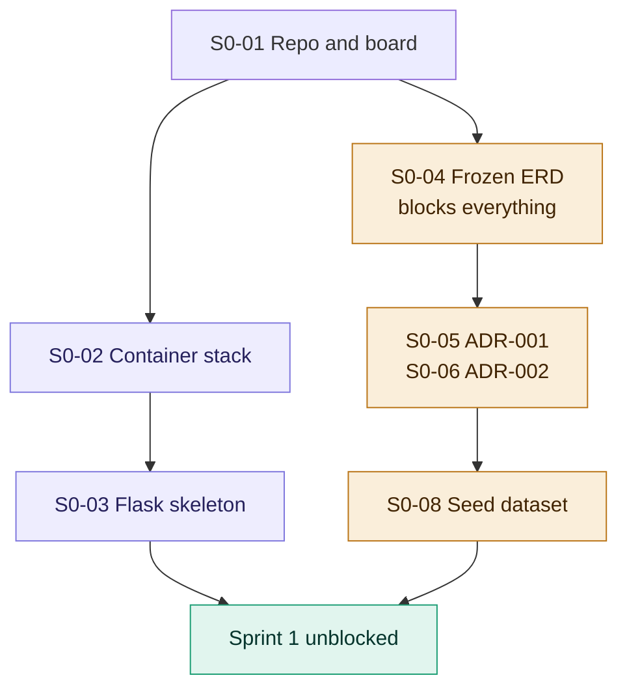

# Sprint 0 Backlog — Foundation and Contracts

**Sprint:** 0
**Dates:** Mon 2026-08-10 → Fri 2026-08-14 (5 working days)
**Capacity:** 19 SP · **Committed:** 16 SP · **Commitment ratio:** 84%
**Scrum Master:** Marcelo · **Proxy PO:** Raquel

---

## Sprint Goal

> One command brings up the full local stack against a frozen database schema, and every architectural contract the other three components depend on is written down and agreed.

---

## Why this sprint is serialized

Sprint 0 has more sequential dependency than any later sprint, and that is intentional. Parallelizing before the schema and the authentication contract exist produces four incompatible interpretations of the data model and a week spent on merge conflicts instead of features.

Execution order:



Day by day:

| Day | Work |
|---|---|
| Mon | S0-01 repository and board, then S0-02 container stack; S0-04 ERD begins |
| Tue | S0-04 ERD frozen; ADR-001, ADR-002, ADR-003 start |
| Wed | S0-08 seed dataset; S0-09 baseline diagrams |
| Thu | S0-10 standards; S0-11 requirements skeleton |
| Fri | Integration verification, Review, Retrospective |

**S0-04 blocks everything downstream.** It is the highest-priority item in the sprint and it is not permitted to slip past Tuesday.

---

## Committed stories

### S0-01 — Repository, organization and board
**Owner:** Marcelo · **Points:** 2 · **Type:** chore · **Blocks:** all

> As a development team, we need a shared repository and task board so that work is traceable and does not depend on any individual's personal account.

**Tasks**
- Create the GitHub organization; add all four members as members, two as owners
- Create the monorepo with the agreed directory structure
- Protect `main`: no direct pushes, pull request required, one approval minimum
- Create `develop` as the default integration branch
- Configure GitHub Projects board: Backlog, Ready, In Progress, In Review, Done
- Create issue labels: `type:feature|bug|chore|docs|spike`, `component:web|services|mobile|desktop|ml|infra|docs`, `sprint:0|1|2`, `priority:P0|P1|P2|P3`
- Add issue templates for user story and defect
- Commit the root `README.md` and `CONTRIBUTING.md`

**Directory structure**
```
retail-segmentation/
  web/            Flask + Jinja2 web system (M1)
  services/       microservices module (M2) — README placeholder only
  mobile/         Android client (M3) — README placeholder only
  desktop/        desktop client (M3) — README placeholder only
  ml/             notebooks, RFM, clustering, seed generation
  infra/          docker-compose, Dockerfiles, GCP scripts
  docs/           all documentation, English only
    adr/          architecture decision records
    analysis/     problem analysis
    architecture/ diagrams
    data/         database designs, seed strategy
    requirements/ functional, non-functional, stories, business rules
    scrum/        this directory
    security/     permission matrix
```

A monorepo is chosen over separate repositories per component. The requirement that each microservice deploy independently concerns containers and pipelines, not repository boundaries. With four people, five repositories means five coordinated pull requests for every contract change and no single place to see which versions belong together.

**Acceptance criteria**
- Given a team member with a fresh clone, when they attempt to push directly to `main`, then the push is rejected
- Given a new issue, when it is created, then a template is offered and the label set is available
- Given the board, when a pull request is opened referencing an issue, then the issue is visible in In Review

---

### S0-02 — Local container stack
**Owner:** Max · **Points:** 3 · **Type:** chore · **Depends on:** S0-01

> As a developer, I want the entire stack to start with one command so that every team member runs an identical environment and "it works on my machine" is not an accepted explanation.

**Tasks**
- `infra/docker-compose.yml`: PostgreSQL 16, MongoDB 7, Redis 7, web service
- Named volumes for all three data stores
- Health checks on each service; `depends_on` with `condition: service_healthy`
- `web/Dockerfile` on `python:3.12-slim`, non-root user, layer-cached dependency install
- `.env.example` listing every required variable with safe defaults
- `Makefile` targets: `up`, `down`, `migrate`, `seed`, `test`, `logs`, `reset`

**Base image decision.** Alpine is rejected. scikit-learn and pandas do not publish musl wheels, so an Alpine base forces source compilation and multi-minute rebuilds. `python:3.12-slim` is the correct default for this stack.

**Acceptance criteria**
- Given a clean clone and a copied `.env`, when `make up` runs, then all four containers reach a healthy state without manual intervention
- Given a running stack, when `make reset` runs, then volumes are removed and the next `make up` starts from empty databases
- Given the web container, when it is inspected, then the process is not running as root
- Given `docker compose config`, when it is evaluated, then no secret values are present in the file

---

### S0-03 — Flask application skeleton
**Owner:** Raquel · **Points:** 3 · **Type:** chore · **Depends on:** S0-02

> As a developer, I want an application skeleton with configuration, blueprints and migrations already wired so that feature work in Sprint 1 does not begin with structural decisions.

**Tasks**
- Application factory pattern, `create_app(config_name)`
- Configuration classes: development, testing, production, read from environment
- Blueprint registration: `public`, `auth`, `admin`, `catalog`, `analytics`, `audit`, `api`
- SQLAlchemy initialization; Alembic initialized with one empty baseline revision
- MongoDB and Redis client initialization with connection pooling
- `structlog` configured for JSON output with a request-scoped correlation identifier
- Base Jinja2 layout, static asset structure, error handlers for 400, 401, 403, 404, 500
- `pytest` configured with an application fixture and a transactional database fixture
- `requirements.txt` and `requirements-dev.txt`

**Dependencies beyond the course minimum, with justification**

| Package | Justification |
|---|---|
| Alembic | Four people modifying one PostgreSQL schema without versioned migrations guarantees environment drift. This is the most significant gap in the specified minimum stack. |
| pandas, scikit-learn | RFM aggregation and K-means. Hand-implementing K-means spends capacity on a solved problem. |
| pytest | Testing is a required deliverable. |
| structlog | Structured error and event logging is a required deliverable; plain `logging` makes correlation identifiers awkward. |
| Argon2 (`argon2-cffi`) | Current password hashing standard. |

Rejected for M1: React (Jinja2 is required and sufficient), Celery (a manually triggered endpoint is adequate for a segmentation run at this stage), Kubernetes (see ADR-004).

**Acceptance criteria**
- Given the running container, when `/health` is requested, then it returns 200 with the status of PostgreSQL, MongoDB and Redis
- Given `alembic upgrade head` against an empty database, when it runs, then it completes without error
- Given `pytest`, when it runs, then the suite passes with at least one test per configured blueprint
- Given any request, when its log lines are inspected, then all lines for that request share one correlation identifier

---

### S0-04 — Frozen data model including bi-temporal segment traceability
**Owner:** Estefanía (lead) + Marcelo · **Points:** 5 · **Type:** docs + feature · **Blocks:** S0-05, S0-06, S0-08, and all Sprint 1 stories

> As a team, we need the PostgreSQL schema frozen and the segment assignment model bi-temporal so that segments can be updated without losing historical traceability, which is the central requirement of the problem statement.

This is the highest-value story in the sprint. The problem statement's core requirement — update segments without losing historical traceability — is satisfied or broken here, at the schema level, before any code is written.

**The rule:** there is no mutable `customer.segment_id`. Segment assignment is never updated in place. Each run closes the prior assignment and inserts a new one.

**Core traceability tables**

| Table | Key columns | Purpose |
|---|---|---|
| `segmentation_model_run` | `id`, `algorithm`, `algorithm_version`, `parameters` (JSONB), `k`, `random_seed`, `silhouette`, `inertia`, `analysis_window_start`, `analysis_window_end`, `triggered_by_user_id`, `started_at`, `completed_at`, `status` | One row per algorithm execution |
| `segment` | `id`, `model_run_id`, `label`, `centroid` (JSONB), `member_count`, `description` | Segment definitions scoped to a run, not global |
| `customer_rfm_snapshot` | `id`, `customer_id`, `model_run_id`, `recency_days`, `frequency`, `monetary`, `r_score`, `f_score`, `m_score`, `computed_at` | Immutable RFM values per run |
| `customer_segment_assignment` | `id`, `customer_id`, `segment_id`, `model_run_id`, `rfm_snapshot_id`, `valid_from`, `valid_to` (nullable), `distance_to_centroid` | Bi-temporal assignment history |

**Consequences that make later epics cheap**
- Migration detection is a query over two consecutive assignments for a customer, not a separate subsystem
- Point-in-time lookup: the segment of customer X on date D is the assignment where `valid_from <= D` and (`valid_to > D` or `valid_to IS NULL`)
- Model comparison becomes possible because two runs coexist over the same population

**Tasks**
- Conceptual model: entities and relationships
- Logical model: full attribute set, keys, constraints
- Physical model: DDL as the first substantive Alembic migration
- Transactional tables: `customer`, `product`, `category`, `store`, `sales_transaction`, `sales_transaction_line`, `inventory_availability`
- Security tables: `user_account`, `role`, `permission`, `role_permission`, `user_role`
- Audit table: `audit_log`, append-only
- Partial unique index enforcing one open assignment per customer: unique on `customer_id` where `valid_to IS NULL`
- Indexes for the migration query and the point-in-time query
- MongoDB collection design: `ingestion_run`, `ingestion_error`, `model_run_telemetry`, `recommendation_event`
- Redis key namespace design: sessions, revocation denylist, query cache, rate-limit counters, distributed locks, with TTLs per namespace

**Acceptance criteria**
- Given the migration, when `alembic upgrade head` runs against an empty database, then all tables, constraints and indexes are created
- Given a customer with an open assignment, when a second open assignment is inserted, then the partial unique index rejects it
- Given two completed runs, when the point-in-time query is executed for a date between them, then it returns exactly one segment per customer
- Given the ERD document, when reviewed, then every table has a stated purpose and every foreign key a stated cardinality
- Given the Redis design, when reviewed, then every key pattern has a documented TTL and eviction expectation

---

### S0-05 — ADR-001 Authentication and Token Lifecycle
**Owner:** Marcelo · **Points:** 2 · **Type:** docs · **Depends on:** S0-04 · **Blocks:** all authentication work in every component

> As a team, we need the authentication scheme fixed in one document so that the web, mobile and desktop clients do not each invent their own and so that a single revocation mechanism serves all three.

The specification requires JWT, but the web system is server-rendered. Left unresolved, teams build Flask session cookies for the web and JWT for the API clients, duplicating authentication and producing two revocation paths that disagree.

**Decision to record:** one JWT scheme, two transports.

| Client | Transport | Rationale |
|---|---|---|
| Web system | `HttpOnly`, `Secure`, `SameSite=Lax` cookie | Server-rendered pages cannot attach headers to ordinary navigation; `HttpOnly` removes XSS token theft |
| Android | `Authorization: Bearer` header | Standard for native clients |
| Desktop | `Authorization: Bearer` header | Same |

**Must be specified**
- Claim structure: `sub`, `jti`, `iat`, `exp`, `roles`, `permissions` or a permission version reference, `token_type`
- Access token TTL (15 minutes proposed) and refresh token TTL (7 days proposed)
- Refresh token rotation, with reuse of a rotated token treated as compromise
- CSRF protection for the cookie transport, given that `SameSite=Lax` alone is insufficient for state-changing POSTs
- Redis key patterns: `session:{user_id}:{jti}`, `denylist:{jti}`, `refresh:{jti}`
- Revocation semantics: logout, forced logout, permission change
- Signing algorithm and key rotation policy
- What happens when Redis is unavailable — fail closed or fail open, and why

**Acceptance criteria**
- Given the ADR, when read by a developer who did not write it, then they can implement token issuance and validation without asking a follow-up question
- Given the ADR, when the Redis outage behaviour section is read, then it states a single decision with a justification, not a list of options

---

### S0-06 — ADR-002 Data Ownership Map
**Owner:** Estefanía · **Points:** 1 · **Type:** docs · **Depends on:** S0-04

> As a team, we need each table, collection and key namespace assigned to exactly one writing component so that shared databases do not become accidental coupling between the web system and the microservices module.

The specification permits microservices to share authorized databases. That permission is an invitation to accidental coupling: two components writing the same table with different invariants is a defect that appears in M2 and is expensive to unwind. Ownership is recorded now, while the answer is still obvious.

**Tasks**
- Table-by-table matrix: owning component (writer), permitted readers
- Same for MongoDB collections and Redis key namespaces
- State the rule for cross-component writes: prohibited; the owner exposes an endpoint instead

**Acceptance criteria**
- Given the matrix, when any table is looked up, then exactly one component is listed as writer
- Given the matrix, when reviewed against the epic list, then every planned microservice has its read and write scope stated

---

### S0-07 — ADR-003 API Standards and Content Negotiation
**Owner:** Marcelo · **Points:** 2 · **Type:** docs

> As a team, we need REST conventions, error format and content negotiation fixed now so that the microservices module can be built in M2 without redesign, and so that XML support is not retrofitted.

The desktop application consumes XML exclusively; the mobile application consumes JSON exclusively. Designing for JSON in M2 and adding XML in M3 means rewriting the serialization layer. Content negotiation via the `Accept` header is specified now and implemented once.

**Must be specified**
- URL versioning: `/api/v1/...`
- Content negotiation: `Accept: application/json` and `Accept: application/xml`, with a defined default and a defined 406 behaviour
- JSON-to-XML mapping conventions: root element, collection element naming, null representation, date format
- Error envelope, identical in structure across both formats: code, message, details, correlation id
- HTTP status usage: 400, 401, 403, 404, 409, 422, 429, 500, 503
- Pagination convention
- Correlation identifier propagation: `X-Correlation-ID`, inbound reuse, generated when absent
- Rate limit headers and the 429 response shape
- Health endpoint contract: `/health/live`, `/health/ready`, `/health/database`, `/health/redis`, `/health/mongodb`, `/health/storage`, with the response schema and the meaning of degraded versus down

**Acceptance criteria**
- Given the ADR, when a developer implements an endpoint, then the same resource can be returned as JSON or XML from one handler
- Given the error envelope specification, when an error is produced in either format, then the field set is identical

---

### S0-08 — Seed dataset with realistic transaction history
**Owner:** Estefanía · **Points:** 3 · **Type:** feature · **Depends on:** S0-04

> As a team, we need a realistic multi-month transaction history so that RFM quintiles are meaningful and segment migrations are observable in the demonstration.

Nobody usually assigns this, and its absence is what kills the demonstration. RFM over hand-entered rows produces degenerate quintiles, and with no purchase history there is nothing between two runs for a migration report to detect.

**Approach.** Start from a public retail transaction dataset with genuine purchase behaviour rather than generating everything synthetically — real purchase patterns produce plausible segments and plausible migrations without tuning. Store, channel and controlled migration behaviour are layered on top synthetically, since the base data lacks those dimensions. See `docs/data/seed-strategy.md` for the source, licence and transformation steps.

**Tasks**
- Acquire and document the base dataset, including its licence
- Map source columns to `customer`, `product`, `category`, `sales_transaction`, `sales_transaction_line`
- Assign stores and channels probabilistically per customer, with a documented distribution
- Inject controlled migration behaviour for a known subset of customers: frequency change, category shift, channel switch, spend increase and decrease
- Record the injected ground truth so migration detection can be validated rather than eyeballed
- Idempotent loader invoked by `make seed`
- Write ingestion telemetry to MongoDB during loading, exercising that path from day one

**Acceptance criteria**
- Given an empty database, when `make seed` runs, then at least 2,000 customers and 100,000 transaction lines spanning at least 18 months are loaded
- Given `make seed` run twice, when the row counts are compared, then they are unchanged
- Given the loaded data, when RFM is computed, then all five quintiles are populated in every dimension
- Given the injected ground truth, when two runs are compared, then the known migrating customers appear in the migration set

---

### S0-09 — Baseline architecture diagrams
**Owner:** Marcelo · **Points:** 2 · **Type:** docs · **Depends on:** S0-04, S0-05

> As a team, we need the context, container, authentication and data storage diagrams so that component responsibilities are agreed before Sprint 1 development begins.

Four of the nine required diagrams are produced now. Component and sequence diagrams follow in Sprint 1; deployment and network diagrams in Sprint 2, once the infrastructure exists and the diagrams can be accurate rather than aspirational.

**Tasks**
- Context diagram: the platform, its seven actor profiles, and external systems
- Container diagram: web system, microservices module, mobile, desktop, three data stores, Cloud Storage
- Authentication diagram: login, access token use, refresh rotation, revocation, for both transports
- Data storage diagram: which data lives in PostgreSQL, MongoDB, Redis and Cloud Storage, with the justification for each placement
- Written justification section covering which functions belong to the web system versus a microservice, and why

**Acceptance criteria**
- Given the container diagram, when compared with ADR-002, then no component is shown writing a store it does not own
- Given the authentication diagram, when compared with ADR-001, then both transports and the revocation path are represented

---

### S0-10 — Engineering standards and Definition of Done
**Owner:** Marcelo · **Points:** 1 · **Type:** docs

> As a team, we need coding standards, naming conventions and an enforced Definition of Done so that four people produce one coherent codebase.

**Tasks**
- Python style: PEP 8, `black`, `ruff`, line length, docstring convention
- Naming conventions: database (snake_case, singular table names), Python, Jinja2 templates, CSS, JavaScript, branches, commits
- Conventional Commits specification with examples
- Pull request checklist derived from the Definition of Done
- `CONTRIBUTING.md` covering local setup, branch flow, and review expectations
- Publish the Definition of Done and Definition of Ready in the repository

**Acceptance criteria**
- Given `black --check` and `ruff` over the repository, when they run, then both pass
- Given a new pull request, when it is opened, then the Definition of Done checklist appears in the description

---

### S0-11 — Requirements and analysis skeleton
**Owner:** Raquel · **Points:** 1 · **Type:** docs

> As a Proxy Product Owner, I need the requirements documents created with their structure and Sprint 1 content in place so that the analysis deliverable is written incrementally rather than the weekend before delivery.

The commit history of these documents is itself evidence that the process was followed. A single large commit dated 2026-09-07 is visible to any evaluator.

**Tasks**
- Create `docs/analysis/problem-analysis.md` with all required sections and the context and actors sections drafted
- Create `docs/requirements/functional-requirements.md`, `non-functional-requirements.md`, `user-stories.md`, `business-rules.md`, `traceability-matrix.md` with headings and identifier schemes
- Define the identifier scheme: `FR-nnn`, `NFR-nnn`, `BR-nnn`, `US-nnn`
- Requirements are classified by component: web, microservices, mobile, desktop, databases, infrastructure, security, monitoring
- Populate the traceability matrix columns: requirement → story → component → test → status

**Acceptance criteria**
- Given each document, when opened, then its section structure matches the course deliverable list
- Given the traceability matrix, when a Sprint 1 story is added, then it can be linked to a requirement identifier without restructuring the table

---

## Sprint 0 summary

| Story | Owner | SP | Type |
|---|---|---|---|
| S0-01 Repository, organization and board | Marcelo | 2 | chore |
| S0-02 Local container stack | Max | 3 | chore |
| S0-03 Flask application skeleton | Raquel | 3 | chore |
| S0-04 Frozen data model, bi-temporal traceability | Estefanía + Marcelo | 5 | docs + feature |
| S0-05 ADR-001 Authentication | Marcelo | 2 | docs |
| S0-06 ADR-002 Data Ownership | Estefanía | 1 | docs |
| S0-07 ADR-003 API Standards | Marcelo | 2 | docs |
| S0-08 Seed dataset | Estefanía | 3 | feature |
| S0-09 Baseline diagrams | Marcelo | 2 | docs |
| S0-10 Engineering standards | Marcelo | 1 | docs |
| S0-11 Requirements skeleton | Raquel | 1 | docs |
| **Total** | | **25** | |

The committed total is 25 SP against a stated commitment of 16 SP. This is a deliberate overload of the sprint board, and it must be resolved at Sprint 0 Planning rather than by pretending the numbers add up. Two options, to be decided by the team on Monday:

1. **Move S0-09, S0-10 and S0-11 into Sprint 1** (9 SP), bringing Sprint 0 to 16 SP. Sprint 1's committed total then rises to 41 SP against a 38 SP capacity, which requires cutting a Sprint 1 story.
2. **Accept a higher Sprint 0 load** on the grounds that documentation stories carry less execution risk than feature stories, and reduce the Sprint 1 commitment accordingly.

Recommendation: option 1, moving S0-09 (diagrams) and S0-11 (requirements skeleton) to Sprint 1, and keeping S0-10 (standards) in Sprint 0 because standards published after development starts are not followed. That brings Sprint 0 to 22 SP — still above the 19 SP capacity line. The honest conclusion is that **Sprint 0 needs six days rather than five, or one document deliverable must move.** This is exactly the kind of discrepancy that is cheaper to confront at planning than to discover on Friday.

---

## Per-person load (assuming option 1)

| Person | Stories | SP | Effective hours available | SP capacity at 2.5 h/SP |
|---|---|---|---|---|
| Marcelo | S0-01, S0-05, S0-07, S0-10, ½ S0-04 | 10.5 | 12 | 4.8 |
| Estefanía | S0-06, S0-08, ½ S0-04 | 6.5 | 12 | 4.8 |
| Raquel | S0-03 | 3 | 12 | 4.8 |
| Max | S0-02 | 3 | 12 | 4.8 |

Marcelo is loaded at more than double his capacity. This is the single-point-of-failure risk (R-03) appearing in the very first sprint. Required rebalancing before commitment:

- **S0-07 (ADR-003 API Standards) moves to Max.** He owns infrastructure and will implement rate limiting and health endpoints in M2, so he is the correct owner of the contract that specifies them.
- **S0-10 (Engineering standards) moves to Raquel.** She writes the most application code and will be the primary consumer of the conventions.
- **S0-04 leads with Estefanía**, with Marcelo reviewing rather than co-authoring.

Rebalanced: Marcelo 5, Estefanía 9, Raquel 4, Max 5. Estefanía remains over capacity because S0-04 and S0-08 are both hers and both are on the critical path. Mitigation: S0-08 (seed dataset) may extend into Monday of Sprint 1 without blocking anyone, since nothing in Sprint 1 week 1 depends on seeded data.

---

## Sprint 0 risks

| Risk | Mitigation |
|---|---|
| S0-04 slips past Tuesday and blocks the whole sprint | Timeboxed to two days. If incomplete Tuesday evening, the transactional tables are frozen and the traceability tables are finalized Wednesday morning; nothing else may start until both are done. |
| The bi-temporal model is agreed but misunderstood, and Sprint 1 code writes mutable assignments | The partial unique index makes the incorrect pattern fail at the database level rather than silently succeed. |
| Nobody has used Alembic before | Timeboxed spike inside S0-03. If not working by Tuesday, raise as a blocker; it is not optional. |
| GCP billing or quota problems surface late | Max verifies project billing, enabled APIs and quota on Day 1, even though deployment is Sprint 2. |

---

## Definition of Done for Sprint 0

Beyond the standard story-level Definition of Done:

- A team member who has never run the project can clone, `make up`, `make migrate`, `make seed` and reach a login page, following only `README.md`
- `alembic upgrade head` succeeds against an empty database
- ADR-001, ADR-002 and ADR-003 are committed and marked Accepted
- The ERD is committed and its DDL matches the applied migration
- The board shows at least ten closed issues with commit references
